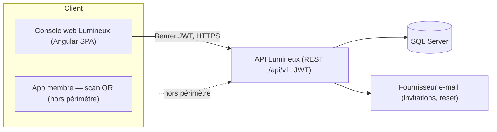
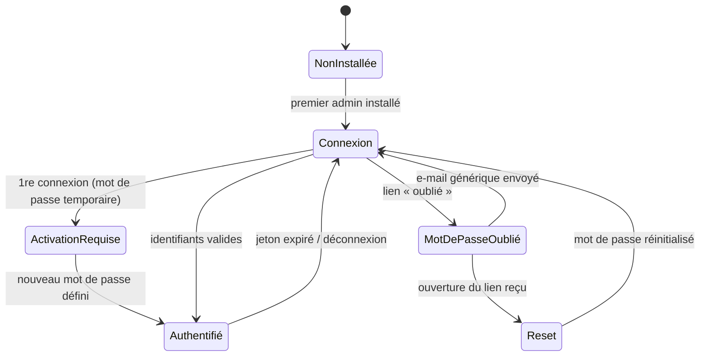

# Fiche Produit — Console web Lumineux (SPA)

> **Rôle** : rédigé en posture de **Product Owner senior**.
> **Objet** : cadrer la mise en place d'une application web monopage (SPA) qui consomme l'API Lumineux existante (features 001→006).
> **Statut** : brief produit (vision, périmètre, parcours, exigences). Sert d'entrée au futur `/speckit-specify`.
> **Date** : 2026-07-04 · **Dernière mise à jour** : 2026-07-05.
>
> **Avancement (2026-07-05)** : livrés et poussés — préalables API **007 `/auth/me`** et **010 référentiels** ;
> **Lot 0+1** (socle & compte, feature 008), **Lot 2** (membres, 009), **Lot 3** (profils & droits, 011),
> ainsi que la **config CORS** de l'API. Reste : **Lot 4** (présences), et la **découvrabilité de
> l'installation du premier administrateur** (cf. §12, prochaine cible de `/speckit-specify`).

---

## 1. Vision

Doter le **bureau de l'association Lumineux** d'une **console web unique, sécurisée et en français**, pour piloter au quotidien les **membres**, les **présences** et les **droits**, en s'appuyant intégralement sur l'API REST déjà livrée. La SPA est la **face visible** d'un back-end déjà mûr : elle ne réimplémente aucune règle métier, elle **orchestre les parcours** et **applique les droits** au plus près de l'utilisateur, l'API restant la seule source de vérité.

**Phrase produit** : « En me connectant, chaque membre du bureau accède — selon ses droits — à tout ce dont il a besoin pour accueillir un membre, animer une session de présence et gérer les habilitations, sans jamais quitter son navigateur. »

---

## 2. Personas & valeur

| Persona | Droit (claim) | Ce que la SPA lui apporte |
|---------|---------------|----------------------------|
| **Super-administrateur** | `manage_bureau_profiles` | Installe l'instance (premier admin), crée les profils du bureau, attribue/révoque les droits. Gardien de la gouvernance. |
| **Gestionnaire des membres** | `manage_members` | Enrôle et corrige les fiches membres, gère les doublons/homonymes, recherche. |
| **Responsable de présence** | `manage_attendance` | Ouvre une session, affiche le QR à projeter, suit les présences en temps réel, ajoute une présence manuelle, clôture. |
| **Membre (compte simple)** | *(aucun droit de gestion)* | Self-service **léger** : se connecter, activer son compte (1re connexion), changer/réinitialiser son mot de passe. |

> Un même utilisateur peut cumuler plusieurs droits (via un ou plusieurs profils). L'UI s'adapte au **union des droits** du jeton.

---

## 3. Périmètre

### 3.1 Dans le périmètre (SPA web — back-office bureau)

1. **Installation** de l'instance : écran de premier administrateur (`POST /setup/first-admin`), auto-bloqué une fois l'instance amorcée.
2. **Cycle de vie du compte** : connexion, première connexion / activation (mot de passe temporaire → nouveau), **mot de passe oublié + réinitialisation** (feature 006), changement de mot de passe.
3. **Membres** : recherche/liste paginée, création (avec gestion **doublon/homonyme** et repli « remise bureau » quand pas d'email), consultation de fiche, correction.
4. **Profils du bureau & droits** : lister/créer/modifier/supprimer les profils, consulter le **référentiel figé des permissions**, attribuer/révoquer un profil à un membre (avec garde-fou « dernier administrateur »).
5. **Sessions de présence** : démarrer une session, **afficher le QR rotatif**, lister les présences (filtre par statut), **ajout manuel** pour membre non équipé, annulation tant que la session est ouverte, **clôture**.

### 3.2 Hors périmètre (pour cet incrément)

- **Application mobile membre de scan QR** (caméra, saisie hors ligne, synchronisation par lot `scan/batch`) → client distinct (mobile/Flutter), parcours et contraintes propres. La SPA se limite à l'**affichage** du QR et au **suivi** côté bureau.
- Reporting/statistiques avancés (backlog E), suivi financier/cotisations (B), communications/notifications (C), import/export de masse (D), multi-antennes (F).

> ✅ **Décision PO figée** (2026-07-04) : la SPA cible **le back-office bureau**, pas le poste du membre scannant. Le scan QR membre sera un **client mobile séparé** (hors périmètre).

---

## 4. Contexte technique (vue produit)

**Faits d'API structurants (contraintes produit à intégrer) :**
- Authentification par **JWT d'accès unique** (`TokenType: Bearer`, `ExpiresAt` ~60 min). **Pas de jeton de rafraîchissement** aujourd'hui → à l'expiration, l'utilisateur doit se reconnecter (voir §7 et §9).
- Les **droits** sont portés par le jeton (claims). Il **n'existe pas** d'endpoint « qui suis-je / mes droits » (`/me`) → ✅ **décision : ajouter `GET /api/v1/auth/me`** côté API (petite feature préalable, cf. §9).
- Routes **anonymes** : `setup/first-admin`, `auth/login`, `auth/activate`, `auth/forgot-password`, `auth/reset-password`. Tout le reste exige un jeton (et le bon droit).
- Le lien de réinitialisation e-mail pointe déjà vers `…:4200/auth/reset-password` → la **route SPA `/auth/reset-password?token=…` doit exister** et être publique.
- Réponses **génériques anti-énumération** (forgot-password) : l'UI ne doit **jamais** laisser deviner si un compte/e-mail existe.

---

## 5. Parcours clés (haut niveau)

### 5.1 Cycle de vie de l'authentification

### 5.2 Enrôler un membre (gestionnaire des membres)
Rechercher pour éviter un doublon → saisir la fiche → gérer l'alerte homonyme (confirmer ou annuler) → à la création, afficher soit « invitation envoyée par e-mail », soit **la remise bureau** (identifiant + mot de passe temporaire à transmettre en main propre) selon la présence d'un e-mail.

### 5.3 Attribuer des droits (super-administrateur)
Consulter les profils → attribuer un profil à un membre (idempotent) → l'UI signale le garde-fou « dernier administrateur » lors d'une révocation risquée (409).

### 5.4 Animer une session de présence (responsable présence)
Démarrer la session → **projeter le QR** (rafraîchi automatiquement) → suivre la liste des présences qui se remplit → ajouter manuellement un membre non équipé → clôturer (propage l'heure de fin).

---

## 6. Épics & découpage incrémental (proposition de roadmap)

| Lot | Épic | Contenu | Droits concernés |
|-----|------|---------|------------------|
| **Lot 0** | Socle SPA | Amorçage projet, layout/navigation, client HTTP + **intercepteur Bearer**, **gestion centralisée des erreurs** (401/403/409/validation), gardes de routes par droit, écran de connexion. | — |
| **Lot 1** | Compte & sécurité | Connexion, activation 1re connexion, **mot de passe oublié + reset**, changement de mot de passe, déconnexion. | tous |
| **Lot 2** | Membres | Recherche/liste paginée, création (doublon/homonyme + remise bureau), fiche, édition. | `manage_members` |
| **Lot 3** | Profils & droits | CRUD profils, référentiel permissions, attribution/révocation aux membres (garde-fous). | `manage_bureau_profiles` (+ lecture `manage_members`) |
| **Lot 4** | Présences | Démarrer/clôturer session, affichage QR rotatif, liste présences, ajout manuel, annulation. | `manage_attendance` |
| **Lot 5** | Installation | Écran premier administrateur (auto-bloqué). **Écran livré (feature 008) mais non découvrable depuis l'UI** → complété par la **découvrabilité** (cf. §12). | anonyme → admin |

> **MVP recommandé** : Lot 0 + Lot 1 + Lot 5 (on peut se connecter, installer, sécuriser son compte), puis Lot 2 (valeur métier immédiate : enrôlement). Lots 3 et 4 suivent.

---

## 7. Exigences non-fonctionnelles

### Sécurité (priorité — défense en profondeur)
- **HTTPS** exclusivement ; en-têtes de sécurité (CSP stricte, `X-Content-Type-Options`, etc.).
- **Stockage du jeton** : proscrire `localStorage` (exposition XSS). Décision PO recommandée : jeton **en mémoire** (perdu au rafraîchissement, reconnexion) **ou** cookie `HttpOnly`+`Secure`+`SameSite` si l'API évolue pour l'émettre ainsi (§9).
- **RBAC côté UI** = confort et lisibilité (masquer/désactiver ce qui est interdit), **jamais** un contrôle de sécurité : l'API reste l'autorité (elle renvoie 401/403).
- **Anti-énumération** respectée : messages génériques identiques quel que soit l'état réel du compte (forgot-password).
- **Aucun secret** (mot de passe, jeton, mot de passe temporaire) en clair dans les logs navigateur, l'URL persistée, ou le stockage. Le mot de passe temporaire de la « remise bureau » s'affiche une fois, sans persistance.
- Gestion propre de l'**expiration** (401) : purge de l'état, redirection connexion, message clair, retour à la page visée après reconnexion.
- Politique de mot de passe alignée sur l'API (longueur min., lettre + chiffre) avec retour de validation immédiat.

### Qualité d'expérience
- **Français** par défaut, structuré pour l'i18n.
- **Responsive** (usage bureau + tablette lors des sessions ; le QR projeté doit être lisible en grand).
- **Accessibilité** raisonnable (navigation clavier, contrastes, libellés).
- Retours d'erreurs **exploitables** : mapper les `ProblemDetails` (RFC 7807) et codes métier (ex. `password_change_required`, `duplicate`, `last_administrator`, `contact_in_use`) vers des messages compréhensibles et des actions.
- États de chargement, vides et d'erreur explicites ; idempotence respectée (pas de double-soumission).

### Testabilité & industrialisation
- Tests des parcours critiques (connexion, garde de routes, création membre, reset).
- **Client API généré depuis l'OpenAPI** de l'API (source de vérité des contrats) pour éviter la dérive.
- Intégration continue (build + lint + tests) cohérente avec le dépôt.

---

## 8. Choix pressentis (à valider)

- **Stack** : **Angular** (aligné sur la configuration existante `…:4200` et le backlog G), TypeScript, composants standalone, Router avec *guards* de droits, `HttpInterceptor` pour le Bearer et la gestion 401.
- **Emplacement** : ✅ **mono-dépôt** — nouveau dossier front dans ce repo (ex. `web/` ou `src/Lumineux.Web/`), CI commune, contrats OpenAPI synchronisés au plus près.
- **Design** : système de composants léger et sobre ; priorité à la clarté et à la vitesse plutôt qu'au sur-mesure graphique.

---

## 9. Dépendances & questions ouvertes

### ✅ Tranchées le 2026-07-04
1. **Endpoint `/me`** → **Ajouter `GET /api/v1/auth/me`** côté API (identité + droits effectifs). Constitue une **petite feature API préalable** (ou premier lot conjoint) au SPA.
2. **Scan QR membre** → **hors périmètre** SPA web (futur client mobile séparé).
3. **Emplacement du front** → **mono-dépôt** (dossier dédié dans ce repo).

### ⏳ Restant à trancher (peut se faire pendant la spec du Lot 0/1)
4. **Expiration / rafraîchissement** : aujourd'hui pas de refresh token (reconnexion à ~60 min). Acceptable pour le MVP, ou prévoir un **refresh token** côté API ? → *proposition PO : reconnexion simple au MVP, refresh en évolution.*
5. **CORS** : l'API devra autoriser l'origine de la SPA (`http://localhost:4200` en dev, origine de prod ensuite) — tâche technique, sans décision produit.
6. **Portée du self-service membre** sur le web : strictement compte/mot de passe (proposition PO), ou exposer au membre la consultation de sa propre fiche (nécessiterait un endpoint API dédié) ?

---

## 10. Critères de succès (mesurables)

- **SC-1** : un membre du bureau nouvellement provisionné peut, **sans assistance**, activer son compte et se connecter.
- **SC-2** : le parcours « mot de passe oublié → e-mail → nouveau mot de passe → connexion » est réalisable de bout en bout depuis la SPA.
- **SC-3** : un gestionnaire crée un membre (avec gestion du doublon) en **moins de 2 minutes**, et obtient un retour clair (invitation e-mail **ou** remise bureau).
- **SC-4** : l'UI **n'affiche jamais** une action pour laquelle l'utilisateur n'a pas le droit ; toute tentative directe reste refusée par l'API (403).
- **SC-5** : aucun secret n'est observable dans le stockage du navigateur, les URL persistées ou la console.
- **SC-6** : une session de présence peut être démarrée, son QR projeté et rafraîchi, puis clôturée, avec suivi des présences à l'écran.

---

## 11. Prochaine étape proposée

1. **Feature API préalable — `GET /api/v1/auth/me`** (identité + droits effectifs) : ✅ **livrée** (feature 007).
2. **Lot 0 + Lot 1** (socle + cycle de vie du compte) : ✅ **livré** (feature 008).
3. **Prochaine cible `/speckit-specify`** : **découvrabilité de l'installation du premier administrateur** (§12) — précédée de son **prérequis API** (endpoint de statut d'installation).

Les points §9.4 (refresh) et §9.6 (self-service membre) restent des évolutions ouvertes.

---

## 12. Feature — Installation découvrable du premier administrateur (2026-07-05)

### Contexte & manque
L'écran d'**installation du premier administrateur** (super-admin) **existe déjà** côté SPA (feature 008 :
route publique `/setup/first-admin`, formulaire, appel `POST /api/v1/setup/first-admin`, auto-bloqué par
l'API une fois l'instance amorcée — 409). **Problème** : cet écran **n'est référencé nulle part dans
l'interface** — il n'est atteignable qu'en **tapant l'URL à la main**. Sur une instance vierge, la toute
première personne n'a donc **aucun moyen de découvrir** comment créer le compte super-admin depuis la
console.

### Objectif
Rendre la **création du compte super-admin découvrable et accessible depuis la console web**, **sans
jamais** proposer cette action lorsque l'instance est **déjà installée**.

### Décision PO figée (2026-07-05) — approche « lien conditionnel + endpoint de statut »
1. **Prérequis API — petit endpoint de statut d'installation** (feature API préalable, lecture seule,
   **anonyme**) : par ex. `GET /api/v1/setup/status` → `{ "installed": true|false }`. Ne divulgue **aucune**
   donnée sensible (un simple booléen indiquant si au moins un administrateur actif existe déjà).
2. **SPA — lien conditionnel** : l'écran de **connexion** affiche un lien discret « **Première
   installation** » → `/setup/first-admin` **uniquement si** l'instance **n'est pas encore initialisée**
   (statut `installed = false`). Si l'instance est déjà installée, **aucun** lien n'est affiché.
3. **Réutilisation** : l'écran d'installation existant (`SetupComponent`) et son endpoint
   `POST /setup/first-admin` sont **réutilisés tels quels** — ce lot n'introduit **pas** de nouvel écran
   d'installation, seulement la **découvrabilité** (le lien conditionnel) et le **prérequis de statut**.

### Périmètre
- **Prérequis API** : endpoint anonyme de statut d'installation (lecture seule, aucun secret).
- **SPA** :
  - au chargement de l'écran de connexion, interroger le statut d'installation ;
  - afficher le lien « Première installation » **si et seulement si** l'instance n'est pas initialisée ;
  - masquer/retirer le lien dès qu'une installation existe ;
  - conserver l'écran d'installation actuel (auto-bloqué : un `409` reste géré proprement si l'instance
    est amorcée entre-temps).

### Contraintes
- **Français**, responsive, cohérent avec le socle (features 008).
- **Sécurité** : le statut est un **booléen non sensible** ; aucune énumération de comptes ; l'installation
  reste protégée côté API (409 si déjà installée). Aucun secret affiché/persisté.
- **RBAC** : sans objet (parcours **anonyme**, avant toute session).

### Hors périmètre
- Refonte de l'écran d'installation (réutilisé).
- Détection/bascule automatique « premier démarrage » plus poussée (option écartée au profit du simple
  lien conditionnel).
- Gestion des membres/profils/présences (autres lots).

### Séquencement
**Prérequis API (endpoint de statut)** → **SPA (lien conditionnel sur la connexion)**. Deux petits
incréments, à spécifier via `/speckit-specify` (l'API d'abord, comme pour 007/010).

### Critères de succès
- **SC-I1** : sur une instance **vierge**, un utilisateur trouve, **depuis l'écran de connexion**, comment
  créer le premier administrateur (lien visible) et y parvient.
- **SC-I2** : sur une instance **déjà installée**, **aucun** lien/entrée d'installation n'est proposé dans
  l'UI.
- **SC-I3** : l'endpoint de statut ne renvoie **qu'un booléen** (aucune donnée sensible) et est
  consultable **sans authentification**.

---

## 13. Nouveau produit — Application mobile membre (Flutter) — 2026-07-07

> **Changement de posture** : jusqu'ici ce document cadre la **console web bureau** (SPA). À partir d'ici,
> on ouvre un **second client**, distinct et complémentaire : l'**application mobile du membre**, en
> **Flutter**, qui « ferme la boucle » de la présence. Le bureau **projette** le QR rotatif (feature 014,
> SPA) ; le membre le **scanne** avec son téléphone pour **marquer sa présence**. Ce client vit dans le
> **mono-dépôt** (nouveau dossier `mobile/`) et consomme **l'API existante** (aucune règle métier
> dupliquée). Ordre de livraison prévu (voir backlog piste I) : **M0 socle & compte** → M1 scan QR →
> M2 sync hors ligne → M3 tableau de bord membre réduit.

### Vision (mobile)
Donner à **chaque membre** un moyen **simple, rapide et sûr** de **prouver sa présence** en séance :
il ouvre l'app, s'authentifie une fois, **scanne** le code projeté, et voit **immédiatement** la
confirmation. L'expérience est pensée pour le **terrain** (salle de réunion, réseau incertain), en
**français**, sur son propre téléphone. L'API reste l'**unique autorité** (validation du jeton QR,
règles de présence, droits).

### Persona cible
**Membre (compte simple)** — *aucun droit de gestion*. Il ne gère ni membres, ni profils, ni sessions ;
il **consomme** son compte et **marque sa présence**. (Les responsables de bureau restent sur la SPA.)

---

### Feature M0 (PREMIÈRE) — Socle mobile & cycle de vie du compte membre

#### Contexte & manque
Il n'existe **aucun** client mobile aujourd'hui. Avant tout scan (M1), le membre doit pouvoir **installer
l'app, s'authentifier et gérer son mot de passe** en toute sécurité depuis son téléphone. Tous les
endpoints nécessaires **existent déjà** côté API (auth **003**, mot de passe oublié/reset **006**,
identité **007**) : ce lot **ne requiert aucune évolution d'API**.

#### Objectif
Poser le **socle technique** de l'app Flutter (`mobile/`) et livrer le **cycle de vie complet du compte
membre** sur mobile, avec une **gestion sécurisée du jeton**, prêt à accueillir le scan (M1).

#### Périmètre (mobile uniquement)
1. **Amorçage de l'app Flutter** dans `mobile/` : structure de projet, navigation (pile d'écrans /
   routeur), thème sobre en **français**, configuration d'environnement (URL de base de l'API par
   profil dev/prod).
2. **Accès réseau encapsulé** : un client HTTP dédié avec **intercepteur Bearer** (ajout du jeton),
   **gestion centralisée des erreurs** (401 → purge + retour connexion ; 403 ; validation ; réseau
   indisponible → message clair), et **mapping des `ProblemDetails`/codes métier** vers des messages
   compréhensibles (ex. `password_change_required`).
3. **Stockage sécurisé du jeton** : conservation via le **coffre sécurisé de l'OS** (Keychain iOS /
   Keystore Android), **jamais** en clair ni dans des logs ; effacement à la déconnexion et sur 401.
4. **Écrans du cycle de vie du compte** :
   - **Connexion** (référence / identifiant + mot de passe → jeton).
   - **Activation à la 1re connexion** (mot de passe temporaire → nouveau mot de passe) — déclenchée par
     le code métier `password_change_required`.
   - **Mot de passe oublié** (envoi générique **anti-énumération**) + **réinitialisation** (saisie du
     jeton reçu par e-mail + nouveau mot de passe).
   - **Changement de mot de passe** (utilisateur connecté).
   - **Déconnexion** (purge de l'état et du jeton).
5. **Politique de mot de passe alignée sur l'API** (longueur min., lettre + chiffre) avec retour de
   validation immédiat.

#### Contraintes
- **Français**, ergonomie mobile (cibles tactiles, claviers adaptés, états chargement/erreur/vide).
- **Sécurité (défense en profondeur)** : jeton dans le **coffre sécurisé** uniquement ; **aucun secret**
  (mot de passe, jeton, mot de passe temporaire) journalisé ou affiché en clair au-delà du strict
  nécessaire ; **HTTPS** exclusivement ; messages **anti-énumération** conservés (mot de passe oublié).
- **Aucune règle métier dupliquée** : l'API valide identifiants, activation et réinitialisation ; l'app
  **présente** et **orchestre**. L'API reste l'autorité (401/403).
- **Aucune évolution d'API** dans ce lot.

#### Hors périmètre (M0)
- Le **scan QR** et le marquage de présence (feature **M1**).
- La **capture hors ligne** et la synchronisation par lot (feature **M2**).
- Le **tableau de bord membre** / historique de présences (feature **M3**, prérequis API probable).
- La consultation de la fiche membre (cf. §9.6, endpoint à créer — évolution ouverte).
- Toute fonction de **gestion** (membres, profils, présences) réservée à la SPA bureau.

#### Dépendance outillage (à traiter au `/speckit-implement`)
L'implémentation nécessitera le **Flutter SDK** installé sur le poste (téléchargement réseau à
**approuver** conformément aux règles projet). La spécification et le plan (`/speckit-specify`,
`/speckit-plan`) ne requièrent **aucune** installation.

#### Critères de succès
- **SC-M0-1** : un membre nouvellement provisionné peut, **depuis son téléphone et sans assistance**,
  activer son compte (mot de passe temporaire → nouveau) puis se connecter.
- **SC-M0-2** : le parcours « mot de passe oublié → e-mail → réinitialisation → connexion » est
  réalisable **de bout en bout** depuis l'app.
- **SC-M0-3** : le **jeton** n'est **jamais** observable en clair (logs, stockage non sécurisé) ; il est
  purgé à la déconnexion et à l'expiration (401).
- **SC-M0-4** : à l'expiration du jeton, l'app **purge** l'état et **ramène à la connexion** avec un
  message clair, sans blocage.

#### Séquencement (piste I du backlog)
**M0 socle & compte** (ce lot) → **M1 scan QR** (décision à trancher : le QR de 014 encode aujourd'hui le
seul token ; le scan a besoin du `sessionId` → adapter la qr-panel ou la convention) → **M2 sync hors
ligne** (`scan/batch`, idempotence `ClientOperationId`) → **M3 tableau de bord membre réduit**
(prérequis API « mes présences » probable).
