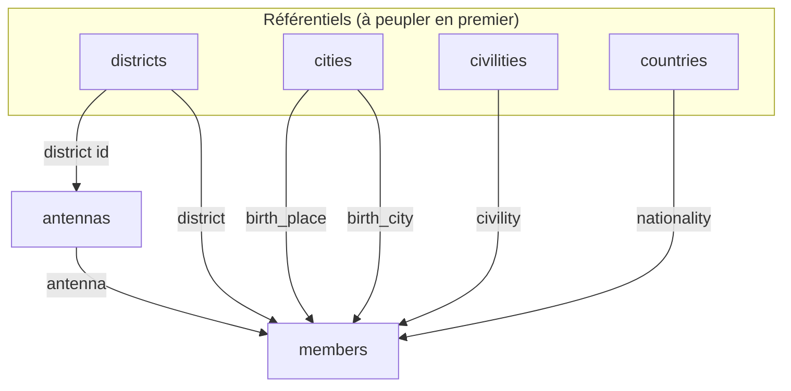

# Script de peuplement des données de référence (création de membre)

**Objectif** : peupler les tables de nomenclature nécessaires au formulaire de **création d'un membre**
(feature 009 / API 002 / référentiels 010) : `civilities`, `countries` (nationalité), `cities`
(lieu / ville de naissance), `districts`, et quelques `antennas` d'exemple.

**Cible** : SQL Server (base pilotée en code-first). Script **idempotent** (rejouable : n'insère que
les codes absents). Aucun `DELETE`/`TRUNCATE` — purement additif.

> **Trajectoire prévue**
> - **`antennas`** : données d'amorçage temporaires ici ; un **module CRUD Antennes** les gérera ensuite.
> - **`countries` (nationalités)** et **`cities`** : à terme **intégrées comme seed de migration**
>   (`HasData` / migration dédiée). Ce script sert d'amorçage immédiat en attendant.

## Schéma & dépendances d'insertion

Les champs FK de `members` pointent vers ces tables ; il faut donc peupler les référentiels **avant**
de créer un membre. `antennas.district` est un **entier** référençant un id de `districts`.



**Ordre** : `districts` → `cities` / `civilities` / `countries` (indépendants) → `antennas` → (création de membres).

## Colonnes ciblées (rappel du mapping réel)

| Table | Colonnes métier | Longueurs | Audit |
|-------|-----------------|-----------|-------|
| `districts` | `code`, `label`, `status` | code 10 · label 150 · status 20 | `createdt`,`createdby`,`updatedt`,`updatedby` |
| `cities` | `code`, `label`, `status` | code 10 · label 150 · status 20 | idem |
| `civilities` | `code`, `label`, `status` | code 60 · label 100 · status 20 | idem |
| `countries` | `code`, `label_country`, `label_nationality`, `status` | code 10 · pays 200 · nationalité 210 · status 20 | idem |
| `antennas` | `code`, `label`, `district` (int → `districts.id`), `status` | code 60 · label 100 · status 20 | idem |

> Les valeurs ci-dessous (géographie ivoirienne / Abidjan) sont **illustratives** : adaptez-les à
> votre réalité. Seuls les **codes** servent de clé d'idempotence.

## Script T-SQL (idempotent)

```sql
-- =============================================================================
-- Lumineux — Amorçage des données de référence pour la création de membre.
-- Idempotent : réexécutable sans créer de doublon (clé = colonne `code`).
-- Sûr : aucune suppression. À exécuter sur la base cible (SSMS / sqlcmd).
-- =============================================================================
SET NOCOUNT ON;
SET XACT_ABORT ON;

DECLARE @now  datetime2 = SYSUTCDATETIME();
DECLARE @by   nvarchar(255) = N'seed';

BEGIN TRANSACTION;

-- 1) DISTRICTS (quartiers / communes) --------------------------------------------------
INSERT INTO districts (code, label, status, createdt, createdby)
SELECT v.code, v.label, N'Active', @now, @by
FROM (VALUES
    (N'COC', N'Cocody'),
    (N'YOP', N'Yopougon'),
    (N'ABO', N'Abobo'),
    (N'PLT', N'Plateau'),
    (N'MAR', N'Marcory'),
    (N'TRE', N'Treichville'),
    (N'ADJ', N'Adjamé'),
    (N'KOU', N'Koumassi')
) AS v(code, label)
WHERE NOT EXISTS (SELECT 1 FROM districts d WHERE d.code = v.code);

-- 2) CITIES (villes — lieu & ville de naissance) ---------------------------------------
INSERT INTO cities (code, label, status, createdt, createdby)
SELECT v.code, v.label, N'Active', @now, @by
FROM (VALUES
    (N'ABJ', N'Abidjan'),
    (N'YAM', N'Yamoussoukro'),
    (N'BKE', N'Bouaké'),
    (N'SPE', N'San-Pédro'),
    (N'KOR', N'Korhogo'),
    (N'DAL', N'Daloa'),
    (N'MAN', N'Man'),
    (N'GAG', N'Gagnoa')
) AS v(code, label)
WHERE NOT EXISTS (SELECT 1 FROM cities c WHERE c.code = v.code);

-- 3) CIVILITIES (civilités) ------------------------------------------------------------
INSERT INTO civilities (code, label, status, createdt, createdby)
SELECT v.code, v.label, N'Active', @now, @by
FROM (VALUES
    (N'M',    N'Monsieur'),
    (N'MME',  N'Madame'),
    (N'MLLE', N'Mademoiselle'),
    (N'DR',   N'Docteur'),
    (N'PR',   N'Professeur')
) AS v(code, label)
WHERE NOT EXISTS (SELECT 1 FROM civilities x WHERE x.code = v.code);

-- 4) COUNTRIES (pays + nationalité) ----------------------------------------------------
INSERT INTO countries (code, label_country, label_nationality, status, createdt, createdby)
SELECT v.code, v.country, v.nationality, N'Active', @now, @by
FROM (VALUES
    (N'CI', N'Côte d''Ivoire', N'Ivoirienne'),
    (N'FR', N'France',         N'Française'),
    (N'SN', N'Sénégal',        N'Sénégalaise'),
    (N'ML', N'Mali',           N'Malienne'),
    (N'BF', N'Burkina Faso',   N'Burkinabè'),
    (N'GH', N'Ghana',          N'Ghanéenne'),
    (N'BJ', N'Bénin',          N'Béninoise'),
    (N'TG', N'Togo',           N'Togolaise'),
    (N'CM', N'Cameroun',       N'Camerounaise'),
    (N'NG', N'Nigeria',        N'Nigériane')
) AS v(code, country, nationality)
WHERE NOT EXISTS (SELECT 1 FROM countries c WHERE c.code = v.code);

-- 5) ANTENNAS (amorçage temporaire — futur module CRUD) --------------------------------
--    `district` = id résolu depuis districts.code.
INSERT INTO antennas (code, label, district, status, createdt, createdby)
SELECT v.code, v.label,
       (SELECT d.id FROM districts d WHERE d.code = v.district_code),
       N'Active', @now, @by
FROM (VALUES
    (N'ANT-COC', N'Antenne Cocody',   N'COC'),
    (N'ANT-YOP', N'Antenne Yopougon', N'YOP'),
    (N'ANT-PLT', N'Antenne Plateau',  N'PLT')
) AS v(code, label, district_code)
WHERE NOT EXISTS (SELECT 1 FROM antennas a WHERE a.code = v.code)
  AND EXISTS     (SELECT 1 FROM districts d WHERE d.code = v.district_code);

COMMIT TRANSACTION;

-- Contrôle rapide des volumes insérés / présents.
SELECT 'districts' AS ref, COUNT(*) AS total FROM districts
UNION ALL SELECT 'cities',     COUNT(*) FROM cities
UNION ALL SELECT 'civilities', COUNT(*) FROM civilities
UNION ALL SELECT 'countries',  COUNT(*) FROM countries
UNION ALL SELECT 'antennas',   COUNT(*) FROM antennas;
```

## Exécution

Depuis la racine du projet (adapter `-S` serveur, `-d` base, et l'authentification) :

```powershell
# Authentification Windows (SQL Server local)
sqlcmd -S localhost -d Lumineux -E -i ai-specs\seed-reference-data.sql

# ... ou authentification SQL
sqlcmd -S localhost -d Lumineux -U <user> -P <motdepasse> -i ai-specs\seed-reference-data.sql
```

> Le script vit ici en Markdown. Pour l'exécuter, copiez le bloc SQL dans un fichier
> `ai-specs\seed-reference-data.sql` (ou collez-le directement dans SSMS).
> `sqlcmd` effectue un appel à la base : à lancer manuellement de votre côté (aucune exécution
> automatique depuis l'assistant).

## Vérification fonctionnelle

Après exécution, l'API `GET /api/v1/reference/{antennas|civilities|cities|districts|countries}`
(feature 010) doit renvoyer ces entrées, et le formulaire de **création de membre** (SPA) doit
proposer les listes déroulantes peuplées — antenne d'origine sélectionnable en particulier.

## Notes de sécurité & qualité

- **Idempotence** par `code` : réexécutions sûres, pas de doublon.
- **Aucune suppression** ni mise à jour destructive ; transaction + `XACT_ABORT` pour l'atomicité.
- `status = 'Active'` : les référentiels sont directement exploitables (les listes filtrent souvent
  sur l'actif).
- **À faire ensuite** :
  - Migrer `countries` et `cities` vers un **seed de migration** (`HasData`) pour un provisionnement
    reproductible sur base vierge (Principe II — Code-First).
  - Remplacer l'amorçage `antennas` par le **module CRUD Antennes**.
  - Ajuster les libellés/codes à la géographie réelle de l'association.
```
