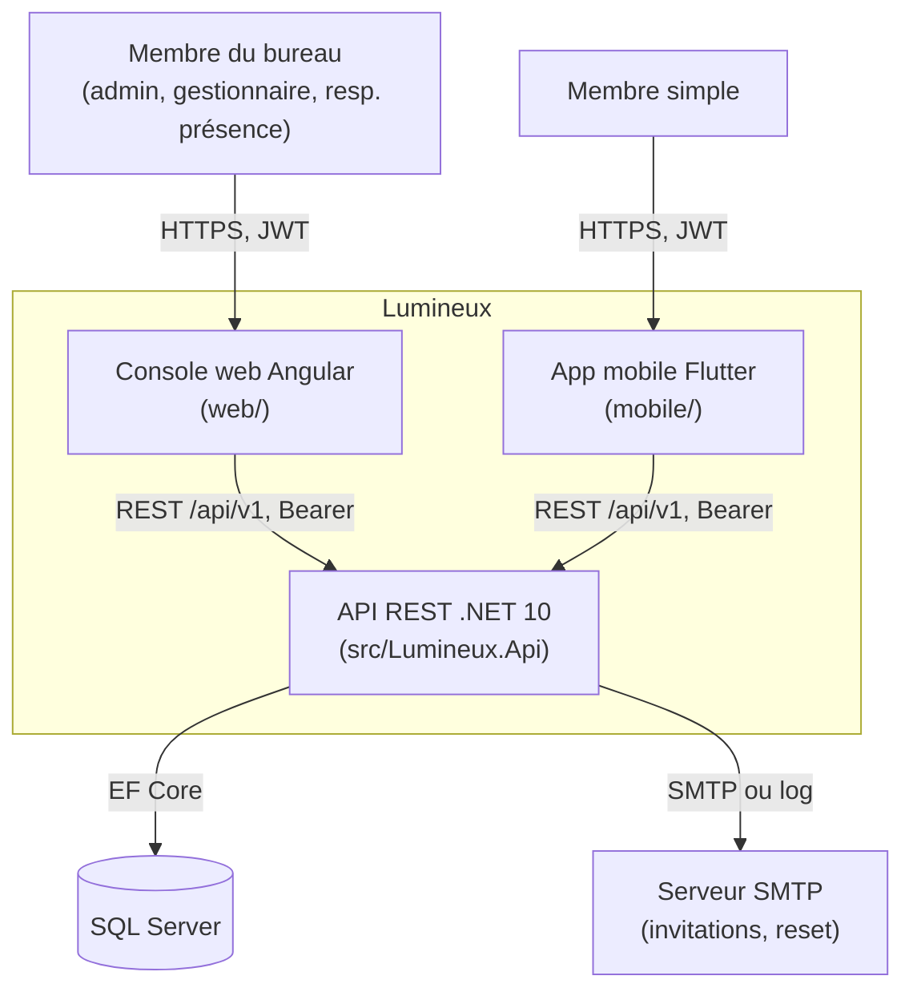

# 01 — Vue d'ensemble

## Sommaire

1. [À quoi sert la solution](#à-quoi-sert-la-solution)
2. [Stack et versions](#stack-et-versions)
3. [Prérequis](#prérequis)
4. [Builder, lancer, tester](#builder-lancer-tester)
5. [Diagramme de contexte](#diagramme-de-contexte)
6. [Sources analysées](#sources-analysées)

## À quoi sert la solution

**Lumineux** est le système d'information de l'association du même nom. Il permet au **bureau**
de gérer au quotidien :

- les **membres** de la communauté (enrôlement, fiche d'identité, rattachement à une antenne) ;
- les **présences** aux réunions, via des **sessions de présence** matérialisées par un **QR code
  rotatif** que les membres scannent avec leur téléphone pour prouver leur présence ;
- les **droits d'accès** (profils du bureau regroupant des permissions fonctionnelles) ;
- le **cycle de vie des comptes** (activation à la première connexion, mot de passe oublié, verrouillage).

Trois applications composent le produit :

1. **API REST** (`src/`) — le cœur : porte toute la logique métier et la persistance. Unique source de vérité.
2. **Console web bureau** (`web/`, Angular) — back-office : membres, profils, sessions, rapports.
   Affiche et projette le QR ; ne scanne pas.
3. **App mobile membre** (`mobile/`, Flutter) — côté terrain : le membre s'authentifie et **scanne**
   le QR pour marquer sa présence, avec **capture hors ligne** et synchronisation par lot.

Le cadrage produit détaillé (personas, périmètre, roadmap par lots) est dans `PO_description.md`.

## Stack et versions

### API (.NET)

Source : `Directory.Build.props`, `Directory.Packages.props`, `*.csproj`.

| Élément | Valeur |
|---------|--------|
| Framework cible | **net10.0** (`Directory.Build.props`) |
| Langage | C# `LangVersion=latest`, `Nullable=enable`, `ImplicitUsings=enable` |
| ORM | **EF Core 10.0.0** (SqlServer + Sqlite pour les tests, Design) |
| Base de données | **SQL Server** (`options.UseSqlServer`, `Infrastructure/DependencyInjection.cs`) |
| Auth | JWT Bearer (`Microsoft.AspNetCore.Authentication.JwtBearer` 10.0.0, `System.IdentityModel.Tokens.Jwt` 8.3.0) |
| Validation | **FluentValidation 11.11.0** |
| Hachage mot de passe | `Microsoft.Extensions.Identity.Core` 10.0.0 (`PasswordHasher`, PBKDF2) |
| Logs | **Serilog.AspNetCore 9.0.0** (console + request logging) |
| OpenAPI | **Swashbuckle 7.2.0** (Swagger UI en dev) |
| Tests | xUnit 2.9.2, FluentAssertions 6.12.2, NSubstitute 5.3.0, `Mvc.Testing` 10.0.0, coverlet |
| Gestion des versions | **Central Package Management** (`Directory.Packages.props`) |

> Note : le fichier de solution est au format récent **`.slnx`** (`Lumineux.slnx`), pas `.sln`.

### Console web

Source : `web/package.json`.

| Élément | Valeur |
|---------|--------|
| Framework | **Angular 20.3** (composants standalone, signals) |
| Langage | TypeScript 5.9 |
| QR | `angularx-qrcode` 20 + `qrcode` 1.5 |
| Tests | Karma/Jasmine + Vitest + **Playwright** (e2e) |

### App mobile

Source : `mobile/pubspec.yaml`.

| Élément | Valeur |
|---------|--------|
| SDK | **Flutter** (canal stable, `3.44.5` en CI), Dart `>=3.7.0 <4.0.0` |
| État / DI | `flutter_riverpod` 2.6 |
| Navigation | `go_router` 14.6 |
| HTTP | `dio` 5.7 (intercepteurs Bearer + erreurs) |
| Stockage sécurisé | `flutter_secure_storage` 9.2 (Keychain/Keystore) |
| Scan | `mobile_scanner` 7.2, `permission_handler` 12 |
| Connectivité | `connectivity_plus` 6.1 (déclencheur de synchro hors ligne) |

## Prérequis

- **.NET SDK 10** (pour builder/tester l'API).
- **SQL Server** accessible (chaîne `ConnectionStrings:Default`). En dev :
  `Server=localhost;Database=Lumineux;Trusted_Connection=True;TrustServerCertificate=True`
  (`src/Lumineux.Api/appsettings.Development.json`).
- **Node.js + Angular CLI 20** pour la console web.
- **Flutter SDK stable** pour l'app mobile.
- Outil `dotnet-ef` pour appliquer les migrations. ⚠️ Hypothèse — à confirmer : aucun script
  d'application automatique des migrations au démarrage n'a été trouvé dans `Program.cs` ; la base
  doit être migrée manuellement (`dotnet ef database update`).

## Builder, lancer, tester

> ⚠️ Les commandes ci-dessous sont **déduites** de la structure standard .NET/Angular/Flutter.
> Aucun script d'orchestration racine (Makefile, `build.ps1`) n'a été trouvé au niveau du dépôt.

### API

```bash
# À la racine du dépôt
dotnet build Lumineux.slnx
dotnet test Lumineux.slnx                       # 373 tests (xUnit)
dotnet run --project src/Lumineux.Api            # Swagger UI en dev sur /swagger
```

Configurer avant lancement (hors dev) : `ConnectionStrings:Default`, `Jwt:SigningKey`,
`Cors:AllowedOrigins` (voir 06-configuration-deploiement.md).

### Console web

```bash
cd web
npm install
npm start        # ng serve, http://localhost:4200
npm test         # Karma/Vitest
npm run e2e      # Playwright
```

### App mobile

```bash
cd mobile
flutter pub get
flutter run --dart-define-from-file=env/dev.json   # profils : dev / device / usb / prod
flutter test
```

## Diagramme de contexte

Le diagramme montre le système Lumineux, ses acteurs et ses dépendances externes.



Points d'attention :

- Les deux clients ne parlent **qu'à l'API** ; aucun accès direct à la base ou au SMTP.
- L'e-mail peut être un **vrai SMTP** ou un simple **logger** selon `Email:Provider`
  (voir `Infrastructure/DependencyInjection.cs`).
- Le lien de réinitialisation pointe vers la **SPA** (`Auth:PasswordResetUrlBase`), pas vers l'API.

## Sources analysées

- `Directory.Build.props`, `Directory.Packages.props`, `Lumineux.slnx`
- `src/Lumineux.Api/Program.cs`, `appsettings.json`, `appsettings.Development.json`
- `src/Lumineux.Infrastructure/DependencyInjection.cs`
- `web/package.json`, `mobile/pubspec.yaml`, `mobile/env/*.json`
- `PO_description.md`, `specs/` (liste des features)
</content>
