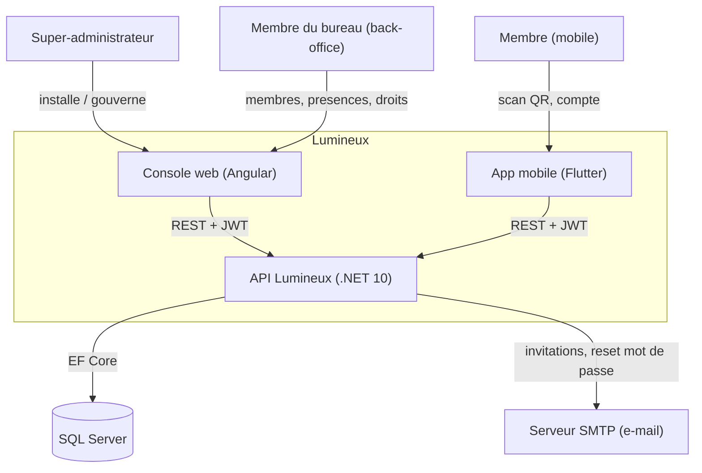

# 01 — Vue d'ensemble

## Sommaire

- [À quoi sert la solution](#à-quoi-sert-la-solution)
- [Stack et versions](#stack-et-versions)
- [Prérequis](#prérequis)
- [Builder, lancer, tester](#builder-lancer-tester)
- [Diagramme de contexte](#diagramme-de-contexte)
- [Sources analysées](#sources-analysées)

## À quoi sert la solution

Lumineux est le système de gestion d'une **communauté associative** organisée en
**antennes** (lieux de réunion). Le besoin métier premier, et le plus abouti dans
le code, est la **gestion des présences** aux réunions : un membre du bureau ouvre
une **session** de présence dans une antenne, un **code QR rotatif** est projeté,
les membres le scannent avec l'application mobile pour être pointés à leur heure
d'arrivée, et le bureau peut aussi ajouter manuellement les présents non équipés.
La clôture de la session fixe l'heure de fin de réunion pour tous les présents.
(`src/Lumineux.Domain/Entities/AttendanceSession.cs`, `Attendance.cs`, `Starter.md`.)

Autour de ce cœur, la solution gère :

- **Les membres** : fiche d'identité complète (état civil, contacts, rattachement
  à une antenne d'origine, introducteur), avec référence unique servant
  d'identifiant de connexion (`Member.cs`, `Members/CreateMemberHandler.cs`).
- **Les comptes et l'authentification** : provisionnement d'un compte à la création
  du membre, mot de passe temporaire, activation, connexion JWT, verrouillage après
  échecs, mot de passe oublié (`MemberAccount.cs`, `Auth/*Handler.cs`).
- **Les droits (RBAC)** : des **profils du bureau** regroupent des permissions
  fonctionnelles, attribuées aux membres ; les droits effectifs sont l'union des
  permissions des profils portés (`BureauProfile.cs`, `EffectivePermissionsReader.cs`).
- **Les antennes** et **référentiels** (civilités, pays, villes, districts).
- **Les rapports** de présence (synthèse par antenne, série temporelle, taux de
  présence par membre, export CSV) — `src/Lumineux.Application/Reports/`.

Deux frontaux consomment l'API : une **console web Angular** (back-office bureau,
dashboard complet) et une **application mobile Flutter** (membre : scan QR,
capture hors ligne, cycle de vie du compte).

## Stack et versions

| Composant | Technologie | Version cible (constatée) | Source |
|-----------|-------------|---------------------------|--------|
| Backend | .NET / ASP.NET Core Web API | `net10.0` | `Directory.Build.props` |
| ORM | EF Core (SQL Server) | `10.0.0` | `Directory.Packages.props` |
| Auth | JWT Bearer (HMAC-SHA256) | pkg `10.0.0` / `8.3.0` | `Directory.Packages.props`, `JwtTokenIssuer.cs` |
| Validation | FluentValidation | `11.11.0` | `Directory.Packages.props` |
| Logs | Serilog.AspNetCore | `9.0.0` | `Program.cs` |
| API docs | Swashbuckle (Swagger) | `7.2.0` | `Program.cs` |
| Tests backend | xUnit + FluentAssertions + NSubstitute | `2.9.2` / `6.12.2` / `5.3.0` | `Directory.Packages.props` |
| Console web | Angular (standalone) | `^20.3` | `web/package.json` |
| QR (web) | angularx-qrcode / qrcode | `^20.0` / `^1.5.4` | `web/package.json` |
| Tests web | Vitest / Karma+Jasmine / Playwright | — | `web/package.json` |
| Mobile | Flutter / Dart | Dart `>=3.7 <4.0` | `mobile/pubspec.yaml` |
| État mobile | Riverpod / go_router / Dio | `^2.6` / `^14.6` / `^5.7` | `mobile/pubspec.yaml` |
| Scan / stockage | mobile_scanner / flutter_secure_storage | `^7.2` / `^9.2` | `mobile/pubspec.yaml` |

Le versionnement des paquets NuGet est **centralisé** (`ManagePackageVersionsCentrally`)
dans `Directory.Packages.props` ; `Nullable` et `ImplicitUsings` sont activés, les
analyseurs .NET sont en `latest-recommended` (`Directory.Build.props`).

> Note : `.NET 10`, `EF Core 10` et `Angular 20` sont des versions récentes ;
> vérifier leur disponibilité GA sur l'environnement de build ciblé.

## Prérequis

- **SDK .NET 10** (backend, CI : `dotnet-version: 10.0.x`).
- **SQL Server** accessible (chaîne `ConnectionStrings:Default`).
- **Node.js 22** + npm (console web, CI : `node-version: 22`).
- **Flutter stable 3.44.5** (mobile, CI : `subosito/flutter-action`).
- **Secret JWT obligatoire** : `Jwt:SigningKey` (min. 32 octets) — le démarrage de
  l'API échoue volontairement s'il est absent ou trop court (`Program.cs` l.108-115).

## Builder, lancer, tester

**Backend** (depuis la racine) :

```bash
dotnet restore Lumineux.slnx
dotnet build Lumineux.slnx -c Release
dotnet test Lumineux.slnx -c Release        # ~83 fichiers de tests
# Fournir le secret en dev avant de lancer l'API :
dotnet user-secrets set "Jwt:SigningKey" "<clé aléatoire >= 32 octets>" \
  --project src/Lumineux.Api
dotnet run --project src/Lumineux.Api        # Swagger exposé en Development
```

**Migrations base de données** (code-first) :

```bash
# Un AppDbContextFactory existe pour les outils EF (design-time).
dotnet ef database update --project src/Lumineux.Infrastructure \
  --startup-project src/Lumineux.Api
```

(`src/Lumineux.Infrastructure/Persistence/AppDbContextFactory.cs`.)

**Console web** :

```bash
cd web
npm ci
npm start          # ng serve (http://localhost:4200)
npm test           # tests unitaires
npm run build      # build de production
npm run e2e        # Playwright
```

**Mobile** :

```bash
cd mobile
flutter pub get
flutter analyze
flutter test
flutter run
```

## Diagramme de contexte

Ce diagramme montre le système Lumineux, ses acteurs humains et les systèmes
externes avec lesquels il interagit.



Points d'attention :

- L'API est **la seule source de vérité** des règles métier ; web et mobile
  appliquent les droits côté UX mais l'API reste l'autorité (`PO_description.md`,
  `guards.ts`).
- L'e-mail est **optionnel** : sans configuration SMTP, un émetteur de repli
  journalise (`LoggingEmailSender`) et les identifiants sont remis « en main
  propre » par le bureau (`CreateMemberHandler.cs`).

## Sources analysées

- `Directory.Build.props`, `Directory.Packages.props`, `Lumineux.slnx`
- `src/Lumineux.Api/Program.cs`
- `web/package.json`, `mobile/pubspec.yaml`
- `.github/workflows/dotnet-ci.yml`, `.github/workflows/mobile-ci.yml`
- `Starter.md`, `PO_description.md`
</content>
