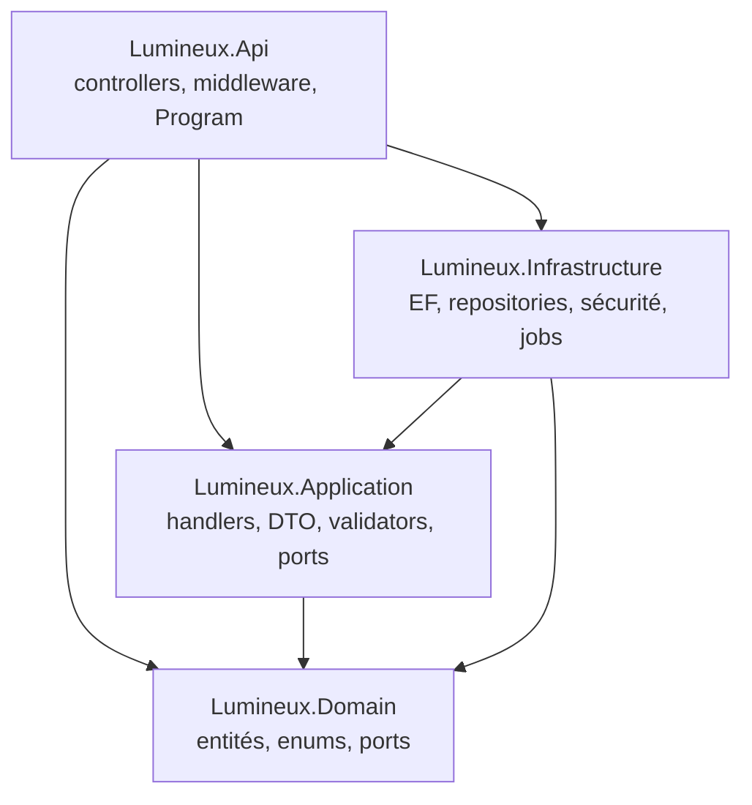
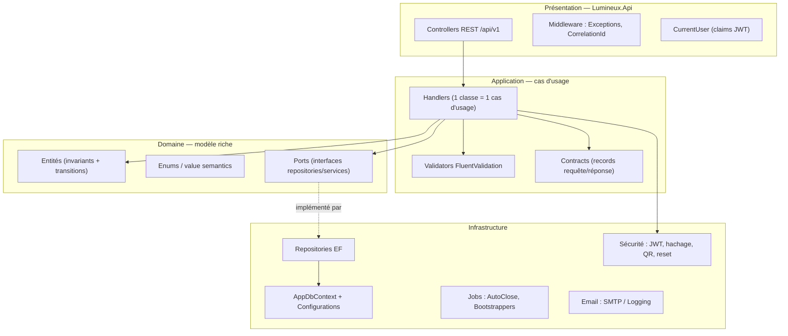
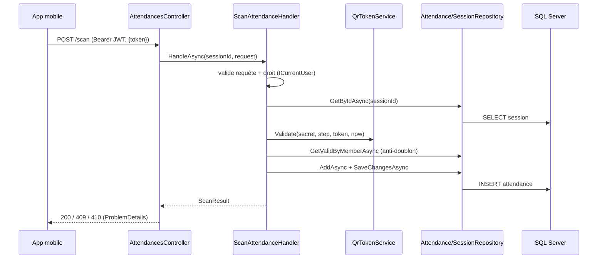

# 02 — Architecture

## Sommaire

1. [Vue générale](#vue-générale)
2. [Projets et dépendances](#projets-et-dépendances)
3. [Couches logiques réelles](#couches-logiques-réelles)
4. [Patterns identifiés (avec preuve)](#patterns-identifiés-avec-preuve)
5. [Flux d'une requête](#flux-dune-requête)
6. [Points de friction et écarts](#points-de-friction-et-écarts)
7. [Sources analysées](#sources-analysées)

## Vue générale

L'API suit une **architecture en oignon (Clean Architecture)** stricte à 4 projets. La règle de
dépendance pointe vers l'intérieur : `Domain` ne dépend de rien, `Application` dépend de `Domain`,
`Infrastructure` et `Api` dépendent des deux. Les inversions de dépendance passent par des
**ports** (interfaces) définis dans `Domain/Abstractions` et `Application/Abstractions`, implémentés
dans `Infrastructure` et `Api`.

## Projets et dépendances

Diagramme des 4 projets applicatifs et de leurs implémentations de ports.

Points d'attention :

- `Api` référence `Infrastructure` **uniquement pour le câblage DI** (`AddInfrastructure`) et la
  validation JWT (`JwtOptions`, `Program.cs`) ; les controllers ne dépendent que des handlers `Application`.
- `Infrastructure` dépend de `Application` car il implémente des ports déclarés côté Application
  (`ITokenIssuer`, `IAuditLogger`, `ICurrentUser`) et réutilise `Permissions`/`AuthOptions`.
- Deux familles de ports : ceux du **Domain** (`IMemberRepository`, `IClock`, `IEmailSender`,
  `IQrTokenService`…) et ceux de l'**Application** (`ICurrentUser`, `ITokenIssuer`, `IAuditLogger`).

Les tests miroir chaque couche : `tests/Lumineux.{Domain,Application,Infrastructure,Api}.Tests`.

## Couches logiques réelles

Observations vérifiées :

- **Domaine riche, pas anémique** : les entités portent leurs invariants (fabriques `Create`) et
  leurs transitions (`AttendanceSession.Close/Cancel/AutoClose`, `MemberAccount.RegisterFailedLogin`,
  `PasswordResetToken.Consume`). Voir `src/Lumineux.Domain/Entities/`.
- **Un handler par cas d'usage** (`Application/**/*Handler.cs`), enregistrés explicitement dans
  `Application/DependencyInjection.cs` (pas de médiateur type MediatR).
- **Controllers minces** : ils délèguent au handler et laissent le middleware traduire les exceptions.

## Patterns identifiés (avec preuve)

| Pattern | Preuve |
|---------|--------|
| **Clean/Onion Architecture** | Découpage 4 projets + règle de dépendance (`.csproj`, `.slnx`) |
| **Repository** | `IMemberRepository`, `IAttendanceRepository`… (Domain) → `*Repository` (Infrastructure) |
| **Séparation lecture/écriture (CQRS léger)** | Ports distincts `IAntennaRepository` vs `IAntennaReadRepository`, `IMemberRepository` vs `IMemberReadRepository`, repos dédiés rapports (`IAttendanceReportRepository`) |
| **Unit of Work implicite** | `SaveChangesAsync` du repo = frontière transactionnelle ; membre+compte créés en un seul save (`CreateMemberHandler`) |
| **Ports & Adapters (DI)** | `AddApplication` / `AddInfrastructure`, injection par constructeur partout |
| **Interceptor** | `AuditInterceptor : SaveChangesInterceptor` peuple `createdt/by`, `updatedt/by` |
| **Options pattern** | `JwtOptions`, `AuthOptions`, `EmailOptions`, `AutoCloseOptions`, `MemberReferenceOptions` |
| **Hosted / Background services** | `SessionAutoCloseService`, `PermissionBootstrapper`, `BureauProfilesBootstrapper` |
| **Middleware pipeline** | `ExceptionHandlingMiddleware` (RFC 7807), `CorrelationIdMiddleware` |
| **Policy-based authorization** | Policies par permission dans `Program.cs`, `[Authorize(Policy=…)]` sur controllers |
| **Factory design-time** | `AppDbContextFactory : IDesignTimeDbContextFactory` |
| **Strategy (résolution runtime)** | Choix `SmtpEmailSender` vs `LoggingEmailSender` selon `Email:Provider` |

## Flux d'une requête

Exemple : `POST /api/v1/attendance-sessions/{id}/scan` (scan de présence).

## Points de friction et écarts

- **Contrôle d'autorisation en double** : la plupart des endpoints sont protégés par
  `[Authorize(Policy=…)]` **et** par une re-vérification `_user.HasPermission(...)` dans le handler
  (ex. `StartSessionHandler`, `AddManualAttendanceHandler`, `CreateMemberHandler`). C'est de la
  défense en profondeur, mais certains controllers laissent le handler seul juge (voir ci-dessous).
- **`AttendancesController` marqué `[Authorize]` simple** : le scan (`/scan`, `/scan/batch`) n'exige
  aucune policy au niveau route (tout membre authentifié peut scanner — c'est voulu), tandis que
  `attendances` (ajout/liste/suppression manuelle) porte `[Authorize(Policy=ManageAttendance)]`.
- **`TestTokenIssuer` enregistré dans la DI de production** (`Infrastructure/DependencyInjection.cs`,
  `services.AddScoped<TestTokenIssuer>()`). Classe destinée aux tests, mais présente dans le conteneur
  applicatif. Voir 07-dette-technique (Mineur).
- **Deux sources de permissions** : `member_permissions` (héritée, feature 003) et l'union des droits
  via profils du bureau (`MemberPermissionRepository.GetPermissionsAsync`). Le jeton n'utilise **que**
  les profils ; `member_permissions` ne sert plus qu'aux bootstrappers. Voir 04 et 07.
- **Aucune application automatique des migrations** dans `Program.cs` : la mise à jour du schéma est
  une étape opératoire externe. ⚠️ Hypothèse — à confirmer.

## Sources analysées

- `src/Lumineux.*/**.csproj`, `Lumineux.slnx`
- `src/Lumineux.Api/Program.cs`, controllers, middleware, `Security/CurrentUser.cs`
- `src/Lumineux.Application/DependencyInjection.cs` et handlers
- `src/Lumineux.Infrastructure/DependencyInjection.cs`, repositories, `Persistence/Interceptors/AuditInterceptor.cs`
- `src/Lumineux.Domain/Entities/`, `Abstractions/`
</content>
