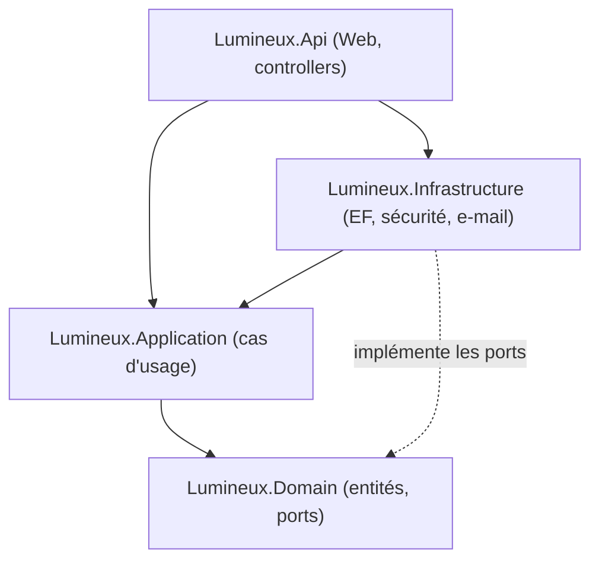
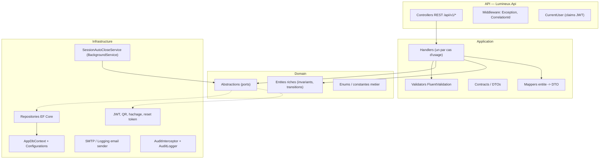
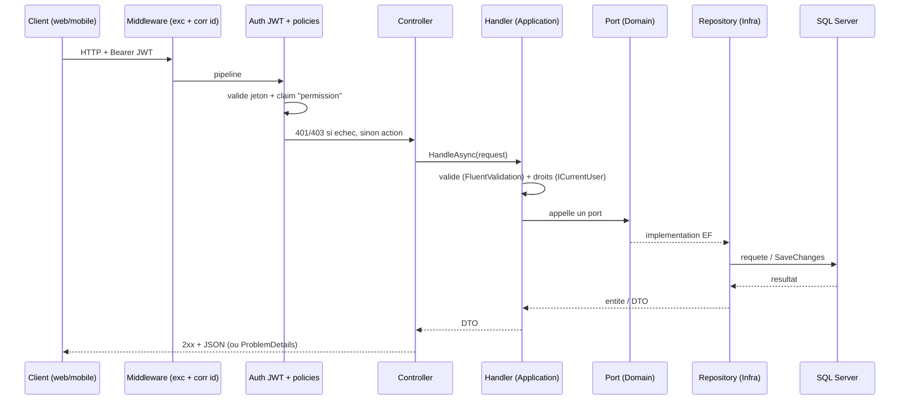

# 02 — Architecture

## Sommaire

- [Vue macro](#vue-macro)
- [Projets .NET et dépendances](#projets-net-et-dépendances)
- [Couches logiques réelles](#couches-logiques-réelles)
- [Patterns identifiés](#patterns-identifiés)
- [Flux d'une requête type](#flux-dune-requête-type)
- [Violations et écarts constatés](#violations-et-écarts-constatés)
- [Sources analysées](#sources-analysées)

## Vue macro

La solution suit une **architecture en oignon** (Clean/Onion) revendiquée
(`Starter.md`, commentaire `Program.cs` l.21). Le backend est découpé en quatre
projets avec dépendances dirigées vers le domaine. Deux clients (Angular, Flutter)
consomment l'API HTTP.

## Projets .NET et dépendances

Ce diagramme montre les références inter-projets réelles, extraites des `.csproj`.

Références telles que déclarées :

- `Lumineux.Api` → `Application` + `Infrastructure` (`Lumineux.Api.csproj`).
- `Lumineux.Application` → `Domain` (`Lumineux.Application.csproj`).
- `Lumineux.Infrastructure` → `Application` (`Lumineux.Infrastructure.csproj`).
- `Lumineux.Domain` → **aucune** dépendance projet ni paquet
  (`Lumineux.Domain.csproj` est vide) : domaine pur.

Point d'attention : `Infrastructure` référence `Application` (et non seulement
`Domain`). C'est cohérent avec le fait que certaines abstractions (ex.
`ICurrentUser`, `AuthOptions`, `IAuditLogger`, `Permissions`) vivent dans
`Application/Abstractions` et sont implémentées/consommées par l'infrastructure.
Les **ports de persistance** (`IMemberRepository`, `IAttendanceRepository`…) et
les **ports techniques** (`IClock`, `IEmailSender`, `IQrTokenService`,
`IPasswordHasher`…) résident, eux, dans `Domain/Abstractions`.

## Couches logiques réelles

Ce diagramme (flowchart + subgraphs) montre les responsabilités effectives par
couche, telles que le code les organise.

- **API** : controllers fins, une action = un appel de handler. Autorisation par
  policies (`[Authorize(Policy = Permissions.*)]`). Traduction des exceptions en
  `ProblemDetails` RFC 7807 (`ExceptionHandlingMiddleware.cs`).
- **Application** : un **handler par cas d'usage** (pas de MediatR ; instanciation
  directe via DI). Validation en entrée, vérification des droits, orchestration des
  ports, mapping vers DTO. Enregistrés en `Scoped` dans `DependencyInjection.cs`.
- **Domain** : entités **riches** (fabriques statiques `Create`/`Start`/`Issue`,
  méthodes de transition, invariants levant `DomainException`/`ConflictException`).
- **Infrastructure** : implémentations EF des ports, services de sécurité, job de
  fond, envoi d'e-mail, audit.

## Patterns identifiés

| Pattern | Preuve | Localisation |
|---------|--------|--------------|
| Onion / Clean Architecture | dépendances dirigées vers `Domain` | ensemble des `.csproj` |
| Ports & Adapters (DIP) | interfaces `I*Repository`, `IClock`, `IEmailSender`, `IQrTokenService`… | `Domain/Abstractions`, `Application/Abstractions` |
| Repository | `MemberRepository`, `AttendanceRepository`, etc. | `Infrastructure/Repositories/` |
| Handler / Use-case (CQRS léger) | un handler par action ; lecture vs écriture séparées (`I*ReadRepository`) | `Application/**Handler.cs` |
| Domain model riche | fabriques + méthodes de transition sur les entités | `Domain/Entities/*.cs` |
| Options pattern | `JwtOptions`, `AuthOptions`, `AutoCloseOptions`, `EmailOptions`… | `*/Security`, `*/BackgroundJobs` |
| Interceptor (cross-cutting) | audit `CreatedAt/By`, `UpdatedAt/By` automatique | `AuditInterceptor.cs` |
| Middleware | corrélation + traduction d'erreurs | `Api/Middleware/` |
| Background worker | clôture automatique périodique | `SessionAutoCloseService.cs` |
| Émetteur de jeton substituable | `ITokenIssuer` (JWT en prod, `TestTokenIssuer` hors prod) | `DependencyInjection.cs` l. « TestTokenIssuer » |
| RFC 7807 ProblemDetails | mapping exception → statut + `code` | `ExceptionHandlingMiddleware.cs` |

Séparation lecture/écriture : plusieurs ports distinguent explicitement lecture
seule (`IMemberReadRepository`, `IAntennaReadRepository`,
`IAttendanceReportRepository`, `IReferenceLookupRepository`) et écriture
(`IMemberRepository`, `IAntennaRepository`, `IAttendanceRepository`) — CQRS léger
sans bus ni event sourcing.

## Flux d'une requête type

Ce diagramme montre le trajet d'un appel authentifié (ex. démarrer une session).

## Violations et écarts constatés

- **Double contrôle des droits** (défense en profondeur, pas une faille) : les
  policies ASP.NET (`[Authorize(Policy=…)]`) **et** les handlers
  (`_user.HasPermission(...)`) vérifient les permissions. C'est redondant mais
  intentionnel (le handler reste protégé même appelé hors HTTP). Certains endpoints
  s'appuient uniquement sur `[Authorize]` + contrôle applicatif (ex. bureau
  profiles) — cf. 07 pour la cohérence.
- **`Member` a des setters publics** alors que les autres entités riches
  (`MemberAccount`, `AttendanceSession`, `Attendance`) sont encapsulées. Choix
  assumé et commenté pour compatibilité (`Member.cs`), mais c'est une entorse à
  l'encapsulation du domaine (anémie partielle) — voir 08.
- **Logique métier dans la couche Application** : la règle « session vide » (comptage
  des présences) est portée par `CancelSessionHandler`/`CloseSessionHandler`, pas par
  l'entité (le domaine n'a pas le décompte). Documenté explicitement dans le code
  (`AttendanceSession.Cancel`). Fuite mineure et consciente.
- **Infrastructure → Application** : dépendance acceptable ici, mais elle signifie
  que des abstractions « applicatives » (ex. `Permissions`, `AuthOptions`) sont
  réutilisées côté infra, brouillant légèrement la frontière App/Infra.

## Sources analysées

- Tous les `src/*/*.csproj`
- `src/Lumineux.Api/Program.cs`, `Middleware/ExceptionHandlingMiddleware.cs`
- `src/Lumineux.Application/DependencyInjection.cs`
- `src/Lumineux.Infrastructure/DependencyInjection.cs`
- `src/Lumineux.Domain/Abstractions/*`, `src/Lumineux.Application/Abstractions/*`
</content>
