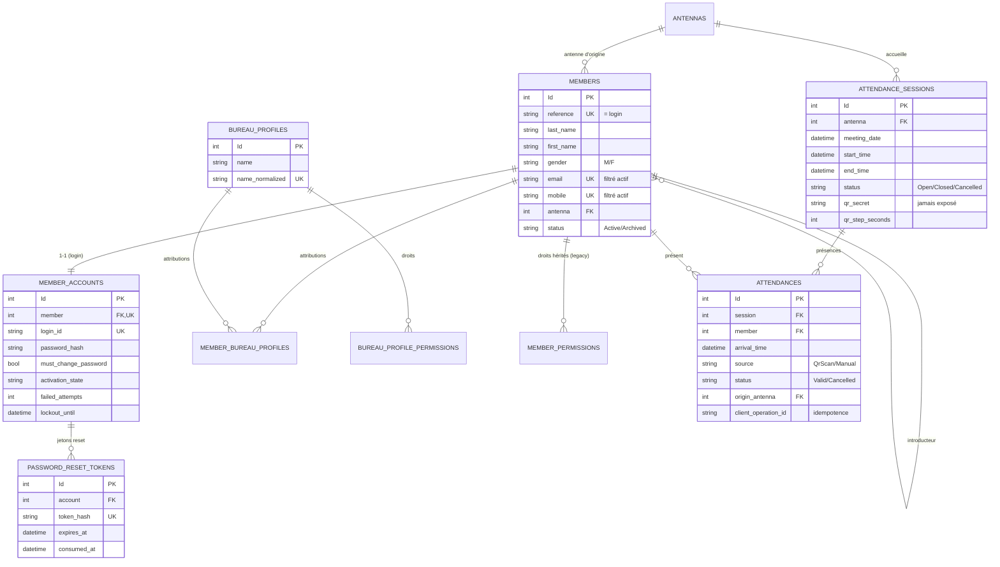

# 03 — Modèle de données

## Sommaire

1. [Vue d'ensemble](#vue-densemble)
2. [Diagramme entité-relation](#diagramme-entité-relation)
3. [Mapping code ↔ tables](#mapping-code--tables)
4. [Index et contraintes notables](#index-et-contraintes-notables)
5. [Configuration EF remarquable](#configuration-ef-remarquable)
6. [Stratégie de migration](#stratégie-de-migration)
7. [Sources analysées](#sources-analysées)

## Vue d'ensemble

Persistance **EF Core 10 sur SQL Server**. Le mapping est **fluent** : une classe
`IEntityTypeConfiguration<T>` par entité dans
`src/Lumineux.Infrastructure/Persistence/Configurations/`, agrégées par
`modelBuilder.ApplyConfigurationsFromAssembly(...)` dans `AppDbContext.OnModelCreating`.

Toutes les entités héritent d'`AbstractEntity` (`Id`, `CreatedAt/By`, `UpdatedAt/By`), mappé sur des
colonnes héritées `createdt`, `createdby`, `updatedt`, `updatedby` (`AuditColumns.Apply`). Les
noms de colonnes sont en **snake_case** et les tables au **pluriel minuscule** (ex. `members`,
`attendance_sessions`).

## Diagramme entité-relation

Le diagramme montre les entités principales et leurs cardinalités. Les nomenclatures (civilité,
pays, ville, district) sont des cibles de clé étrangère depuis `members`.

## Mapping code ↔ tables

| Entité (Domain) | Table | Configuration |
|-----------------|-------|---------------|
| `Member` | `members` | `MemberConfiguration.cs` |
| `MemberAccount` | `member_accounts` | `MemberAccountConfiguration.cs` |
| `Antenna` | `antennas` | `AntennaConfiguration.cs` |
| `AttendanceSession` | `attendance_sessions` | `AttendanceSessionConfiguration.cs` |
| `Attendance` | `attendances` | `AttendanceConfiguration.cs` |
| `BureauProfile` | `bureau_profiles` | `BureauProfileConfiguration.cs` |
| `BureauProfilePermission` | `bureau_profile_permissions` | idem |
| `MemberBureauProfile` | `member_bureau_profiles` | idem |
| `MemberPermission` | `member_permissions` | `MemberPermissionConfiguration.cs` |
| `PasswordResetToken` | `password_reset_tokens` | `PasswordResetTokenConfiguration.cs` |
| `Civility` | `civilities` | `ReferenceConfigurations.cs` |
| `Country` | `countries` | idem |
| `City` | `cities` | idem |
| `District` | `districts` | idem |

## Index et contraintes notables

Vérifiés dans les fichiers `Configuration` :

- **`members`** :
  - `reference` **unique** (= identifiant de connexion).
  - `email` **unique filtré** : `email IS NOT NULL AND status = 'Active'`.
  - `mobile` **unique filtré** : `mobile IS NOT NULL AND status = 'Active'`.
  - Index de recherche sur `last_name` et `first_name`.
  - Filtres écrits **sans quoting** pour rester portables SQL Server / SQLite (commentaire du code).
- **`member_accounts`** : `member` unique (1-1), `login_id` unique.
- **`attendances`** :
  - **Anti-doublon** : `(session, member)` unique filtré `status = 'Valid'` → un membre au plus une
    présence valide par session.
  - **Idempotence hors ligne** : `(session, client_operation_id)` unique filtré `client_operation_id IS NOT NULL`.
  - Index de consultation `(session, status)`.
- **`attendance_sessions`** : index `(antenna, status)` (retrouver la session ouverte d'une antenne).
- **`bureau_profiles`** : `name_normalized` unique (unicité insensible à la casse).
- **`bureau_profile_permissions`** : `(bureau_profile, permission)` unique.
- **`member_bureau_profiles`** : `(member, bureau_profile)` unique.
- **`member_permissions`** : `(member, permission)` unique.
- **`password_reset_tokens`** : `token_hash` unique + index sur `account`.

## Configuration EF remarquable

- **Conversions enum → string** : `AttendanceSource`, `AttendanceStatus`, `SessionStatus`,
  `AccountActivationState` sont stockés en chaîne (`HasConversion<string>().HasMaxLength(20)`).
  Lisible en base, mais couplé aux littéraux (`'Valid'`, `'Active'`, `'Open'`) utilisés dans les
  filtres d'index — un renommage d'enum casserait les filtres.
- **Propriétés calculées ignorées** : `Member.FullName`, `Member.IsActive`, `Antenna.IsActive`
  (`builder.Ignore(...)`).
- **Comportements de suppression** :
  - `Cascade` : `Attendance→AttendanceSession`, `MemberAccount→Member`, `PasswordResetToken→Account`,
    `BureauProfilePermission→BureauProfile`, `MemberBureauProfile→(Member,BureauProfile)`,
    `MemberPermission→Member`.
  - `Restrict` : toutes les FK de `Member` vers les nomenclatures et l'antenne, `Attendance→Member`,
    `Attendance→Antenna` (origine), `AttendanceSession→Antenna`.
- **Champs sensibles non exposés** : `member_accounts.password_hash`, `attendance_sessions.qr_secret`,
  `password_reset_tokens.token_hash` — présents en base, jamais renvoyés dans les DTO (vérifié via
  les mappers `ToResponse`).
- **Insertion atomique par navigation** : `MemberAccount.Member`, `PasswordResetToken.Account`,
  `MemberBureauProfile.Member/BureauProfile` — permet à EF de résoudre les FK avant que les Id
  parents soient générés (usage dans `CreateMemberHandler`, `InstallFirstAdminHandler`).

## Stratégie de migration

- Migrations EF Core versionnées dans `Persistence/Migrations/` — historique lisible via les noms :
  `InitialAttendance` → `AddAttendances` → `MemberRegistration` → `Authentication` → `BureauProfiles`
  → `PasswordReset` → `AntennaCodeUnique` → `CancelSession` (8 migrations, alignées sur les features).
- `AppDbContextModelSnapshot.cs` reflète le modèle courant.
- `AppDbContextFactory` fournit une chaîne design-time via la variable d'environnement `LUMINEUX_DB`
  (fallback `localhost`) pour exécuter `dotnet ef` sans démarrer l'API.
- ⚠️ Hypothèse — à confirmer : les migrations sont appliquées **manuellement** (aucun `Database.Migrate()`
  au démarrage dans `Program.cs`).

## Sources analysées

- `src/Lumineux.Infrastructure/Persistence/AppDbContext.cs`, `AppDbContextFactory.cs`
- Tous les fichiers de `Persistence/Configurations/`
- `Persistence/Migrations/` (liste et snapshot ; contenu SQL non relu en détail — cf. angles morts)
- `src/Lumineux.Domain/Entities/`
</content>
