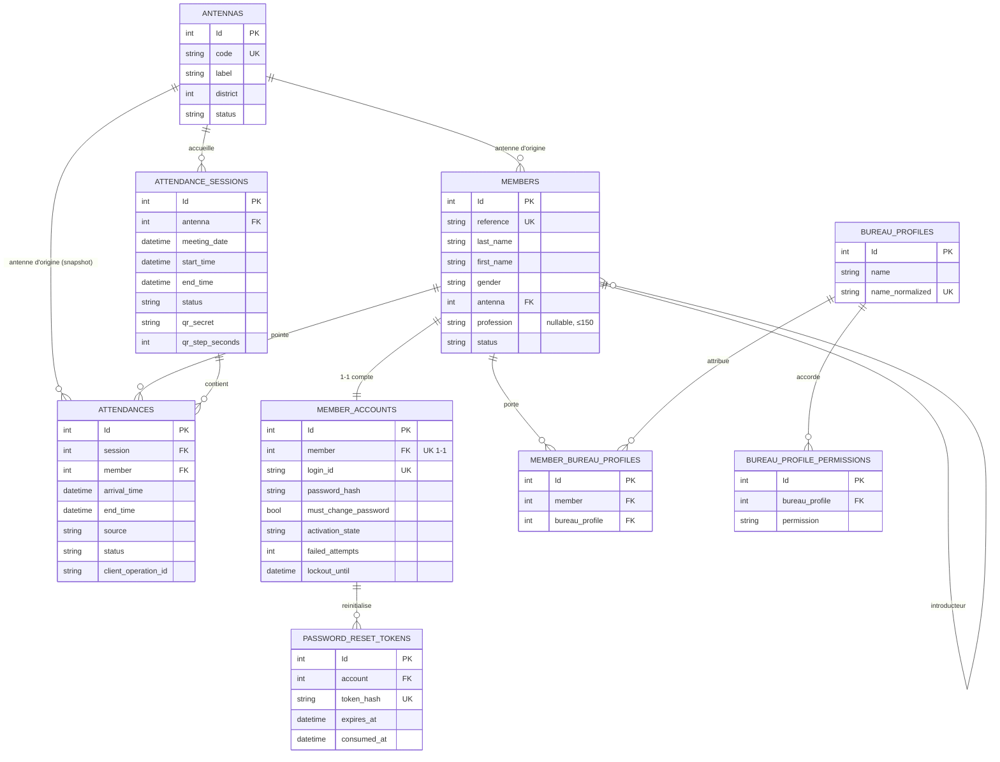

# 03 — Modèle de données

## Sommaire

- [Source de vérité](#source-de-vérité)
- [Diagramme entités-relations](#diagramme-entités-relations)
- [Mapping code ↔ tables](#mapping-code--tables)
- [Contraintes, index et conversions notables](#contraintes-index-et-conversions-notables)
- [Audit automatique](#audit-automatique)
- [Stratégie de migration](#stratégie-de-migration)
- [Sources analysées](#sources-analysées)

## Source de vérité

Le modèle est **code-first EF Core**. La source de vérité est le couple
`Configurations/*.cs` + `Migrations/`. Le fichier racine
`Database Entities Documentation.md` est **explicitement marqué obsolète** (il
décrivait un ancien modèle TypeORM) et ne doit pas être utilisé.

`AppDbContext` (`src/Lumineux.Infrastructure/Persistence/AppDbContext.cs`) déclare
13 `DbSet` et applique automatiquement toutes les `IEntityTypeConfiguration` de
l'assembly (`ApplyConfigurationsFromAssembly`).

## Diagramme entités-relations

Ce diagramme montre les entités principales et leurs cardinalités (relations
déduites des clés étrangères EF).

Référentiels annexes (`civilities`, `countries`, `cities`, `districts`) : cibles
de clé étrangère de `members` (`civility`, `nationality`, `birth_place`,
`birth_city`, `district`). Non détaillés dans le diagramme pour la lisibilité
(`ReferenceEntities.cs`, `ReferenceConfigurations.cs`).

## Mapping code ↔ tables

| Entité (`Domain/Entities`) | Table | Notes |
|----------------------------|-------|-------|
| `Member` | `members` | référence unique = login ; setters publics |
| `MemberAccount` | `member_accounts` | 1-1 avec `Member`, cascade delete |
| `Antenna` | `antennas` | code unique, statut Active/Inactive |
| `AttendanceSession` | `attendance_sessions` | statut Open/Closed/Cancelled |
| `Attendance` | `attendances` | source QrScan/Manual, statut Valid/Cancelled |
| `BureauProfile` | `bureau_profiles` | nom normalisé unique |
| `BureauProfilePermission` | `bureau_profile_permissions` | unicité `(profil, permission)` |
| `MemberBureauProfile` | `member_bureau_profiles` | unicité `(member, profil)` |
| `PasswordResetToken` | `password_reset_tokens` | hash de jeton unique |
| `Civility` | `civilities` | référentiel |
| `Country` | `countries` | libellé pays + nationalité |
| `City` | `cities` | ville / lieu de naissance |
| `District` | `districts` | quartier |

Convention de nommage : tables **snake_case pluriel**, colonnes snake_case
(mapping explicite `HasColumnName`), clés étrangères nommées par le rôle métier
(ex. `antenna`, `opened_by`, `origin_antenna`).

## Contraintes, index et conversions notables

**Unicité et index filtrés** (`Configurations/`) :

- `members.reference` unique (identifiant de connexion).
- `members.email` / `members.mobile` : **uniques filtrés** sur
  `status = 'Active'` et non-null → un contact ne peut être réutilisé que par un
  membre actif (`MemberConfiguration.cs`).
- `member_accounts.member` et `member_accounts.login_id` uniques (1-1 + login).
- `antennas.code` unique (`AntennaConfiguration.cs`).
- `attendances (session, member)` : **unique filtré** sur `status = 'Valid'` →
  anti-doublon d'une présence valide par membre et par session.
- `attendances (session, client_operation_id)` : **unique filtré** sur
  `client_operation_id IS NOT NULL` → idempotence des scans hors ligne.
- `attendances (session, status)` : index de consultation live / post-clôture.
- `attendance_sessions (antenna, status)` : retrouve la session ouverte d'une antenne.
- `bureau_profiles.name_normalized` unique (nom insensible à la casse).
- `password_reset_tokens.token_hash` unique.

Les filtres sont écrits **sans quoting** pour rester portables SQL Server / SQLite
(commentaire dans `AttendanceConfiguration.cs`) — la présence du provider SQLite en
paquet suggère un usage en tests (`⚠️ Hypothèse — à confirmer`, non vu de config
SQLite runtime dans `DependencyInjection.cs` qui n'enregistre que SQL Server).

**Conversions enum → string** (colonnes lisibles) :

- `Attendance.Source` / `Attendance.Status` → `HasConversion<string>` (max 20).
- `AttendanceSession.Status` → string (max 20).
- `MemberAccount.ActivationState` → string (max 20).
- `Member.Status` et `Antenna.Status` sont **déjà des chaînes** (constantes
  `MemberStatuses`, `Antenna.Active/Inactive`).

**Comportements de suppression** :

- `MemberAccount` et `Attendance→Session` : `Cascade`.
- La plupart des autres FK : `Restrict` (protège l'intégrité référentielle des
  référentiels et des membres — `MemberConfiguration.cs`).

**Secrets stockés hachés uniquement** :

- `member_accounts.password_hash` (jamais en clair, `MemberAccount.cs`).
- `password_reset_tokens.token_hash` = SHA-256 du jeton (le clair n'est jamais
  persisté, `ResetTokenService.cs`).
- `attendance_sessions.qr_secret` : secret HMAC **jamais exposé** aux clients
  (`QrTokenService.cs`).

## Audit automatique

Toutes les entités héritent d'`AbstractEntity` (`Id`, `CreatedAt`, `CreatedBy`,
`UpdatedAt`, `UpdatedBy`). L'`AuditInterceptor` (`SaveChangesInterceptor`) remplit
ces champs à chaque sauvegarde : `CreatedAt/By` à l'insertion, `UpdatedAt/By` à la
modification, l'acteur étant `MemberId` du jeton courant, sinon `UserName`, sinon
`"system"` (`AuditInterceptor.cs`). Les colonnes sont appliquées via
`AuditColumns.Apply(builder)` dans chaque configuration.

## Stratégie de migration

- 12 migrations horodatées sous `Persistence/Migrations/`, de `InitialAttendance`
  (2026-07-02) à `MemberProfession` (2026-07-16). L'historique reflète
  l'incrémentalité par feature : `AddAttendances`, `MemberRegistration`,
  `Authentication`, `BureauProfiles`, `PasswordReset`, `AntennaCodeUnique`,
  `CancelSession`, `RemoveMemberPermissions`, `MemberProfession`.
- L'avant-dernière migration (`RemoveMemberPermissions`) matérialise la **consolidation
  RBAC** (feature 029) : le mécanisme de permissions directes par membre a été
  retiré au profit des seuls profils du bureau (cf. `EffectivePermissionsReader.cs`).
- La dernière migration (`MemberProfession`, feature 030) ajoute la colonne
  additive `members.profession` (`nvarchar(150)`, nullable, sans unicité ni index).
- `AppDbContextFactory` fournit un contexte design-time pour `dotnet ef`.

## Sources analysées

- `src/Lumineux.Infrastructure/Persistence/AppDbContext.cs`
- `src/Lumineux.Infrastructure/Persistence/Configurations/*.cs`
- `src/Lumineux.Infrastructure/Persistence/Interceptors/AuditInterceptor.cs`
- `src/Lumineux.Infrastructure/Persistence/Migrations/` (liste)
- `src/Lumineux.Domain/Entities/*.cs`, `src/Lumineux.Domain/Enums/*.cs`
</content>
