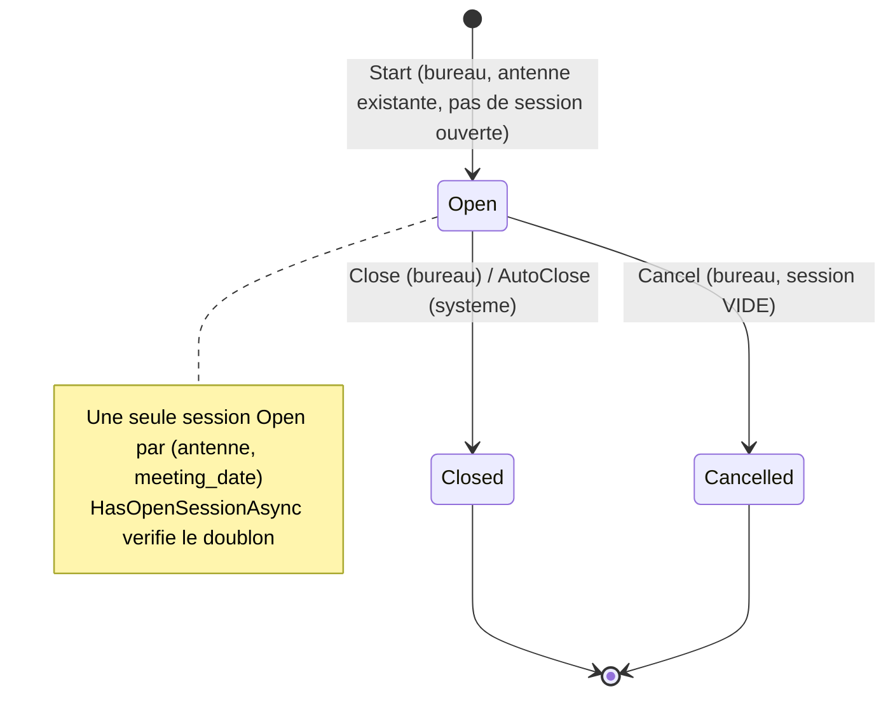
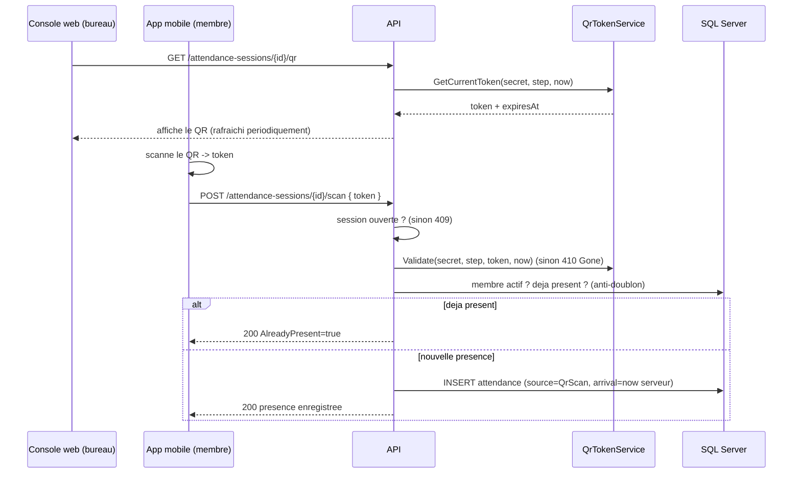
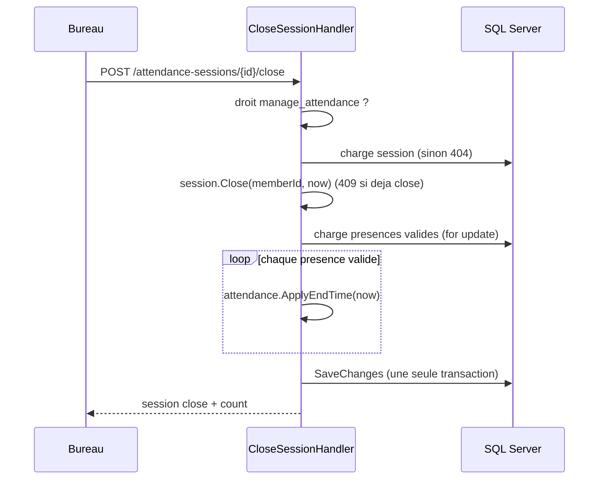
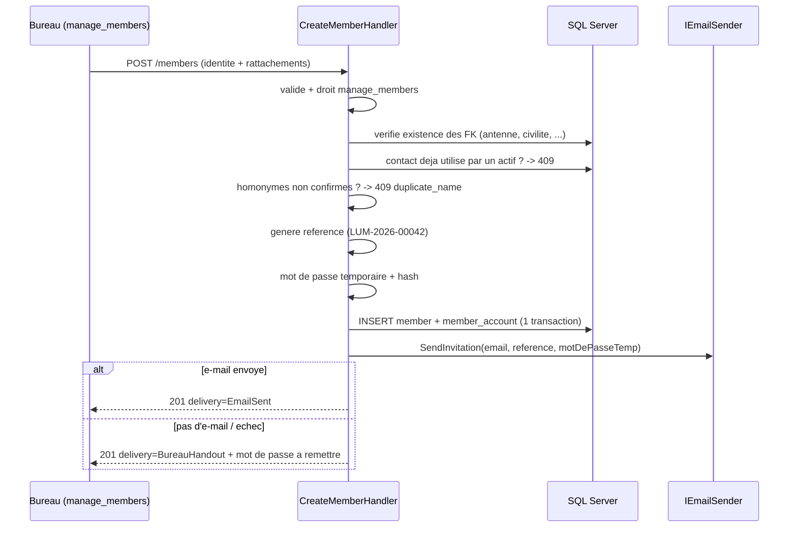
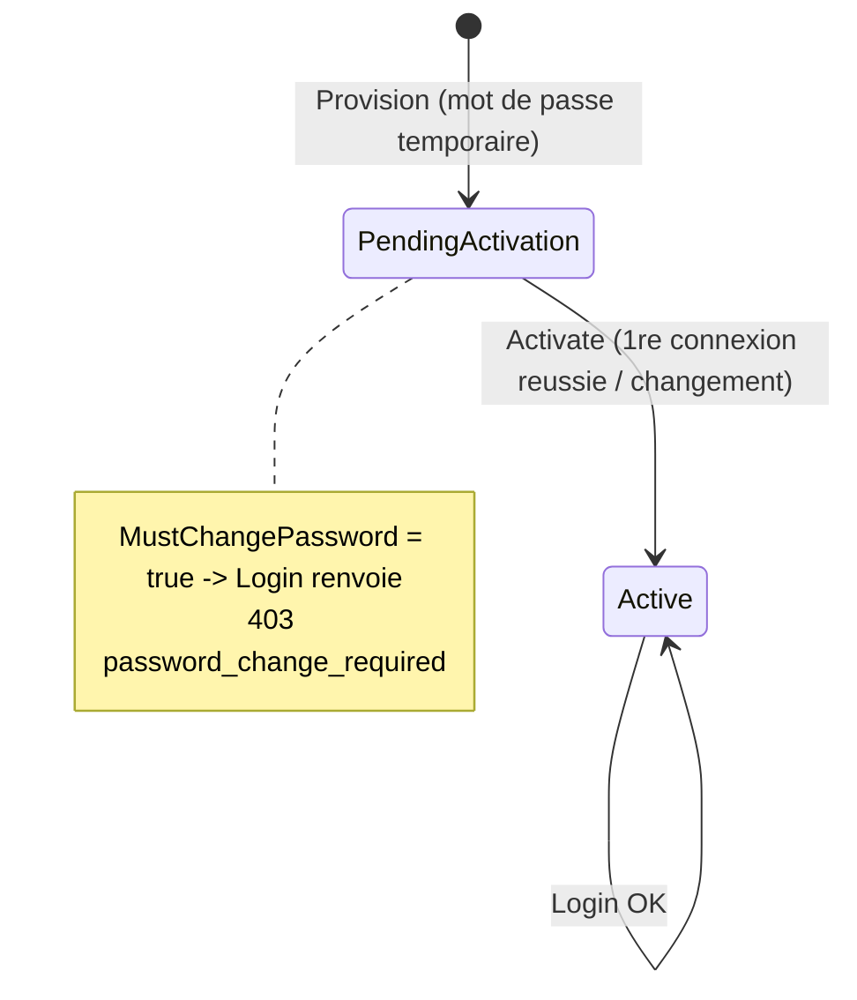

# 04 — Logique métier

## Sommaire

- [Panorama des flux](#panorama-des-flux)
- [Flux 1 — Gestion des présences](#flux-1--gestion-des-présences)
  - [Cycle de vie d'une session](#cycle-de-vie-dune-session)
  - [Scan QR et jeton rotatif](#scan-qr-et-jeton-rotatif)
  - [Synchronisation hors ligne](#synchronisation-hors-ligne)
  - [Clôture et clôture automatique](#clôture-et-clôture-automatique)
- [Flux 2 — Cycle de vie du membre et du compte](#flux-2--cycle-de-vie-du-membre-et-du-compte)
- [Flux 3 — Authentification et sécurité du compte](#flux-3--authentification-et-sécurité-du-compte)
- [Flux 4 — Droits (RBAC par profils)](#flux-4--droits-rbac-par-profils)
- [Flux 5 — Installation du premier administrateur](#flux-5--installation-du-premier-administrateur)
- [Règles enfouies / points de vigilance](#règles-enfouies--points-de-vigilance)
- [Sources analysées](#sources-analysées)

## Panorama des flux

| Flux | Acteur principal | Droit requis | Handlers clés |
|------|------------------|--------------|---------------|
| Présences | Bureau + Membre mobile | `manage_attendance` (bureau) | `StartSession`, `ScanAttendance`, `SyncOfflineScans`, `AddManualAttendance`, `CloseSession`, `CancelSession` |
| Membres | Gestionnaire | `manage_members` | `CreateMember`, `UpdateMember`, `SearchMembers`, `GetMember` |
| Authentification | Tous | — | `Login`, `ActivateAccount`, `ChangePassword`, `RequestPasswordReset`, `ResetPassword`, `GetCurrentUser` |
| Droits | Super-admin | `manage_bureau_profiles` | `CreateBureauProfile`, `AssignProfile`, `RevokeProfile`, … |
| Référentiels | Bureau | `manage_referentials` | `CreateAntenna`, `UpdateAntenna`, `SetAntennaActive` |
| Rapports | Bureau | `manage_attendance` | `GetAntennaAttendanceSummary`, `GetAttendanceTimeSeries`, `GetMemberAttendanceRate`, `ExportAntennaAttendanceCsv` |
| Installation | Super-admin | — (verrou naturel) | `InstallFirstAdmin` |

## Flux 1 — Gestion des présences

C'est le cœur métier. Description : lors d'une réunion, un membre du bureau
**démarre une session** dans une antenne. Un **QR rotatif** est projeté ; chaque
membre le **scanne** pour être pointé à son heure d'arrivée. Le bureau peut
**ajouter manuellement** les présents non équipés. La **clôture** fixe l'heure de
fin, propagée à toutes les présences valides.

### Cycle de vie d'une session

La session est une machine à états portée par `AttendanceSession.cs`.

Règles extraites du code :

- **Démarrage** (`StartSessionHandler.cs`) : exige `manage_attendance` **et** un
  `MemberId` ; l'antenne doit exister ; refus `409` s'il existe déjà une session
  ouverte pour ce couple `(antenne, date)` (`HasOpenSessionAsync`). Le pas de
  rotation QR par défaut est **30 s**, borné à `[10, 120]` s
  (`AttendanceSession.MinQrStepSeconds`/`MaxQrStepSeconds`). Un `qrSecret`
  aléatoire de 32 octets est généré et stocké côté serveur uniquement.
- **Annulation** (`CancelSessionHandler.cs`) : réservée à une session **ouverte et
  vide**. Le décompte de présences valides est re-vérifié **dans une transaction
  sérialisable** pour empêcher qu'un scan concurrent ne fasse perdre une présence
  (`ExecuteInSerializableTransactionAsync`). État terminal conservé pour l'audit
  (`cancelled_by`, `cancelled_at`).
- **Clôture** : voir plus bas.

### Scan QR et jeton rotatif

Le jeton QR est un **TOTP maison** : `token = HMAC-SHA256(qrSecret, compteur_temps)`
tronqué à 8 chiffres, avec `compteur = floor(epoch_seconds / stepSeconds)`
(`QrTokenService.cs`). Une photo du QR devient invalide après ~`stepSeconds`. La
validation tolère **± 1 pas** (dérive/latence) et compare en temps constant
(`CryptographicOperations.FixedTimeEquals`). Le secret ne quitte jamais le serveur ;
seuls le token courant et son `ExpiresAt` sont exposés via `GET .../qr`.

Règles du scan (`ScanAttendanceHandler.cs`) :

- L'heure d'arrivée est **l'heure serveur** (`IClock.UtcNow`), pas celle du client.
- Session close → `409` (`ConflictException`, « réunion terminée »).
- Jeton invalide/périmé → `410 Gone` (« Code QR expiré »).
- Membre inconnu ou **non actif** → `403`.
- Déjà présent (présence valide existante) → réponse `AlreadyPresent = true`
  (idempotent, pas d'erreur).
- Anti-doublon garanti aussi par l'index unique filtré `(session, member)` sur
  `status='Valid'`.

### Synchronisation hors ligne

L'application mobile capture les scans **hors connexion** et les rejoue par lot
(`SyncOfflineScansHandler.cs`, endpoint `scan/batch`). Chaque item porte un
`clientOperationId` (idempotence) et une heure d'arrivée client.

Règles par item :

- **Idempotence** : si un `clientOperationId` a déjà été traité, ou si le membre
  est déjà présent → `AlreadyPresent` (pas de doublon).
- Jeton QR **validé à l'heure du scan client** (pas à l'heure de sync).
- Heure d'arrivée **bornée** : rejetée si `< StartTime` ou `> now serveur`.
- **Post-clôture (FR-023b)** : si la session est close et l'arrivée `>= EndTime` →
  rejet (« postérieure à la clôture »).
- Course concurrente : `ConflictException` (violation d'unicité) rattrapée →
  reclassée `AlreadyPresent`.

Côté mobile, la file est **persistée chiffrée** (`OfflineQueueStore` sur
`flutter_secure_storage`) avec **déduplication par séance** (une capture par
`sessionId`), et un `SyncController` (Riverpod) rejoue le lot au **retour de
connectivité**, sur **relance manuelle**, ou par **backoff**, sans jamais
journaliser le jeton (`mobile/lib/features/attendance/`).

### Clôture et clôture automatique

- **Clôture manuelle** (`CloseSessionHandler.cs`) : l'heure de fin = heure de
  clôture, propagée à **toutes les présences valides** dans **une seule
  sauvegarde** (atomicité). `Close` lève `409` si déjà close.
- **Clôture automatique de secours** (`SessionAutoCloseService.cs`, FR-024) :
  `BackgroundService` qui scrute périodiquement (`PollingIntervalSeconds`, min 30 s)
  les sessions ouvertes depuis plus de `MaxOpenHours`. L'heure de fin par défaut =
  `StartTime + DefaultDurationHours`, **bornée à maintenant** (garantit
  `StartTime < endTime <= now`). Idempotente, sans membre clôturant. Désactivable
  par `AutoClose:Enabled`.

## Flux 2 — Cycle de vie du membre et du compte

Description : le **bureau** enrôle un membre ; un **compte** est provisionné
automatiquement avec un mot de passe temporaire, transmis par e-mail ou remis en
main propre. Le membre active son compte à la première connexion.

Règles (`CreateMemberHandler.cs`, `Member.cs`) :

- Invariants domaine à la création : référence, nom, prénom, genre (`M`/`F`),
  antenne d'origine `> 0` (sauf surcharge nullable pour le premier admin).
- **Référence** générée `LUM-{yyyy}-{seq:00000}` d'après le nombre de membres de
  l'année (`MemberReferenceGenerator.cs`) ; l'index unique en base est le filet.
- **Contact unique** : refus `409 contact_in_use` si e-mail/mobile déjà utilisé par
  un membre actif (non contournable).
- **Homonymes** : si nom+prénom déjà présents et `ConfirmDuplicate=false` →
  `409 duplicate_name` avec la liste des `duplicateMemberIds` (l'UI demande
  confirmation).
- Provisionnement atomique membre + compte (`MustChangePassword=true`,
  `ActivationState=PendingActivation`).
- **Activation** (`ActivateAccountHandler.cs`) : le nouveau mot de passe doit
  différer du temporaire (`PasswordRules`).

## Flux 3 — Authentification et sécurité du compte

État du compte (`MemberAccount.cs`, `AccountActivationState`) :

Règles de connexion (`LoginHandler.cs`) :

- **Anti-énumération** : compte inexistant → on hache quand même le mot de passe
  fourni (égalise le coût), message générique « Identifiants invalides ».
- **Verrouillage** : après `MaxFailedAttempts` (défaut 5) échecs, verrou de
  `LockoutMinutes` (défaut 15). `IsLockedOut` bloque même avec le bon mot de passe.
- Mot de passe correct → réinitialise le compteur d'échecs.
- `MustChangePassword` → `403 password_change_required` (le membre doit changer
  avant d'obtenir un jeton).
- Membre non actif → refus générique.
- Succès → JWT porteur des **droits effectifs** (claim `permission` répété).

Mot de passe oublié (`RequestPasswordResetHandler`, `ResetPasswordHandler.cs`) :

- Jeton de **32 octets** (256 bits), seul le **SHA-256** est persisté ; le clair
  circule uniquement dans le lien e-mail (`ResetTokenService.cs`).
- Réponse **indistincte** que le compte existe ou non (anti-énumération).
- **Politique de mot de passe validée en premier** : un mot de passe non conforme
  échoue en `400` **sans consulter ni consommer** le jeton (FR-006).
- Jeton **usage unique** + expiration (`PasswordResetMinutes`, défaut 30). La
  réinitialisation remet à zéro les compteurs d'échec et lève le verrouillage.
- Politique commune (`PasswordRules.cs`) : longueur min (défaut 8), au moins une
  lettre et un chiffre ; nouveau ≠ ancien pour le changement.

## Flux 4 — Droits (RBAC par profils)

Modèle : un **profil du bureau** (`BureauProfile`) porte un ensemble de permissions
issues d'un **catalogue figé** côté serveur (`PermissionCatalog.cs`). Un membre se
voit **attribuer** des profils (`MemberBureauProfile`). Ses **droits effectifs**
sont l'**union dédupliquée** des permissions de tous ses profils
(`EffectivePermissionsReader.cs`).

Catalogue des droits (`Application/Abstractions/Permissions.cs`) :

| Code | Signification |
|------|---------------|
| `manage_attendance` | Gérer les présences (sessions, présences, rapports) |
| `manage_members` | Gérer les fiches membres |
| `manage_bureau_profiles` | Gérer les profils et attributions |
| `manage_referentials` | Gérer les antennes / référentiels |

- La création/mise à jour de profil valide chaque droit contre le catalogue
  (`BureauProfile.SetPermissions`, `DomainException` si inconnu).
- Nom de profil **unique insensible à la casse** (`NameNormalized`).
- **Garde-fou « dernier administrateur »** : la révocation/suppression protège
  l'existence d'au moins un administrateur actif (cf. `RevokeProfileHandler`,
  `PO_description.md` ; `CountActiveAdministratorsAsync`).
- **Consolidation (feature 029)** : le mécanisme de permissions directes par membre
  a été **retiré** ; les profils sont désormais l'unique source de droits
  (commentaires `EffectivePermissionsReader.cs`, migration `RemoveMemberPermissions`).

## Flux 5 — Installation du premier administrateur

`InstallFirstAdminHandler.cs` amorce une instance vierge :

- **Verrou naturel prioritaire** : refus `409 already_installed` **avant toute
  validation** dès qu'un administrateur actif existe (ne divulgue pas la structure
  attendue).
- Crée en **une seule transaction** : le `Member` (sans antenne obligatoire), un
  `MemberAccount` **actif** (mot de passe fourni final, `MustChangePassword` levé),
  le profil « Administrateur » **avec tous les droits du catalogue** (créé si
  absent, jamais modifié s'il existe), et l'attribution membre→profil.
- Retourne directement un **jeton** (l'admin est connecté).

## Règles enfouies / points de vigilance

- **Heure serveur faisant foi** : toutes les heures de présence/clôture sont
  serveur (`IClock`), jamais celles du client — évite la fraude temporelle.
- **QR = TOTP maison** dans `QrTokenService` : ce n'est pas un simple identifiant
  de session mais un code à durée de vie courte ; toute intégration doit respecter
  la fenêtre `stepSeconds ± 1`.
- **`OriginAntennaId`** : snapshot de l'antenne d'origine du membre **au moment**
  de la présence (un membre peut être présent dans une antenne différente de la
  sienne). Figé sur la présence, pas recalculé.
- **Transaction sérialisable** pour l'annulation de session (`CancelSessionHandler`)
  : règle de cohérence subtile, à préserver lors de tout refactoring.
- **Anti-énumération** présent à trois endroits (login, forgot, reset) : messages
  volontairement génériques — ne pas « améliorer » les messages d'erreur sans
  comprendre l'intention sécurité.
- **Logique métier côté client** : les gardes Angular (`guards.ts`) et les
  permissions Dart (`mobile/lib/features/auth/application/permissions.dart`)
  reproduisent le contrôle des droits pour l'UX, mais **l'API reste l'autorité**
  (403 côté serveur). Ne pas considérer l'UI comme un point de contrôle de sécurité.

## Sources analysées

- `src/Lumineux.Application/AttendanceSessions/*.cs`
- `src/Lumineux.Application/Attendances/*.cs`
- `src/Lumineux.Application/Auth/*.cs`
- `src/Lumineux.Application/Members/CreateMemberHandler.cs`
- `src/Lumineux.Application/Setup/InstallFirstAdminHandler.cs`
- `src/Lumineux.Application/Reports/GetAttendanceTimeSeriesHandler.cs`
- `src/Lumineux.Domain/Entities/*.cs`, `src/Lumineux.Domain/Enums/*.cs`
- `src/Lumineux.Infrastructure/Security/QrTokenService.cs`, `ResetTokenService.cs`, `MemberReferenceGenerator.cs`
- `src/Lumineux.Infrastructure/BackgroundJobs/SessionAutoCloseService.cs`
- `mobile/lib/features/attendance/` (file hors ligne + sync)
</content>
