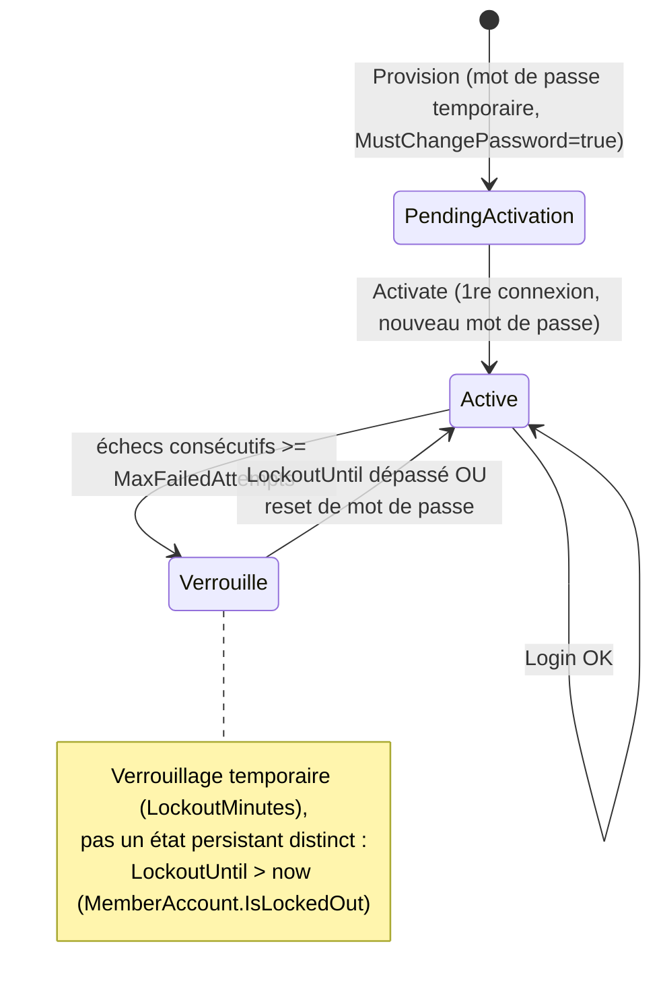
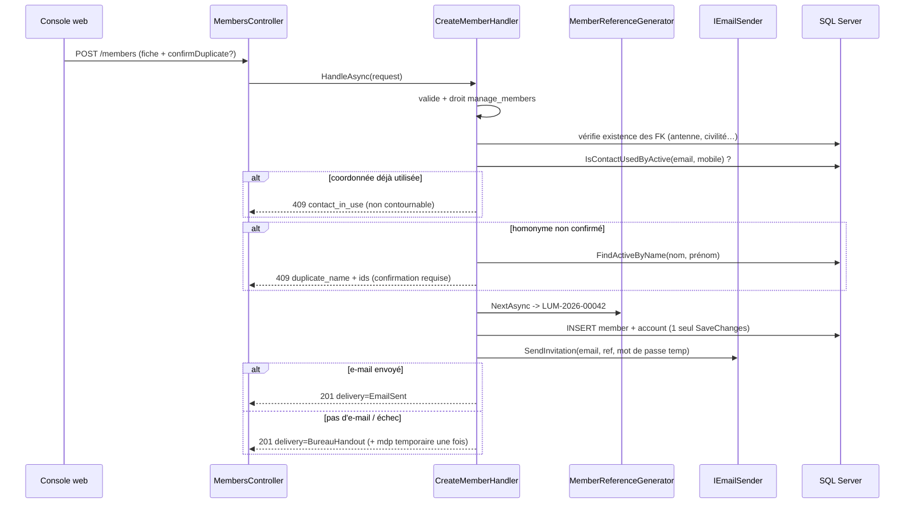
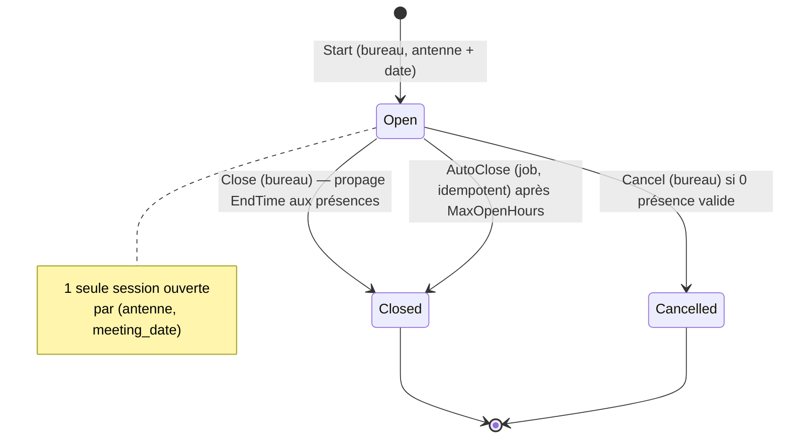

# 04 — Logique métier

## Sommaire

1. [Cartographie des flux](#cartographie-des-flux)
2. [Cycle de vie du compte et authentification](#cycle-de-vie-du-compte-et-authentification)
3. [Enrôlement d'un membre](#enrôlement-dun-membre)
4. [Sessions de présence et QR rotatif](#sessions-de-présence-et-qr-rotatif)
5. [Scan et synchronisation hors ligne](#scan-et-synchronisation-hors-ligne)
6. [Profils du bureau et garde-fou « dernier administrateur »](#profils-du-bureau-et-garde-fou--dernier-administrateur-)
7. [Installation du premier administrateur](#installation-du-premier-administrateur)
8. [Rapports de présence](#rapports-de-présence)
9. [Règles métier enfouies](#règles-métier-enfouies)
10. [Sources analysées](#sources-analysées)

## Cartographie des flux

| Flux | Handler(s) | Droit requis |
|------|-----------|--------------|
| Connexion / activation / reset / changement mdp | `Auth/*Handler` | anonyme (sauf change-password) |
| Enrôlement membre | `Members/CreateMemberHandler` | `manage_members` |
| Recherche / fiche / correction membre | `Members/{Search,Get,Update}MemberHandler` | `manage_members` |
| Démarrer / clôturer / annuler session | `AttendanceSessions/*Handler` | `manage_attendance` |
| Scan / sync hors ligne | `Attendances/{Scan,SyncOfflineScans}Handler` | authentifié (membre) |
| Ajout / annulation présence manuelle | `Attendances/{AddManual,Cancel}Handler` | `manage_attendance` |
| CRUD profils du bureau + attribution/révocation | `BureauProfiles/*Handler` | `manage_bureau_profiles` (lecture élargie) |
| Installation premier admin + statut | `Setup/*Handler` | anonyme |
| Antennes (référentiel) | `Antennas/*Handler` | `manage_referentials` |
| Rapports de présence | `Reports/*Handler` | `manage_attendance` |

## Cycle de vie du compte et authentification

Le compte de connexion (`MemberAccount`) est distinct du membre. Son état est porté par deux
dimensions : `ActivationState` (PendingActivation → Active) et `MustChangePassword`.



Règles vérifiées :

- **Anti-énumération** (`LoginHandler`, `ActivateAccountHandler`, `RequestPasswordResetHandler`) :
  message générique `"Identifiants invalides."` quel que soit le cas ; si le compte est introuvable,
  un **hachage factice** est calculé pour égaliser le coût temporel (`_passwordHasher.Hash(...)` dont
  le résultat est jeté). Pour le mot de passe oublié, opération factice `_tokenService.Generate()`.
- **Verrouillage** (`MemberAccount.RegisterFailedLogin`) : incrémente `FailedAttempts`, verrouille au
  seuil `Auth:MaxFailedAttempts` (5) pour `Auth:LockoutMinutes` (15). Réinitialisé au succès.
- **Ordre des contrôles au login** : validation → compte existe → non verrouillé → mot de passe →
  `MustChangePassword` (403 `password_change_required`) → membre actif → émission du jeton.
- **Activation** (`ActivateAccountHandler`) : vérifie d'abord le mot de passe temporaire **avant** de
  révéler que le compte est déjà activé (409). Le nouveau mot de passe doit différer du temporaire
  (`ActivateAccountValidator`).
- **Reset** (`ResetPasswordHandler`) : la **politique de mot de passe est validée en premier** (400
  sans consulter le jeton) ; un jeton inexistant/expiré/consommé → 401 générique indistinct ; le
  succès change le hash, **consomme** le jeton (usage unique), remet à zéro les compteurs et lève le
  verrouillage.
- **Politique mot de passe** (`PasswordRules.ApplyPolicy`) : longueur min `Auth:PasswordMinLength` (8),
  au moins une lettre et un chiffre.
- **Jeton d'accès** (`JwtTokenIssuer`) : JWT HMAC-SHA256, claims `member_id`, `ClaimTypes.Name`, et un
  claim `permission` par droit ; durée `Auth:AccessTokenMinutes` (60). **Pas de refresh token** (choix
  produit assumé, `PO_description.md` §9.4).

## Enrôlement d'un membre



Règles clés (`CreateMemberHandler`) :

- **Collision de contact non contournable** (email OU mobile d'un membre actif) → `duplicate_name` non,
  `contact_in_use`. Priorité sur l'homonyme.
- **Homonyme (nom+prénom)** contournable via `ConfirmDuplicate=true` : sinon 409 avec la liste des ids.
- **Référence générée** au format `MemberReference:Format` = `LUM-{yyyy}-{seq:00000}` ; la séquence
  dérive du **nombre de membres de l'année** (`MemberReferenceGenerator`), l'index unique servant de
  filet. ⚠️ Risque de course sous forte concurrence (voir 07-dette-technique).
- **Atomicité** : membre + compte insérés dans le même `SaveChanges`.
- **Mot de passe temporaire** : généré aléatoirement (`IdentityPasswordHasher.GenerateTemporaryPassword`,
  ~12 car. base64url), haché avant stockage, transmis par e-mail **ou** affiché une seule fois au bureau
  (« remise bureau ») si pas d'e-mail ou échec d'envoi.

## Sessions de présence et QR rotatif



Règles (`AttendanceSession`, `StartSessionHandler`, `CloseSessionHandler`, `CancelSessionHandler`,
`SessionAutoCloseService`) :

- **Démarrage** : refus si une session ouverte existe déjà pour `(antenne, meeting_date)`
  (`HasOpenSessionAsync`). L'antenne doit exister. Pas de rotation QR par défaut = 30 s
  (`DefaultQrStepSeconds`), borné 10–120 s côté domaine.
- **QR rotatif type TOTP** (`QrTokenService`) : jeton = `HMAC-SHA256(secret, compteur_temps)` tronqué
  à 8 chiffres, valide `qr_step_seconds`. La **validation tolère ±1 pas** (dérive/latence) et utilise
  une comparaison à temps constant. Le secret ne quitte jamais le serveur.
- **Clôture** : `Close` fixe `EndTime` = heure serveur et **propage cette heure de fin à toutes les
  présences valides** dans la même transaction (`CloseSessionHandler`). Double clôture → 409.
- **Clôture automatique de secours** (`SessionAutoCloseService`, job) : ferme les sessions ouvertes
  depuis plus de `AutoClose:MaxOpenHours` (3 h). Heure de fin par défaut = `StartTime + DefaultDurationHours`
  bornée à `now` (jamais dans le futur). Idempotent, sans membre clôturant. Intervalle min. 30 s.
- **Annulation** (feature 028) : réservée à une session **ouverte et vide**. Le décompte de présences
  valides est re-vérifié dans une **transaction sérialisable** (`ExecuteInSerializableTransactionAsync`)
  pour empêcher qu'un scan concurrent ne perde sa présence. La session passe à l'état terminal
  `Cancelled` (conservée pour audit : `CancelledByMemberId`, `CancelledAt`).

## Scan et synchronisation hors ligne

Règles du **scan direct** (`ScanAttendanceHandler`) :

- Membre authentifié requis ; session ouverte ; jeton QR valide (sinon 410 `Gone` « code expiré ») ;
  membre actif ; **anti-doublon** (si déjà présent → renvoie la présence existante, `AlreadyPresent=true`).
- Heure d'arrivée = **heure serveur** (`_clock.UtcNow`), pas l'heure du client.

Règles de la **synchronisation par lot** (`SyncOfflineScansHandler`, feature 027) :

```mermaid
flowchart TD
    A["Item de lot (token, clientArrivalTime, clientOperationId)"] --> B{déjà synchronisé<br/>même clientOperationId ?}
    B -- oui --> R1["AlreadyPresent"]
    B -- non --> C{jeton QR valide<br/>au moment du scan ?}
    C -- non --> R2["Rejected : jeton invalide"]
    C -- oui --> D{arrivée dans<br/>[StartTime, now] ?}
    D -- non --> R3["Rejected : hors plage"]
    D -- oui --> E{session fermée ET<br/>arrivée >= EndTime ?}
    E -- oui --> R4["Rejected : après clôture"]
    E -- non --> F{membre déjà<br/>présent ?}
    F -- oui --> R1
    F -- non --> G["INSERT présence (heure réelle client, bornée)"]
    G --> R5["Created"]
```

Points importants :

- **Idempotence** garantie par `client_operation_id` (index unique filtré) + reprise en cas de course
  (`catch (ConflictException)` relit la présence existante).
- L'heure d'arrivée hors ligne est l'**heure réelle du client**, mais **bornée** `[StartTime, now]`
  et validée par le jeton QR correspondant à ce moment — un scan honnête reste valide même après clôture,
  sauf si postérieur à `EndTime`.

## Profils du bureau et garde-fou « dernier administrateur »

- Un `BureauProfile` porte un nom unique (insensible à la casse via `NameNormalized`) et une liste de
  permissions **validées contre un catalogue figé** (`PermissionCatalog` : 4 droits — `manage_attendance`,
  `manage_members`, `manage_bureau_profiles`, `manage_referentials`). Un droit inconnu → `DomainException`.
- Les **droits effectifs d'un membre** = union des permissions des profils qui lui sont attribués
  (`MemberPermissionRepository.GetPermissionsAsync`, jointure `member_bureau_profiles × bureau_profile_permissions`).
- **Garde-fou triple** (`RevokeProfileHandler` / `DeleteBureauProfileHandler` / mise à jour) : si l'action
  laisserait **zéro administrateur actif** (membre actif portant `manage_bureau_profiles`), refus 409
  `last_administrator`. Le décompte se fait via `CountActiveAdministratorsAsync` (`BureauProfileRepository`).
- Attribution **idempotente** (`(member, bureau_profile)` unique).

## Installation du premier administrateur

`InstallFirstAdminHandler` (feature 005) compose en une transaction : un `Member` (sans antenne),
un `MemberAccount` actif (mot de passe fourni = final), le profil système « Administrateur » (créé
s'il n'existe pas, avec **tous** les droits du catalogue), et l'attribution.

- **Verrou naturel** : refus 409 `already_installed` **dès qu'un admin actif existe**, vérifié
  **avant** la validation du payload (ne rien divulguer sur la structure attendue).
- **Idempotence du profil** : ne modifie pas un profil « Administrateur » préexistant.
- Endpoint de **statut** anonyme (`GET /setup/status`, `GetSetupStatusHandler`) renvoyant un simple
  booléen `installed` pour piloter la découvrabilité côté SPA (feature 013).

## Rapports de présence

- **Synthèse par antenne** (`GetAntennaAttendanceSummaryHandler`) : nb sessions, nb présences valides,
  et **moyenne présences/session** arrondie à 2 décimales (0 si aucune session).
- **Taux d'assiduité membre** (`GetMemberAttendanceRateHandler`) : `présences valides / sessions
  éligibles`, fraction 0..1 arrondie à 4 décimales, 0 si aucune session éligible (pas de division par zéro).
- **Séries temporelles** (`GetAttendanceTimeSeriesHandler` + `TimeBuckets`) et **export CSV**
  (`ExportAntennaAttendanceCsvHandler`). Période validée par `ReportPeriodValidator`.
- Tous exigent `manage_attendance` (re-vérifié dans le handler).

## Règles métier enfouies

Signalées car non évidentes hors du code :

- **Colonnes filtres d'index = règles métier** : l'unicité « un membre actif, un e-mail » et
  « une présence valide par session » vit dans des **index SQL filtrés** (`MemberConfiguration`,
  `AttendanceConfiguration`), pas dans du code applicatif. Un contournement du code resterait bloqué en base.
- **Heure d'arrivée = heure serveur** (scan direct) vs **heure client bornée** (sync hors ligne) :
  divergence intentionnelle mais subtile.
- **Deux tables de permissions** : `member_permissions` (héritée) n'alimente plus le jeton ; seuls les
  profils comptent. Les bootstrappers (`PermissionBootstrapper`, `BureauProfilesBootstrapper`) migrent
  l'ancien modèle au démarrage. Un droit ajouté dans `member_permissions` sans profil n'aurait **aucun effet**.
- **Génération de référence** basée sur un `COUNT` annuel : logique de numérotation cachée dans
  l'infrastructure (`MemberReferenceGenerator`), sensible à la concurrence.
- **RBAC côté SPA/mobile = confort uniquement** : l'API reste l'autorité (double contrôle
  policy + handler). Toute règle vue côté client est réputée non fiable.

## Sources analysées

- `src/Lumineux.Application/Auth/*`, `Members/CreateMemberHandler.cs`, `Attendances/*`,
  `AttendanceSessions/*`, `BureauProfiles/RevokeProfileHandler.cs`, `Setup/*`, `Reports/*`
- `src/Lumineux.Domain/Entities/{MemberAccount,AttendanceSession,Attendance,BureauProfile,PasswordResetToken}.cs`
- `src/Lumineux.Infrastructure/Security/{QrTokenService,MemberReferenceGenerator}.cs`,
  `Repositories/{Attendance,AttendanceSession,BureauProfile,MemberPermission}Repository.cs`,
  `BackgroundJobs/SessionAutoCloseService.cs`
</content>
