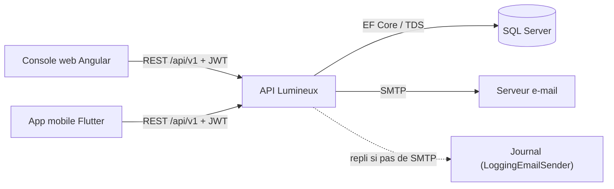

# 05 — Intégrations

## Sommaire

- [Vue d'ensemble des flux](#vue-densemble-des-flux)
- [API REST exposée](#api-rest-exposée)
- [Sécurité de l'API](#sécurité-de-lapi)
- [Dépendances externes consommées](#dépendances-externes-consommées)
- [Clients de l'API](#clients-de-lapi)
- [Comportements en cas de panne](#comportements-en-cas-de-panne)
- [Sources analysées](#sources-analysées)

## Vue d'ensemble des flux

Ce diagramme montre les intégrations entrantes et sortantes de l'API.

L'API est **le seul intégrateur** : elle n'appelle aucune API tierce HTTP (pas de
`HttpClient` métier repéré). Les seules frontières sortantes sont **SQL Server**
(persistance) et **SMTP** (e-mails).

## API REST exposée

Base : `api/v1/*`. Documentée via Swagger (activé uniquement en Development,
`Program.cs`). Endpoints constatés dans `src/Lumineux.Api/Controllers/` :

| Domaine | Méthode + route | Autorisation |
|---------|-----------------|--------------|
| Setup | `GET /setup/status` · `POST /setup/first-admin` | Public (verrou naturel) |
| Auth | `POST /auth/login` · `POST /auth/activate` · `POST /auth/forgot-password` · `POST /auth/reset-password` | Public |
| Auth | `GET /auth/me` · `POST /auth/change-password` | `[Authorize]` |
| Membres | `POST /members` · `GET /members` · `GET /members/{id}` · `PUT /members/{id}` | Policy `manage_members` |
| Recherche | `GET /members/lookup` | `[Authorize]` |
| Profils bureau | `GET/POST /bureau-profiles` · `GET/PUT/DELETE /bureau-profiles/{id}` | `[Authorize]` + contrôle applicatif |
| Attribution | `GET/POST /members/{id}/bureau-profiles` · `DELETE /members/{id}/bureau-profiles/{profileId}` | `[Authorize]` + contrôle applicatif |
| Permissions | `GET /permissions` | `[Authorize]` |
| Antennes | `POST/GET/PUT /antennas` · `POST /antennas/{id}/activate|deactivate` | Policy `manage_referentials` |
| Référentiels | `GET /reference/{antennas,civilities,cities,districts,countries}` | `[Authorize]` |
| Sessions | `POST /attendance-sessions` · `GET /attendance-sessions/mine/open` · `GET /{id}` · `GET /{id}/qr` · `POST /{id}/close` · `POST /{id}/cancel` | Policy `manage_attendance` |
| Présences | `POST /attendance-sessions/{id}/scan` · `POST /{id}/scan/batch` | `[Authorize]` (membre) |
| Présences | `POST/GET /{id}/attendances` · `DELETE /{id}/attendances/{memberId}` | Policy `manage_attendance` |
| Rapports | `GET /reports/attendance/{antenna-summary, antenna-summary.csv, time-series, member-rate}` | Policy `manage_attendance` |

Contrats (DTOs) : `src/Lumineux.Application/Contracts/**`. Réponses d'erreur
normalisées **RFC 7807 ProblemDetails** avec extension `code` métier
(`ExceptionHandlingMiddleware.cs`) :

| Exception domaine | Statut HTTP | `code` éventuel |
|-------------------|-------------|-----------------|
| `ValidationException` / `DomainException` | 400 | — |
| `UnauthorizedException` | 401 | — |
| `ForbiddenException` / `PasswordChangeRequiredException` | 403 | `password_change_required` |
| `NotFoundException` | 404 | — |
| `DuplicateMemberException` / `ConflictException` | 409 | `contact_in_use`, `duplicate_name`, `already_installed`… |
| `GoneException` | 410 | — (QR expiré) |
| (inattendue) | 500 | message masqué |

## Sécurité de l'API

- **JWT Bearer** signé **HMAC-SHA256** (`JwtTokenIssuer.cs`). Claims : `member_id`,
  `ClaimTypes.Name`, et un claim `permission` **par droit effectif**. Durée de vie
  `Auth:AccessTokenMinutes` (défaut 60 min). Validation issuer/audience/lifetime/clé
  (`Program.cs`).
- **Policies d'autorisation** : `manage_attendance`, `manage_members`,
  `manage_bureau_profiles`, `manage_referentials` → `RequireClaim("permission", …)`.
- **Garde-fou démarrage** : `Jwt:SigningKey` absente ou < 32 octets ⇒ l'application
  **refuse de démarrer** (`Program.cs` l.108-115).
- **CORS** : origines lues depuis `Cors:AllowedOrigins`. Auth par jeton (pas de
  cookies) ⇒ `AllowCredentials` **jamais** activé ; sans origine configurée, aucune
  requête cross-origin autorisée (sûr par défaut).
- **Corrélation** : `CorrelationIdMiddleware` + `UseSerilogRequestLogging` tracent
  chaque requête (dont les 401/403).

## Dépendances externes consommées

### SQL Server (EF Core)

- Provider `Microsoft.EntityFrameworkCore.SqlServer` (`DependencyInjection.cs`).
- Chaîne `ConnectionStrings:Default`. Intercepteur d'audit branché sur le contexte.
- `Microsoft.EntityFrameworkCore.Sqlite` est référencé (probablement pour les tests
  d'intégration ; aucun enregistrement runtime SQLite repéré — `⚠️ Hypothèse`).

### SMTP (e-mail)

- `SmtpEmailSender.cs` (`System.Net.Mail.SmtpClient`), activé si `Email:Provider =
  "Smtp"`, sinon repli `LoggingEmailSender`.
- Paramètres : `Email:Smtp:{Host,Port,UseStartTls,User,Password}`, `Email:FromAddress`.
- Deux usages : **invitation** (identifiant + mot de passe temporaire) et **lien de
  réinitialisation**. Le corps contient des secrets légitimes (mot de passe temporaire,
  lien avec jeton) mais ceux-ci **ne sont jamais journalisés**.

## Clients de l'API

### Console web Angular (`web/`)

- `apiBaseUrl` par environnement (`environment.ts` : `https://localhost:4311` en
  dev ; `/` en prod → même origine).
- `authTokenInterceptor` ajoute `Authorization: Bearer` si une session est en
  mémoire (`SessionStore`). `error.interceptor` gère les 401/erreurs.
- Gardes de routes (`guards.ts`) : `authGuard`, `guestOnly`, `setupGuard`,
  `permissionGuard` (single droit ou `anyPermissions`). Clients API par domaine sous
  `core/api/`.

### Application mobile Flutter (`mobile/`)

- Client Dio (`core/network/dio_client.dart`) avec porteur de jeton
  (`token_holder.dart`) stocké chiffré (`secure_token_store.dart`).
- `go_router` avec redirection de session (`routing/app_router.dart`).
- Fonctionnalités : login/activation/reset, scan QR (`mobile_scanner`), **file hors
  ligne chiffrée** + **synchronisation par lot** (voir 04).

## Comportements en cas de panne

| Dépendance | Panne | Comportement constaté |
|------------|-------|-----------------------|
| SMTP | envoi échoue / pas d'e-mail | `EmailSendOutcome.Failed`/`NoRecipient` → repli **remise bureau** du mot de passe (création membre) ; le reset renvoie une réponse générique quoi qu'il arrive (`CreateMemberHandler.cs`, `SmtpEmailSender.cs`) |
| SMTP non configuré | — | `LoggingEmailSender` journalise au lieu d'envoyer |
| SQL Server | violation d'unicité | reclassée en `ConflictException` via `DbUniqueViolation` → HTTP 409 (ex. scan concurrent) |
| Session restée ouverte | oubli de clôture | clôture automatique de secours par `SessionAutoCloseService` (FR-024) |
| Réseau mobile | hors ligne | capture locale persistée + rejeu au retour de connectivité (backoff, idempotence) |
| Jeton QR périmé | scan tardif | HTTP `410 Gone`, invite à rescanner |

## Sources analysées

- `src/Lumineux.Api/Controllers/*.cs`, `Program.cs`, `Middleware/*.cs`, `Security/CurrentUser.cs`
- `src/Lumineux.Infrastructure/Email/SmtpEmailSender.cs`, `LoggingEmailSender.cs`
- `src/Lumineux.Infrastructure/DependencyInjection.cs`
- `web/src/app/core/http/*.ts`, `web/src/app/core/api/*.ts`, `web/src/environments/*.ts`
- `mobile/lib/core/network/*.dart`, `mobile/lib/routing/app_router.dart`
</content>
