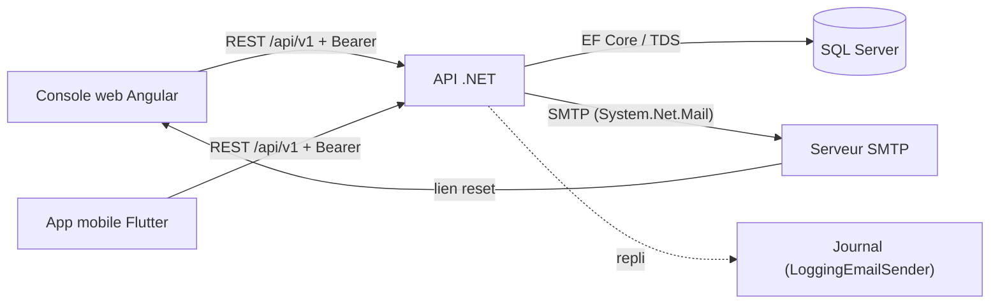

# 05 — Intégrations

## Sommaire

1. [Vue globale des flux](#vue-globale-des-flux)
2. [API exposée](#api-exposée)
3. [Base de données SQL Server](#base-de-données-sql-server)
4. [Serveur SMTP / e-mail](#serveur-smtp--e-mail)
5. [Authentification JWT](#authentification-jwt)
6. [Clients : console web et app mobile](#clients--console-web-et-app-mobile)
7. [Comportements en cas de panne](#comportements-en-cas-de-panne)
8. [Sources analysées](#sources-analysées)

## Vue globale des flux

Points d'attention :

- Le système est **peu couplé à l'extérieur** : une seule vraie dépendance sortante synchrone (SMTP),
  optionnelle. Pas de file de messages, pas d'appel HTTP tiers, pas de WCF.
- Le lien e-mail de réinitialisation renvoie vers la **SPA** (`Auth:PasswordResetUrlBase`), bouclant
  le parcours utilisateur.

## API exposée

Base `api/v1`. Contrat OpenAPI publié via Swagger en développement (`/swagger`, `Program.cs`).
Auth par JWT Bearer. Erreurs normalisées en **ProblemDetails RFC 7807** avec extensions `code`
(`ExceptionHandlingMiddleware`).

| Ressource | Route | Verbes / endpoints | Accès |
|-----------|-------|--------------------|-------|
| Auth | `api/v1/auth` | `login`, `activate`, `forgot-password`, `reset-password` (anonymes) ; `me`, `change-password` (auth) | mixte |
| Setup | `api/v1/setup` | `status` (GET, anonyme), `first-admin` (POST, anonyme) | anonyme |
| Membres | `api/v1/members` | POST, GET liste, GET `{id}`, PUT `{id}` | `manage_members` |
| Lookup membres | `api/v1/members/lookup` | GET | authentifié |
| Profils membre | `api/v1/members/{id}/bureau-profiles` | GET, POST, DELETE `{profileId}` | authentifié (écriture admin) |
| Profils bureau | `api/v1/bureau-profiles` | GET, GET `{id}`, POST, PUT `{id}`, DELETE `{id}` | authentifié (écriture admin) |
| Permissions | `api/v1/permissions` | GET (catalogue) | authentifié |
| Sessions | `api/v1/attendance-sessions` | POST, GET `mine/open`, GET `{id}`, GET `{id}/qr`, POST `{id}/close`, POST `{id}/cancel` | `manage_attendance` |
| Présences | `api/v1/attendance-sessions/{id}` | POST `scan`, POST `scan/batch` (auth) ; POST/GET/DELETE `attendances` | mixte |
| Antennes | `api/v1/antennas` | POST, GET, GET `{id}`, PUT `{id}`, POST `{id}/(de)activate` | `manage_referentials` |
| Référentiels | `api/v1/reference` | GET `antennas/civilities/cities/districts/countries` | authentifié |
| Rapports | `api/v1/reports/attendance` | GET `antenna-summary`, `antenna-summary.csv`, `time-series`, `member-rate` | `manage_attendance` |

Codes de statut métier (extension `code` du ProblemDetails) : `contact_in_use`, `duplicate_name`,
`last_administrator`, `already_installed`, `password_change_required`.

Codes HTTP mappés (`ExceptionHandlingMiddleware`) : 400 (validation/domaine), 401 (`Unauthorized`),
403 (`Forbidden` / `password_change_required`), 404 (`NotFound`), 409 (`Conflict`/`Duplicate`),
410 (`Gone`, QR périmé), 500 (masqué).

## Base de données SQL Server

- Fournisseur : `Microsoft.EntityFrameworkCore.SqlServer` (`Infrastructure/DependencyInjection.cs`).
- Chaîne : `ConnectionStrings:Default`. En dev : authentification Windows intégrée
  (`Trusted_Connection=True;TrustServerCertificate=True`).
- Transactions : `SaveChanges` par cas d'usage ; transaction **sérialisable** explicite pour
  l'annulation de session (`AttendanceSessionRepository.ExecuteInSerializableTransactionAsync`) avec
  `CreateExecutionStrategy` (compatible reprise sur erreur transitoire).
- SQLite est utilisé pour certains tests (`Microsoft.EntityFrameworkCore.Sqlite`), d'où les filtres
  d'index écrits de façon portable.

## Serveur SMTP / e-mail

- Port `IEmailSender` (Domain), deux implémentations (`Infrastructure/Email/`) :
  - `SmtpEmailSender` : `System.Net.Mail.SmtpClient`, `EnableSsl = UseStartTls`, identifiants par config.
  - `LoggingEmailSender` : écrit dans les logs (défaut / dev).
- Sélection à l'enregistrement DI selon `Email:Provider` (`Smtp` sinon `Logging`).
- Deux usages : **invitation** (identifiant + mot de passe temporaire) et **réinitialisation** (lien).
- **Sécurité** : le mot de passe temporaire et le lien de reset (contenant le jeton en clair) sont
  dans le corps du message mais **jamais journalisés** (commentaires FR-016/SC-004 vérifiés).

## Authentification JWT

- Émission (`JwtTokenIssuer`) : HMAC-SHA256, `Jwt:SigningKey`/`Issuer`/`Audience`, claims `member_id`,
  `name`, `permission[]`, durée `Auth:AccessTokenMinutes`.
- Validation (`Program.cs`) : issuer, audience, lifetime et clé validés ; clé lue de façon différée via
  `IOptions<JwtOptions>` (nécessaire pour les tests).
- **Pas de refresh token** : à expiration (~60 min), reconnexion requise. Côté SPA, jeton **en mémoire**
  (jamais `localStorage`, `session-store.ts`) ; côté mobile, **coffre sécurisé OS** (`flutter_secure_storage`).

## Clients : console web et app mobile

### Console web (`web/`)

- Angular 20 standalone. Client HTTP par ressource (`core/api/*-api.ts`).
- `authTokenInterceptor` ajoute le Bearer ; `error.interceptor.ts` gère 401/403/validation.
- `SessionStore` : jeton + profil (`GET /auth/me`) en signals ; RBAC d'affichage via `hasPermission`.
- Guards de routes par permission (`core/guards/guards.ts`, `app.routes.ts`) : `authGuard`,
  `guestOnly`, `permissionGuard`, `setupGuard`.
- Affiche/projette le QR rotatif (`features/attendance/session-run/qr-panel`), ne scanne pas.

### App mobile (`mobile/`)

- Flutter + Riverpod + go_router + Dio. Intercepteur Bearer + gestion 401 (purge + retour login).
- Jeton dans le coffre sécurisé (`core/storage/secure_token_store.dart`, `token_holder.dart`).
- Scan QR (`mobile_scanner`) + **file hors ligne** (`features/attendance/data/offline_queue_store.dart`)
  synchronisée par lot via `scan/batch` avec `clientOperationId` (idempotence), déclenchée au retour de
  connectivité (`connectivity_plus`).
- URL de base de l'API par profil (`env/{dev,device,usb,prod}.json`).

## Comportements en cas de panne

| Dépendance | Panne | Comportement observé |
|------------|-------|----------------------|
| SMTP | Envoi invitation échoue | Membre déjà persisté ; bascule en « remise bureau » (mot de passe affiché une fois) — `CreateMemberHandler` |
| SMTP | Envoi reset échoue | Réponse reste **générique** (anti-énumération) ; échec journalisé sans le lien — `RequestPasswordResetHandler` |
| Base | Violation d'unicité (présence) | `DbUpdateException` → traduit en `ConflictException` 409 — `AttendanceRepository.SaveChangesAsync` |
| Base | Course sur annulation de session | Transaction sérialisable empêche la perte d'une présence concurrente — `CancelSessionHandler` |
| Job AutoClose | Exception dans un cycle | Loggée, le timer poursuit (pas d'arrêt du service) — `SessionAutoCloseService` |
| QR | Jeton photographié périmé | 410 `Gone` « scannez le code actuel » — `ScanAttendanceHandler` |
| Client mobile | Hors ligne | Capture locale, synchro différée idempotente au retour réseau |

## Sources analysées

- `src/Lumineux.Api/Controllers/*.cs`, `Middleware/ExceptionHandlingMiddleware.cs`, `Program.cs`
- `src/Lumineux.Infrastructure/Email/*`, `Security/JwtTokenIssuer.cs`, `Repositories/AttendanceRepository.cs`
- `web/src/app/core/{api,http,session,guards}/*`, `app.routes.ts`
- `mobile/lib/core/network/*`, `features/attendance/data/*`, `mobile/env/*.json`
</content>
