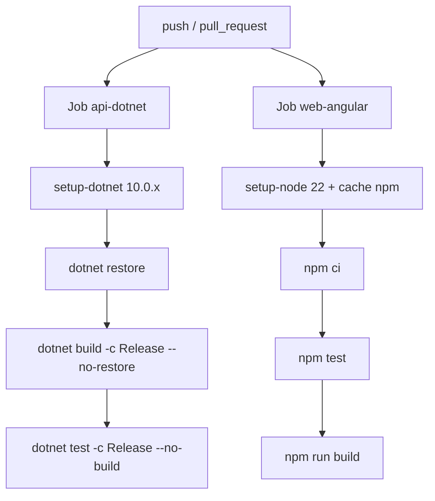
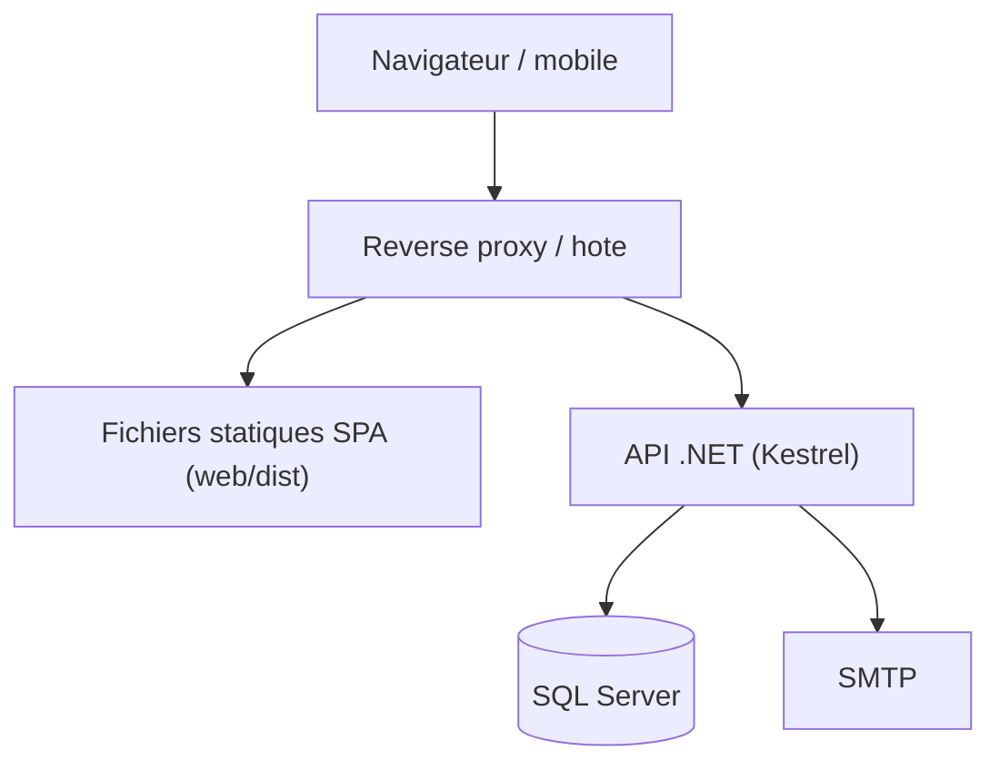

# 06 — Configuration et déploiement

## Sommaire

- [Sources de configuration](#sources-de-configuration)
- [Clés de configuration par section](#clés-de-configuration-par-section)
- [Gestion des secrets](#gestion-des-secrets)
- [Pipelines CI](#pipelines-ci)
- [Topologie d'hébergement](#topologie-dhébergement)
- [Sources analysées](#sources-analysées)

## Sources de configuration

Configuration ASP.NET Core standard, par ordre de priorité croissante :
`appsettings.json` → `appsettings.{Environment}.json` → **user-secrets** (dev) →
**variables d'environnement** → arguments. Le garde-fou de la clé JWT lit la
configuration **après `Build()`** pour prendre en compte toutes les sources
(`Program.cs`).

- `src/Lumineux.Api/appsettings.json` : valeurs par défaut (secrets **vides**).
- `src/Lumineux.Api/appsettings.Development.json` : chaîne de connexion locale +
  CORS `http://localhost:4200`. **Ne contient aucun secret JWT** (commenté :
  toujours via user-secrets/env).
- `UserSecretsId` défini dans `Lumineux.Api.csproj`.

## Clés de configuration par section

Valeurs constatées dans `appsettings.json` (secrets remplacés par `***`) :

| Section | Clé | Défaut | Rôle |
|---------|-----|--------|------|
| `ConnectionStrings` | `Default` | `***` (vide) | Chaîne SQL Server |
| `Jwt` | `Issuer` / `Audience` | `Lumineux` | Émission/validation JWT |
| `Jwt` | `SigningKey` | `***` (vide, **obligatoire ≥ 32 octets**) | Clé de signature HMAC |
| `Auth` | `AccessTokenMinutes` | `60` | Durée de vie du jeton |
| `Auth` | `MaxFailedAttempts` | `5` | Seuil de verrouillage |
| `Auth` | `LockoutMinutes` | `15` | Durée du verrouillage |
| `Auth` | `PasswordMinLength` | `8` | Politique mot de passe |
| `Auth` | `PasswordResetMinutes` | `30` | Validité jeton de reset |
| `Auth` | `PasswordResetUrlBase` | `https://localhost:4200/auth/reset-password` | Base du lien de reset |
| `AutoClose` | `Enabled` | `true` | Active la clôture auto |
| `AutoClose` | `PollingIntervalSeconds` | `300` | Intervalle de scrutation (min 30) |
| `AutoClose` | `MaxOpenHours` | `3` | Ancienneté avant clôture auto |
| `AutoClose` | `DefaultDurationHours` | `3` | Durée nominale d'une réunion |
| `Email` | `Provider` | `Logging` | `Smtp` ou `Logging` (repli) |
| `Email` | `FromAddress` | `no-reply@lumineux.example` | Expéditeur |
| `Email` | `Smtp:Host/Port/UseStartTls/User/Password` | `***` | Paramètres SMTP |
| `MemberReference` | `Format` | `LUM-{yyyy}-{seq:00000}` | Gabarit de référence membre |
| `Cors` | `AllowedOrigins` | `[]` | Origines SPA autorisées |
| `Serilog` | `MinimumLevel…` | Information / Warning | Journalisation |

Ces sections sont liées via l'Options pattern dans `DependencyInjection.cs`
(`JwtOptions`, `AuthOptions`, `AutoCloseOptions`, `EmailOptions`,
`MemberReferenceOptions`).

Frontaux :

- **Web** : `web/src/environments/environment.ts` (dev, `apiBaseUrl` =
  `https://localhost:4311`) et `environment.prod.ts` (prod, `apiBaseUrl = '/'`).
- **Mobile** : `mobile/lib/core/config/env.dart` + dossier `mobile/env/`
  (non détaillé — `⚠️ à confirmer` selon l'environnement ciblé).

## Gestion des secrets

Bonne posture globale : **aucun secret n'est committé** dans `appsettings*.json`.

- **Dev** : `dotnet user-secrets set "Jwt:SigningKey" "<clé>"` (documenté dans
  `appsettings.Development.json`).
- **Prod** : variable d'environnement `Jwt__SigningKey` ou magasin de secrets.
  Idem pour `ConnectionStrings__Default` et `Email__Smtp__Password`.
- Convention : `Section__Cle` (double underscore) pour les variables d'environnement.

⚠️ **Ne jamais recopier une valeur de secret** dans la documentation ou les tickets ;
n'indiquer que la **clé**.

## Pipelines CI

Deux workflows GitHub Actions (`.github/workflows/`). Aucun pipeline de
**déploiement** (CD) n'est présent — la CI est purement une **barrière de qualité**.

### `dotnet-ci.yml` (backend + web)

Déclencheurs : push/PR touchant `src/`, `tests/`, `web/`, les fichiers de solution
et props. Deux jobs parallèles :

### `mobile-ci.yml` (Flutter)

Déclencheurs : push/PR touchant `mobile/`.

1. `subosito/flutter-action` (stable `3.44.5`, cache activé).
2. `flutter pub get`.
3. `flutter analyze` (**zéro avertissement** attendu).
4. `flutter test` (unitaires + widgets).

Les tests sont **bloquants** (« Principe III — tests bloquants », commentaires des
workflows).

## Topologie d'hébergement

Aucun manifeste d'infrastructure (Dockerfile, IIS `web.config` de déploiement,
azure-pipelines, Helm) n'a été trouvé dans le dépôt. La topologie est donc **déduite**
et reste `⚠️ Hypothèse — à confirmer` :

Indices dans le code :

- `environment.prod.ts` positionne `apiBaseUrl = '/'` → la SPA et l'API sont servies
  sous la **même origine** en production (reverse proxy commun, pas de CORS requis).
- En dev, API sur `https://localhost:4311` (`environment.ts`) et SPA sur `:4200`
  (CORS explicitement autorisé).
- `dist/` (web) et `build/` (mobile) sont des sorties de build, non versionnées
  comme artefacts de release.

Recommandation : formaliser le déploiement (conteneur ou service Windows/IIS +
migrations EF appliquées au démarrage ou via étape CD dédiée). Un ancien
`docs/DEPLOIEMENT.md` est référencé dans les commentaires mais **absent** du working
tree (supprimé — voir statut git) : à reconstituer.

## Sources analysées

- `src/Lumineux.Api/appsettings.json`, `appsettings.Development.json`
- `src/Lumineux.Api/Lumineux.Api.csproj`, `Program.cs`
- `src/Lumineux.*/…Options.cs` (Jwt, Auth, AutoClose, Email, MemberReference)
- `.github/workflows/dotnet-ci.yml`, `.github/workflows/mobile-ci.yml`
- `web/src/environments/*.ts`, `mobile/lib/core/config/env.dart`
</content>
