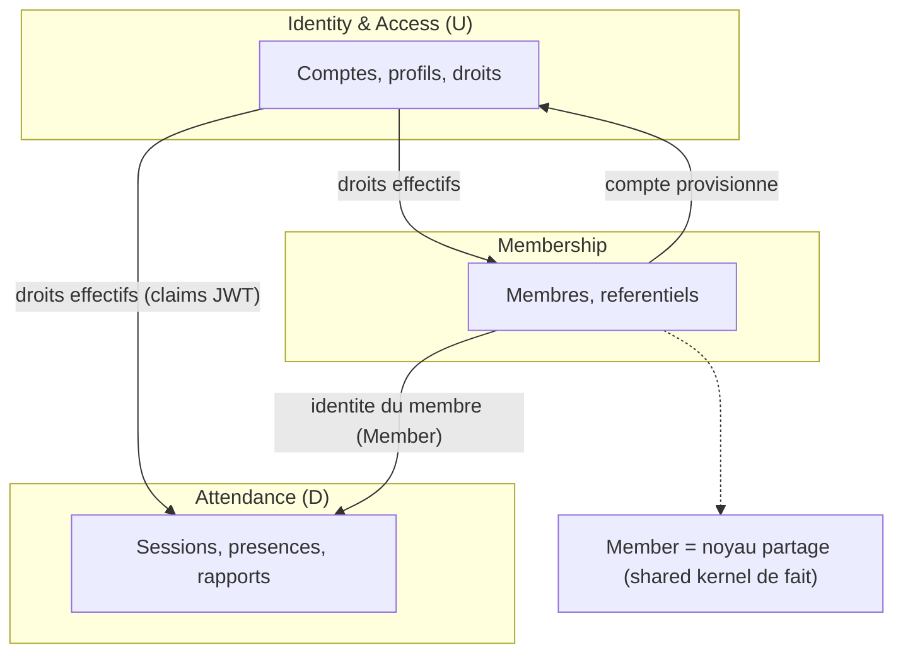

# 08 — Vue Domain-Driven Design

> Grille de lecture DDD **pragmatique** de la solution. Objectif : éclairer la
> conception actuelle et proposer des évolutions réalistes, pas imposer une
> réécriture.

## Sommaire

- [Bounded contexts candidats](#bounded-contexts-candidats)
- [Context map](#context-map)
- [Agrégats, entités, value objects](#agrégats-entités-value-objects)
- [Invariants trouvés dans le code](#invariants-trouvés-dans-le-code)
- [Événements de domaine (implicites)](#événements-de-domaine-implicites)
- [Langage ubiquitaire](#langage-ubiquitaire)
- [Écart avec une cible DDD](#écart-avec-une-cible-ddd)
- [Sources analysées](#sources-analysées)

## Bounded contexts candidats

Le backend est un **monolithe modulaire** : un seul `AppDbContext`, mais un
découpage par dossier fonctionnel dans `Application/` qui révèle des frontières
naturelles.

| Contexte candidat | Cœur métier | Modules code |
|-------------------|-------------|--------------|
| **Attendance** (présence) | sessions, scans, clôture, rapports | `AttendanceSessions/`, `Attendances/`, `Reports/` |
| **Membership** (adhésion) | fiche membre, référence, référentiels | `Members/`, `Reference/` |
| **Identity & Access** (IAM) | comptes, connexion, mots de passe, profils/droits | `Auth/`, `BureauProfiles/`, `Setup/` |

Ces trois contextes partagent aujourd'hui `Member` comme entité pivot — c'est le
principal point de couplage (shared kernel de fait).

## Context map

Ce diagramme montre les contextes candidats et leurs relations (U = upstream
fournisseur, D = downstream consommateur).

- **IAM → Attendance / Membership** : relation *upstream/downstream* via les **claims
  de permission** portés par le JWT ; les contextes aval consomment les droits, ne
  les définissent pas.
- **Membership ↔ IAM** : couplage bidirectionnel autour de `Member`/`MemberAccount`
  (création de membre = provisionnement de compte). Candidat à un **Anti-Corruption
  Layer** si l'un des deux devait être extrait.
- **Attendance** est le contexte le plus autonome (agrégats propres, peu de
  dépendances entrantes hormis l'identité et les droits).

## Agrégats, entités, value objects

### Contexte Attendance

- **Agrégat `AttendanceSession`** (racine) : `AttendanceSession.cs`. Encapsule son
  cycle de vie (`Start`, `Close`, `Cancel`, `AutoClose`), le secret QR et le pas de
  rotation. **Limite actuelle** : les `Attendance` ne sont **pas** chargées comme
  entités enfants de l'agrégat ; elles forment un agrégat séparé référencé par
  `SessionId`. La cohérence « session ↔ présences » est donc orchestrée par les
  handlers, pas par la racine.
- **Agrégat `Attendance`** (racine de fait) : `Attendance.cs`. Fabriques
  `RecordScan`/`RecordManual`, transitions `Cancel`/`ApplyEndTime`.
- **Value objects candidats** (aujourd'hui primitifs) : le **jeton QR**
  (`QrToken` existe déjà comme record côté service), la **période de rapport**
  (`ReportPeriod`), l'**heure d'arrivée bornée**.

### Contexte Membership

- **Agrégat `Member`** (racine) : `Member.cs`. Fabriques `Create`. **Anémie
  partielle** : setters publics, pas de méthodes de mutation métier.
- **Entités référentielles** : `Civility`, `Country`, `City`, `District` — plutôt des
  **value objects de nomenclature** (lecture seule côté membre).
- **Value objects candidats** : `Reference` membre (aujourd'hui `string`), `Gender`
  (déjà validé par `Genders.IsValid`), coordonnées de contact.

### Contexte IAM

- **Agrégat `MemberAccount`** (racine) : `MemberAccount.cs`. Riche : verrouillage,
  changement de mot de passe, activation. Bon exemple d'entité DDD.
- **Agrégat `BureauProfile`** (racine) : `BureauProfile.cs`, avec ses
  `BureauProfilePermission` comme entités enfants (vraie composition d'agrégat).
- **Agrégat `PasswordResetToken`** : cycle de vie usage-unique (`Issue`, `Consume`,
  `IsUsable`).
- **Entité d'association** `MemberBureauProfile` : lien membre↔profil (unicité).

## Invariants trouvés dans le code

- Session : une seule ouverte par `(antenne, date)` ; annulation réservée à une
  session ouverte et **vide** (transaction sérialisable) ; clôture idempotente.
- Présence : au plus une **valide** par `(session, membre)` (domaine + index unique
  filtré) ; heure serveur faisant foi ; `clientOperationId` idempotent.
- Compte : mot de passe stocké **haché uniquement** ; verrouillage après N échecs ;
  `MustChangePassword` bloque l'émission de jeton.
- Profil : nom unique insensible à la casse ; droits validés contre le **catalogue
  figé** ; garde-fou « dernier administrateur ».
- Reset : jeton usage unique + expiration ; seul le hash est persisté.
- Référence membre : unique (`LUM-{yyyy}-{seq}`).

## Événements de domaine (implicites)

Aucun **event bus** ni type `DomainEvent` explicite. Les événements sont **implicites**
(« quand X, alors Y ») et orchestrés dans les handlers :

| Événement métier | Déclencheur | Conséquence codée |
|------------------|-------------|-------------------|
| `MembreEnrôlé` | `CreateMemberHandler` | provisionnement de compte + envoi d'invitation |
| `SessionClôturée` | `CloseSessionHandler` / `AutoClose` | heure de fin propagée aux présences valides |
| `PrésenceEnregistrée` | `ScanAttendanceHandler` | audit `Operation("Scan")` |
| `PremierAdminInstallé` | `InstallFirstAdminHandler` | profil admin + jeton émis |
| `MotDePasseRéinitialisé` | `ResetPasswordHandler` | reset compteurs + levée verrou |

Ces intentions sont tracées via `IAuditLogger` (`Operation`/`Refused`), ce qui
constitue un **journal d'événements** de fait, exploitable pour une évolution vers
des vrais domain events.

## Langage ubiquitaire

Glossaire des termes tels que nommés dans le code :

| Terme métier | Nommage code | Notes |
|--------------|--------------|-------|
| Antenne | `Antenna` | lieu de réunion |
| Membre | `Member` | référence = identifiant de connexion |
| Compte | `MemberAccount` | 1-1 avec Member |
| Session (de présence) | `AttendanceSession` | réunion datée dans une antenne |
| Présence | `Attendance` | pointage d'un membre |
| Profil du bureau | `BureauProfile` | groupe de droits |
| Droit / permission | `Permission` / claim `permission` | catalogue figé |
| Référence membre | `Reference` | `LUM-{yyyy}-{seq}` |
| Jeton QR | `QrToken` / `qr_secret` | TOTP rotatif |

**Incohérences de nommage relevées** :

- « Droit » vs « permission » vs « claim » désignent le même concept selon la couche
  (métier / catalogue / JWT).
- `District` est à la fois une **entité référentielle** (`District` avec `Code`,
  `Label`) et un **champ `int`** sur `Antenna` (`Antenna.District`) — l'antenne stocke
  un identifiant de district non typé comme FK vers la table `districts`
  (`⚠️ à confirmer` : cohérence de la relation antenne↔district).
- « Session » côté attendance vs « session » côté web (`SessionStore` = session
  d'authentification) : homonyme entre deux contextes.
- `BirthPlaceId` et `BirthCityId` pointent tous deux vers `City` — distinction
  lieu/ville de naissance à clarifier dans le glossaire.

## Écart avec une cible DDD

**Ce qui est déjà bien aligné** :

- Entités riches côté IAM et Attendance (fabriques, invariants, transitions).
- Ports & adapters stricts, domaine sans dépendance technique.
- Séparation lecture/écriture (CQRS léger).

**Ce qui est anémique / fuit hors du domaine** :

- `Member` : setters publics, mutations non encapsulées.
- Règles de cardinalité session↔présences portées par les handlers (le décompte et
  la propagation d'heure vivent en Application).
- Pas de value objects : identifiants et coordonnées restent des primitifs
  (`primitive obsession` légère).

**Premières étapes réalistes de refactoring** :

1. Encapsuler `Member` (méthodes `UpdateContact`, `Archive`, `AttachToAntenna`) et
   privatiser les setters.
2. Introduire quelques value objects à fort ROI : `MemberReference`, `Gender`,
   `EmailAddress`/`PhoneNumber`, `ReportPeriod`.
3. Nommer explicitement les domain events (au moins `SessionClosed`,
   `MemberEnrolled`) même sans bus, pour rendre les effets de bord traçables et
   testables.
4. Clarifier l'agrégat `AttendanceSession` : décider s'il devient racine composite
   des présences (cohérence forte, mais volume) ou reste couplé faiblement (statu
   quo documenté).
5. Documenter la frontière IAM/Membership autour de `Member` avant toute extraction
   de service.

## Sources analysées

- `src/Lumineux.Domain/Entities/*.cs`, `src/Lumineux.Domain/Enums/*.cs`
- `src/Lumineux.Application/**/*Handler.cs`
- `src/Lumineux.Infrastructure/Repositories/EffectivePermissionsReader.cs`
- `src/Lumineux.Infrastructure/Security/PermissionCatalog.cs`
- `src/Lumineux.Infrastructure/Observability/AuditLogger.cs` (référencé)
</content>
