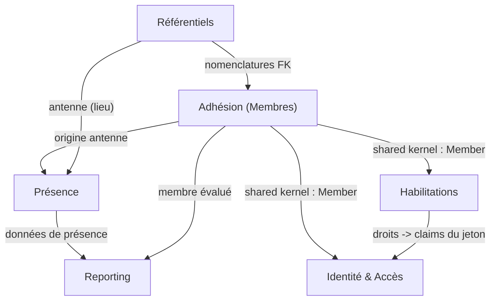

# 08 — Vue Domain-Driven Design

## Sommaire

1. [Posture](#posture)
2. [Bounded contexts (candidats)](#bounded-contexts-candidats)
3. [Context map](#context-map)
4. [Agrégats et invariants par contexte](#agrégats-et-invariants-par-contexte)
5. [Événements de domaine (implicites)](#événements-de-domaine-implicites)
6. [Langage ubiquitaire](#langage-ubiquitaire)
7. [Écart avec une cible DDD](#écart-avec-une-cible-ddd)
8. [Sources analysées](#sources-analysées)

## Posture

La solution est un **monolithe modulaire** bien découpé par fonctionnalité. Elle n'emploie pas
explicitement le vocabulaire DDD (pas de « Aggregate », « ValueObject », « DomainEvent » nommés),
mais son **domaine riche** et son organisation par feature en font une bonne candidate à une lecture
DDD. Les « bounded contexts » ci-dessous sont des **regroupements logiques** identifiés d'après les
namespaces (`Application/*`, `Domain/Entities/*`) — pas des frontières techniques réelles.

## Bounded contexts (candidats)

| Contexte | Cœur métier | Entités / namespaces |
|----------|-------------|----------------------|
| **Identité & Accès** | Comptes, connexion, mots de passe, jetons | `MemberAccount`, `PasswordResetToken`, `Application/Auth`, `Setup` |
| **Adhésion (Membres)** | Fiche membre, enrôlement, référence | `Member`, nomenclatures, `Application/Members` |
| **Habilitations** | Profils du bureau, permissions, RBAC | `BureauProfile`, `BureauProfilePermission`, `MemberBureauProfile`, `MemberPermission` |
| **Présence** | Sessions, QR, scans, clôture | `AttendanceSession`, `Attendance`, `Antenna`, `Application/Attendances`, `AttendanceSessions` |
| **Reporting** | Agrégations, taux, séries, CSV | `Application/Reports`, `IAttendanceReportRepository` |
| **Référentiels** | Antennes, civilités, villes, districts, pays | `Antenna`, `Civility`, `City`, `District`, `Country` |

## Context map

Relations entre contextes (upstream → downstream). `Member` est le concept partagé (shared kernel).

Points d'attention :

- **`Member` est un shared kernel de facto** : partagé entre Adhésion, Identité, Habilitations,
  Présence et Reporting. C'est un concept central mais aussi un point de couplage fort.
- **Habilitations est upstream d'Identité** : les profils déterminent les claims émis à la connexion
  (`MemberPermissionRepository.GetPermissionsAsync` consommé par `LoginHandler`/`JwtTokenIssuer`).
- **Référentiels** est un contexte support (nomenclatures + antennes) fournissant des cibles de FK.

## Agrégats et invariants par contexte

### Identité & Accès
- **Agrégat `MemberAccount`** (racine) : encapsule état d'activation, verrouillage, hash.
  - Invariants : mot de passe jamais en clair ; `Provision` exige référence + hash ; verrouillage au
    seuil ; `ChangePassword` lève `MustChangePassword` ; setters privés (mutation par méthodes seulement).
- **Agrégat `PasswordResetToken`** (racine) : usage unique + durée de vie.
  - Invariants : jamais stocké en clair (hash) ; `Consume` refuse une double consommation ;
    `IsUsable` = non consommé et non expiré.

### Adhésion
- **Agrégat `Member`** (racine) : fabrique `Create` garantissant référence/nom/prénom/genre valides.
  - Invariants : genre ∈ {M,F} ; antenne requise (sauf surcharge admin `antennaId = null`) ; statut Active par défaut.
  - **Anémie partielle** : `Member` a des **setters publics** (compat features 001) — les invariants ne
    sont garantis qu'à la création, pas aux mutations ultérieures. Value objects absents (email, mobile
    sont de simples `string?`).

### Habilitations
- **Agrégat `BureauProfile`** (racine) + `BureauProfilePermission` (entité fille).
  - Invariants : nom unique insensible à la casse (`NameNormalized`) ; permissions validées contre
    `IPermissionCatalog` (droit inconnu rejeté) ; longueurs bornées.
- Invariant inter-agrégats : **au moins un administrateur actif** (garde-fou `last_administrator`),
  porté par la couche Application (`CountActiveAdministratorsAsync`) car il traverse plusieurs agrégats.

### Présence
- **Agrégat `AttendanceSession`** (racine) : machine à états Open → Closed/Cancelled.
  - Invariants : pas de step QR hors [10,120] s ; double clôture interdite ; annulation réservée à une
    session ouverte ; auto-clôture idempotente.
- **Agrégat `Attendance`** (racine séparée) : une présence valide/annulée.
  - Invariants : session et membre valides ; annulation trace (statut `Cancelled`, pas de suppression).
  - Invariant inter-agrégats : « une présence valide par membre et par session » → matérialisé par un
    **index SQL filtré** (hors du domaine), et « vide » vérifié par la couche Application pour l'annulation.

## Événements de domaine (implicites)

Aucun `DomainEvent` explicite. Réactions « quand X arrive, Y se produit » repérées dans le code :

| Événement métier | Effet codé | Où |
|------------------|-----------|-----|
| Session clôturée | Heure de fin propagée à toutes les présences valides | `CloseSessionHandler` |
| Session expirée (timeout) | Clôture automatique + propagation heure de fin | `SessionAutoCloseService` |
| Membre créé | Provisionnement du compte + envoi invitation ou remise bureau | `CreateMemberHandler` |
| Mot de passe réinitialisé | Jeton consommé + compteurs remis à zéro + verrouillage levé | `ResetPasswordHandler` |
| Reset demandé (compte éligible) | Émission jeton + e-mail | `RequestPasswordResetHandler` |
| Toute écriture d'entité | Champs d'audit peuplés | `AuditInterceptor` |

Ces effets sont réalisés **en ligne** dans les handlers (orchestration transactionnelle), pas via un
bus d'événements — cohérent avec la taille du système.

## Langage ubiquitaire

Glossaire des termes tels que nommés dans le code (FR/EN mêlés) :

| Terme métier | Nom dans le code | Remarque |
|--------------|------------------|----------|
| Membre | `Member` | — |
| Compte de connexion | `MemberAccount` | distinct du membre (1-1) |
| Référence membre | `Reference` / `login_id` | sert d'identifiant de connexion |
| Antenne | `Antenna` | lieu de réunion |
| Session de présence | `AttendanceSession` | une réunion datée |
| Présence | `Attendance` | présence d'un membre à une session |
| Profil du bureau | `BureauProfile` | groupe de droits |
| Droit / permission | `Permission` / claim `permission` | catalogue figé |
| Jeton QR rotatif | `QrToken` / `QrSecret` | type TOTP |
| Remise bureau | `BureauHandout` / `CredentialsDelivery` | repli sans e-mail |

### Incohérences de nommage relevées

- **« Bureau »** (français) coexiste avec l'anglais dominant (`Attendance`, `Member`) →
  `member_bureau_profiles`. Bilinguisme assumé mais hétérogène.
- **Permission** portée par **deux modèles** (`MemberPermission` legacy vs `BureauProfilePermission`) →
  même concept, deux tables, sémantiques divergentes (cf. 07-M3).
- **Durée du jeton** : `Jwt:ExpirationMinutes` vs `Auth:AccessTokenMinutes` → même concept, deux clés (07-m3).
- **Statut** exprimé tantôt en `string` (`Member.Status`, `Antenna.Status` = "Active"/"Archived"/"Inactive")
  tantôt en `enum` converti string (`SessionStatus`, `AttendanceStatus`) → deux conventions pour « statut ».

## Écart avec une cible DDD

Ce qui est déjà proche d'une cible DDD :
- Séparation claire domaine / application / infrastructure.
- Agrégats avec racines et méthodes de transition (`AttendanceSession`, `MemberAccount`, `PasswordResetToken`).
- Ubiquité correcte dans le contexte Présence et Auth.

Où la logique « fuit » hors du domaine (à surveiller, sans dramatiser) :
- **Invariants d'unicité dans les index SQL** (présence valide unique, contact unique) plutôt que dans
  le domaine — pragmatique et robuste, mais règle métier invisible depuis le modèle.
- **Garde-fou « dernier administrateur »** et **contrôle « session vide »** portés par l'Application
  (agrégats multiples) — normal en DDD (invariant inter-agrégats via service applicatif), à documenter comme tel.
- **`Member` anémique en mutation** : setters publics et absence de value objects (email, mobile,
  genre, référence pourraient être des VO).
- **Génération de référence** (logique métier) logée dans l'Infrastructure.

Premières étapes de refactoring réalistes (par valeur/coût) :
1. **Clarifier la source unique des droits** (profils) et déprécier `member_permissions` (réduit la confusion).
2. **Encapsuler `Member`** : passer les setters en privés + méthodes de correction (`UpdateContact`,
   `UpdateIdentity`) portant les règles, comme les autres agrégats.
3. **Value objects légers** pour `Reference`, `Email`, `Mobile`, `Gender` (validation centralisée).
4. Documenter explicitement les invariants inter-agrégats (garde-fous admin/session vide) comme des
   **services de domaine**.
5. À terme seulement, si le besoin d'extensibilité apparaît : introduire des **événements de domaine**
   pour découpler les effets (clôture → propagation, création → invitation).

> Recommandation : rester pragmatique. Le système est petit, cohérent et bien testé ; un passage DDD
> intégral n'est pas justifié. La grille DDD sert surtout à nommer les frontières et à guider les
> prochaines évolutions (multi-antennes, cotisations — backlog `PO_description.md`).

## Sources analysées

- `src/Lumineux.Domain/Entities/*`, `Enums/*`
- `src/Lumineux.Application/{Auth,Members,Attendances,AttendanceSessions,BureauProfiles,Setup,Reports}/*`
- `src/Lumineux.Infrastructure/{Security,Repositories,BackgroundJobs}/*`
- `PO_description.md` (roadmap/backlog)
</content>
