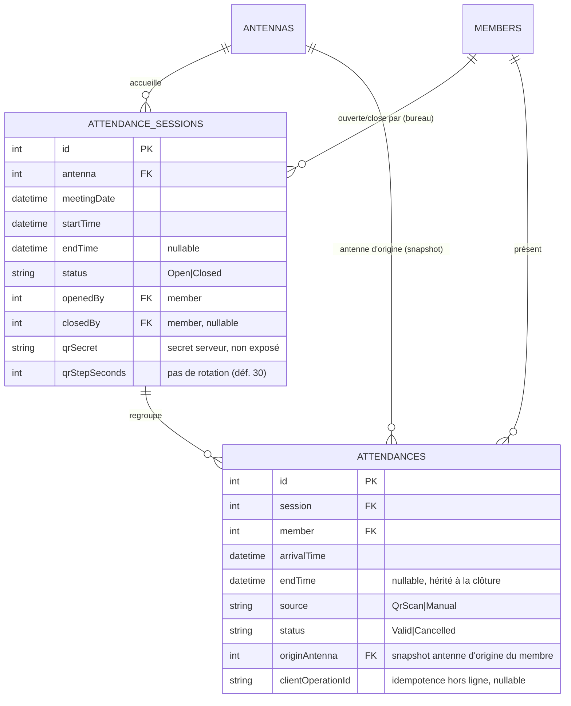
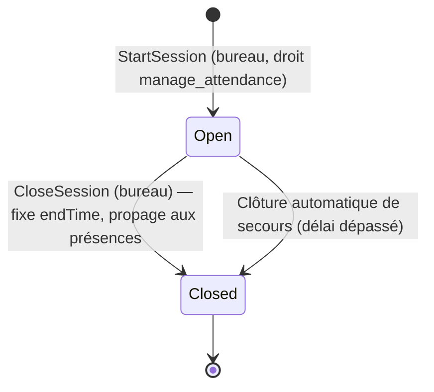
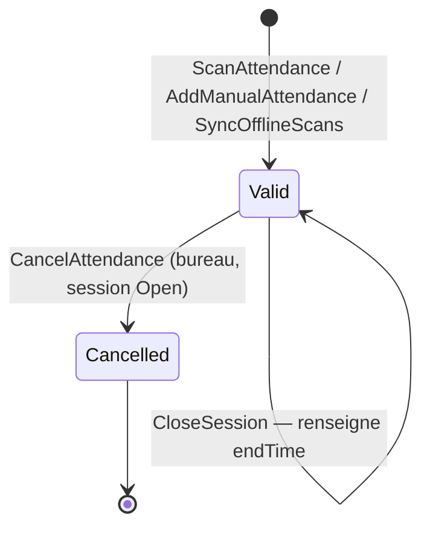

# Phase 1 — Modèle de données

**Feature**: Gestion de la présence aux réunions · **Date**: 2026-07-02

Modèle code-first (EF Core, SQL Server). Toutes les nouvelles entités héritent de `AbstractEntity`
(champs d'audit : `createdt`, `createdby`, `updatedt`, `updatedby`) conformément à la documentation
des entités existantes. Heures stockées en **UTC**.

## Vue d'ensemble

## Entités existantes réutilisées

- **Antennas** *(non modifiée)* : lieu de réunion. Champs utilisés : `id`, `status`.
- **Members** *(enrichie d'un champ)* : personne de la communauté. Champs utilisés : `id`, `status`.
  Cette fonctionnalité **ne crée pas** de membre mais **ajoute un rattachement** à l'antenne
  d'origine (décision de modélisation FR-011) :

  | Champ ajouté | Type | Contraintes | Description |
  |--------------|------|-------------|-------------|
  | `antenna` | int | FK → Antennas, **nullable**, indexé | Antenne d'origine du membre |

  > `Attendance.originAntenna` est un **instantané** de `Members.antenna` au moment de la réunion.
  > L'ajout de cette FK est porté par une migration dédiée (voir `tasks.md` T012a). L'historique des
  > changements d'antenne d'origine n'est pas conservé dans cette itération.

## Nouvelle entité : AttendanceSession (Session de présence)

Représente une réunion tenue dans une antenne à une date/heure donnée.

| Champ | Type | Contraintes | Description |
|-------|------|-------------|-------------|
| `id` | int | PK, auto | Identifiant |
| `antenna` | int | FK → Antennas, requis, indexé | Antenne où se tient la réunion |
| `meetingDate` | datetime2 | requis | Date/heure planifiée de la réunion (métier) |
| `startTime` | datetime2 (UTC) | requis | Instant réel d'ouverture de la session |
| `endTime` | datetime2 (UTC) | nullable | Instant de clôture = heure de fin de réunion |
| `status` | string(20) | requis, ∈ {Open, Closed} | État du cycle de vie |
| `openedBy` | int | FK → Members, requis | Membre du bureau initiateur |
| `closedBy` | int | FK → Members, nullable | Membre du bureau ayant clôturé |
| `qrSecret` | varbinary/string | requis, **non exposé** | Secret de dérivation du jeton QR (TOTP) |
| `qrStepSeconds` | int | requis, défaut 30 | Pas de rotation du jeton QR |
| *(audit)* | — | hérité | `createdt/by`, `updatedt/by` |

**Index & contraintes**
- Index `(antenna, status)` pour retrouver rapidement la session ouverte d'une antenne.
- Unicité applicative : au plus **une** session `Open` par `(antenna, créneau)` (FR-003) — imposée
  par vérification transactionnelle à l'ouverture (filtre sur `status = Open` et chevauchement de
  créneau) ; un index filtré peut renforcer la garantie.
- `qrSecret` protégé (accès restreint, jamais sérialisé dans un DTO).

**Règles / invariants (Domain)**
- Une session créée est `Open` avec `startTime` = heure serveur.
- La clôture n'est possible que depuis l'état `Open` ; elle fixe `endTime` (heure serveur) et
  `status = Closed`.
- Aucun enregistrement/retrait de présence n'est permis si `status = Closed` (FR-007), sous réserve
  de la règle de synchro hors ligne (FR-023b).

**Transitions d'état**

## Nouvelle entité : Attendance (Présence)

Représente la participation d'un membre à une session.

| Champ | Type | Contraintes | Description |
|-------|------|-------------|-------------|
| `id` | int | PK, auto | Identifiant |
| `session` | int | FK → AttendanceSession, requis, indexé | Session rattachée |
| `member` | int | FK → Members, requis | Membre présent |
| `arrivalTime` | datetime2 (UTC) | requis | Heure d'arrivée (instant du scan ou de l'ajout) |
| `endTime` | datetime2 (UTC) | nullable | Heure de fin héritée à la clôture de la session |
| `source` | string(20) | requis, ∈ {QrScan, Manual} | Origine de l'enregistrement (FR-015) |
| `status` | string(20) | requis, ∈ {Valid, Cancelled} | Validité (retrait tracé, FR-016) |
| `originAntenna` | int | FK → Antennas, nullable | Instantané de l'antenne d'origine du membre |
| `clientOperationId` | string(64) | nullable, unique par session | Idempotence des scans hors ligne |
| *(audit)* | — | hérité | `createdt/by`, `updatedt/by` |

**Index & contraintes**
- **Unicité `(session, member)` sur les présences valides** — anti-doublon (FR-010, SC-003). Mise en
  œuvre par index unique filtré `WHERE status = 'Valid'`.
- Unicité `(session, clientOperationId)` quand `clientOperationId` non nul — idempotence hors ligne
  (FR-023a).
- Index `(session, status)` pour la consultation en direct et post-clôture (FR-021, FR-022).

**Règles / invariants (Domain)**
- Création possible seulement sur une session `Open` (hors cas synchro FR-023b).
- `source = QrScan` implique un jeton QR valide pour la fenêtre courante (± tolérance) au moment du
  scan en ligne ; pour un scan hors ligne synchronisé, `arrivalTime = clientArrivalTime` borné.
- `source = Manual` implique un membre existant (FR-017) et le droit `manage_attendance`.
- Un second enregistrement du même `(session, member)` valide ne crée pas de doublon : renvoi « déjà
  présent », `arrivalTime` initial conservé.
- Le retrait passe la présence à `Cancelled` (trace conservée) et n'est permis que tant que la
  session est `Open`.
- À la clôture de session, `endTime` de toutes les présences `Valid` = `endTime` de la session.

**Transitions d'état**

## Objet dérivé (non persisté) : Jeton QR de session

- Non stocké comme table : le **jeton courant** est calculé à la demande à partir de `qrSecret` et de
  la fenêtre temporelle (`qrStepSeconds`), façon TOTP (voir `research.md` §3).
- Exposé uniquement au bureau autorisé via l'endpoint de récupération du QR courant ; le `qrSecret`
  n'est jamais renvoyé.

## Traçabilité (Constitution VI)

- Toutes les entités portent les champs d'audit hérités (`createdt/by`, `updatedt/by`), **peuplés
  automatiquement** par un intercepteur EF `SaveChanges` s'appuyant sur `ICurrentUser` et `IClock`
  (voir `tasks.md` T018a).
- Les opérations sensibles et les refus sont journalisés (hors persistance métier) : ouverture,
  clôture, scan, ajout manuel, retrait, tentatives refusées (droit manquant, jeton périmé, session
  close). Aucun secret ni donnée personnelle superflue dans les journaux.

## Correspondance exigences → modèle

| Exigence | Élément de modèle |
|----------|-------------------|
| FR-001/002 | AttendanceSession (`antenna`, `meetingDate`, `qrSecret`, `qrStepSeconds`) |
| FR-003 | Unicité session `Open` par antenne/créneau |
| FR-004/005/006 | `status`, `endTime`, transition Open→Closed + propagation |
| FR-008/009 | Attendance (`source=QrScan`, `arrivalTime` UTC serveur) |
| FR-010 | Index unique filtré `(session, member)` valides |
| FR-011 | `Members.antenna` (antenne d'origine) + `Attendance.originAntenna` (snapshot), session rattachée à l'antenne visitée |
| FR-013/013a | `qrSecret` + jeton dérivé rotatif |
| FR-014/015/017 | `source=Manual`, FK `member` requise |
| FR-016 | `status=Cancelled` (trace) |
| FR-019 | champs d'audit hérités + intercepteur d'audit EF (T018a) |
| FR-024 | transition Open→Closed déclenchée par le service de clôture automatique |
| FR-025 | contrôle du `status` du membre dans les cas d'usage Scan / AddManual |
| FR-023/023a/023b | `clientOperationId`, `arrivalTime` client borné, règle post-clôture |
