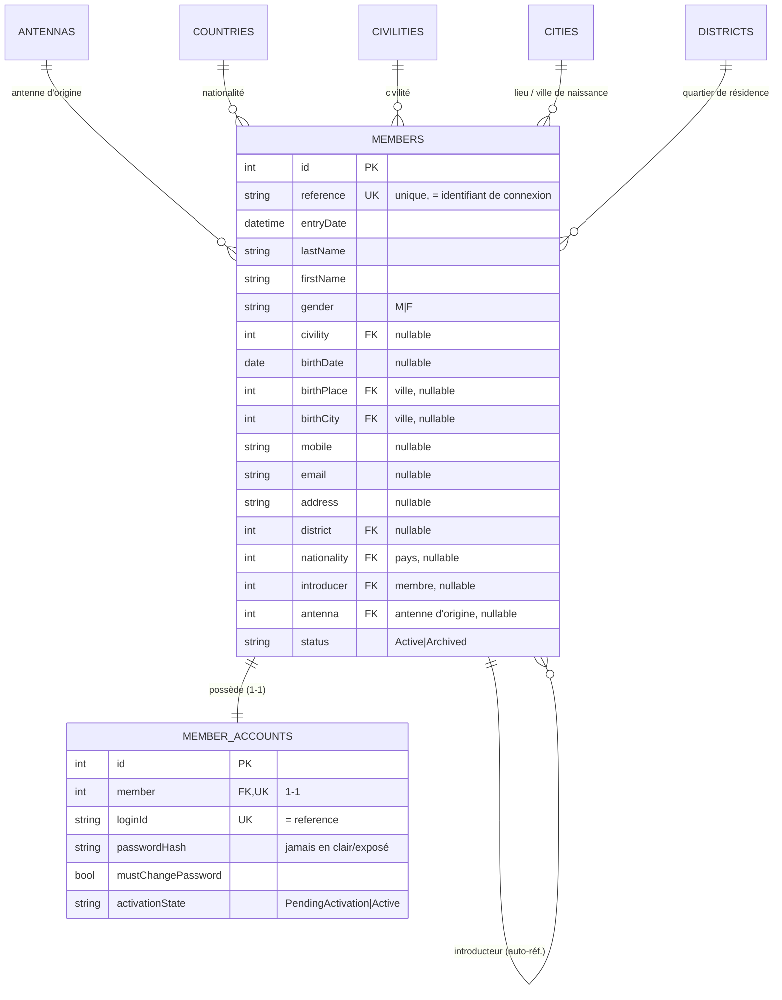
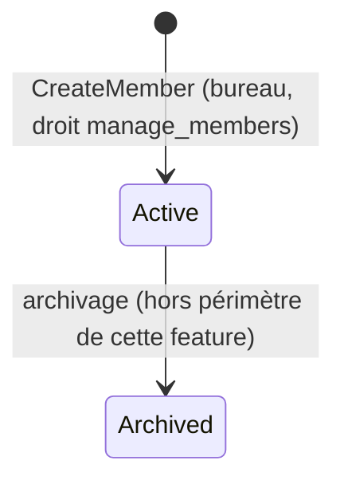

# Phase 1 — Modèle de données

**Feature**: Ajout d'un nouveau membre · **Date**: 2026-07-03

Modèle code-first (EF Core, SQL Server). Nouvelle entité `MemberAccount` + **enrichissement** de
`Member`. Héritage des champs d'audit (`AbstractEntity`) et peuplement automatique via l'intercepteur
existant. Heures en UTC.

## Vue d'ensemble

## Entité enrichie : Member

Champs **ajoutés** à l'entité/table `members` existante (feature 001) par migration additive. Les
champs `id`, `lastName`, `firstName`, `status`, `antenna` existent déjà.

| Champ | Type | Contraintes | Description |
|-------|------|-------------|-------------|
| `reference` | string(60) | **unique**, requis, indexé | Référence membre = identifiant de connexion (Q1) |
| `entryDate` | datetime2 | requis | Date d'entrée (par défaut : date de création) |
| `gender` | string(6) | requis, ∈ {M, F} | Sexe |
| `civility` | int | FK → Civilities, nullable | Civilité |
| `birthDate` | date | nullable | Date de naissance |
| `birthPlace` | int | FK → Cities, nullable | Lieu de naissance |
| `birthCity` | int | FK → Cities, nullable | Ville de naissance |
| `mobile` | string(255) | nullable | Mobile |
| `email` | string(255) | nullable | E-mail |
| `address` | string(255) | nullable | Adresse |
| `district` | int | FK → Districts, nullable | Quartier de résidence |
| `nationality` | int | FK → Countries, nullable | Nationalité |
| `introducer` | int | FK → Members, nullable | Membre introducteur |
| *(existants)* | — | — | `id`, `lastName`, `firstName`, `status`, `antenna`, audit |

**Contraintes & index**
- **Unicité** `reference` (index unique).
- **Unicité filtrée des contacts actifs** (FR-008) : index unique sur `email` `WHERE email IS NOT NULL
  AND status = 'Active'` ; idem sur `mobile`.
- **Pas** d'unicité stricte `(lastName, firstName)` (homonymes autorisés après confirmation, FR-007).
- Index de recherche : `reference`, `lastName`, `firstName`, `email`, `mobile` (FR-013).
- FK avec `OnDelete: Restrict` vers les nomenclatures et l'introducteur.

**Champs obligatoires à la création (FR-003)** : `lastName`, `firstName`, `gender`, **au moins une**
coordonnée (`mobile` **ou** `email`), `antenna`. Les autres sont optionnels.

**Règles / invariants (Domain)**
- `reference`, `entryDate` et `status = Active` sont fixés par le système à la création (FR-004).
- Les FK fournies (antenne, civilité, nationalité, villes, district, introducteur) doivent exister
  (validées à la création/correction, FR-005) sinon refus.
- Une coordonnée déjà utilisée par un membre **actif** est refusée (FR-008).
- Suppression physique interdite : archivage par changement de `status` (Assumptions).

**Transitions d'état (statut membre)**

## Nouvelle entité : MemberAccount

| Champ | Type | Contraintes | Description |
|-------|------|-------------|-------------|
| `id` | int | PK, auto | Identifiant |
| `member` | int | FK → Members, **unique** (1-1), requis | Membre rattaché |
| `loginId` | string(60) | **unique**, requis | Identifiant de connexion (= `reference`) |
| `passwordHash` | string | requis, **non exposé** | Empreinte du mot de passe (jamais en clair) |
| `mustChangePassword` | bool | requis, défaut `true` | Changement requis à la 1re connexion |
| `activationState` | string(20) | requis, ∈ {PendingActivation, Active} | État d'activation du compte |
| *(audit)* | — | hérité | `createdt/by`, `updatedt/by` |

**Règles / invariants (Domain)**
- Créé **en même temps** que le membre (transaction unique, FR-006) ; `mustChangePassword = true`,
  `activationState = PendingActivation`.
- `passwordHash` calculé via `IPasswordHasher` à partir d'un mot de passe temporaire aléatoire ; le
  mot de passe en clair n'est **jamais** persisté ni journalisé.
- L'activation (passage `Active`, `mustChangePassword = false`) relève de la **feature
  d'authentification** (hors périmètre).

## Objet transitoire (non persisté) : Identifiants initiaux

- Le **mot de passe temporaire en clair** existe uniquement en mémoire le temps de : (a) le hacher
  pour persistance, et (b) le transmettre une seule fois (e-mail, ou repli bureau dans la réponse de
  création). Jamais stocké, jamais journalisé.

## Entités de référence réutilisées (existantes)

`Antennas`, `Countries` (nationalité), `Civilities`, `Cities`, `Districts` — mappées et validées à la
création. Leur gestion (CRUD) relève d'autres fonctionnalités.

## Traçabilité (Constitution VI)

- `members` et `member_accounts` portent les champs d'audit hérités (peuplés par l'intercepteur EF
  existant). Création et corrections tracées (auteur, horodatage, FR-014/015).
- Refus (droit manquant, doublon non confirmé, contact déjà utilisé, référence inconnue) et
  résultat d'envoi d'e-mail journalisés **sans** secret ni mot de passe.

## Correspondance exigences → modèle

| Exigence | Élément de modèle |
|----------|-------------------|
| FR-001/002 | Création via droit `manage_members` |
| FR-003 | Champs obligatoires (lastName, firstName, gender, contact, antenna) |
| FR-004 | `reference` (unique), `entryDate`, `status = Active` |
| FR-005 | FK validées (antenne, nomenclatures, introducteur) |
| FR-006 | Transaction unique Member + MemberAccount |
| FR-007 | Détection homonyme applicative + confirmation (pas d'unicité (nom,prénom)) |
| FR-008 | Index unique filtré `email`/`mobile` sur membres actifs |
| FR-009/010 | `MemberAccount` (`loginId = reference`, `passwordHash`, `mustChangePassword`, `activationState`) |
| FR-011 | Transmission e-mail ou repli bureau (objet transitoire identifiants) |
| FR-012 | Compte sans droit de gestion (moindre privilège) |
| FR-013/014 | Index de recherche + correction tracée |
| FR-015/016 | Audit hérité + journalisation sans secret |
