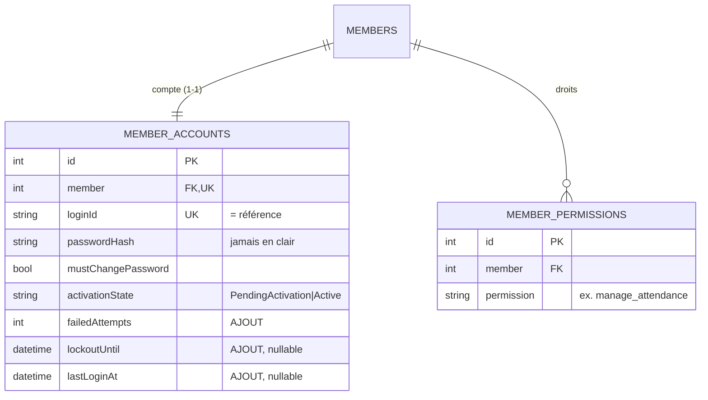
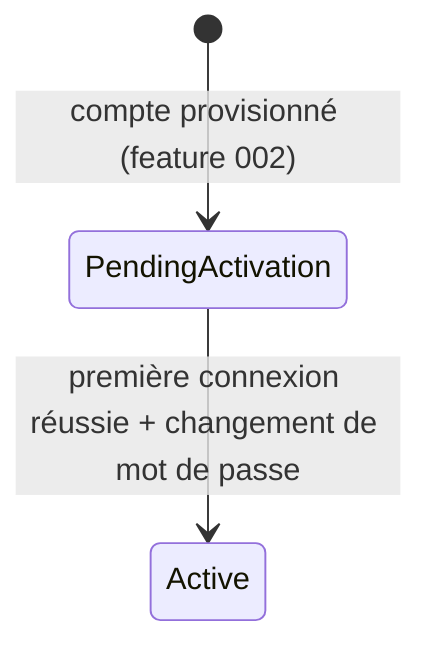

# Phase 1 — Modèle de données

**Feature**: Authentification et connexion des membres · **Date**: 2026-07-03

Enrichissement de `MemberAccount` (feature 002) + nouvelle table `member_permissions`. Aucune
persistance de jeton. Champs d'audit hérités ; heures en UTC.

## Vue d'ensemble

## Entité enrichie : MemberAccount

Champs **ajoutés** (migration additive sur `member_accounts`) :

| Champ | Type | Contraintes | Description |
|-------|------|-------------|-------------|
| `failedAttempts` | int | requis, défaut 0 | Échecs de connexion consécutifs |
| `lockoutUntil` | datetime2 (UTC) | nullable | Fin du verrouillage temporaire (si verrouillé) |
| `lastLoginAt` | datetime2 (UTC) | nullable | Dernière connexion réussie |

*(existants : `id`, `member` FK/unique, `loginId` unique, `passwordHash`, `mustChangePassword`,
`activationState`, audit)*

**Méthodes de domaine (invariants)**
- `IsLockedOut(nowUtc)` → `lockoutUntil != null && lockoutUntil > nowUtc`.
- `RegisterFailedLogin(nowUtc, maxAttempts, lockoutDuration)` → incrémente `failedAttempts` ; si
  `failedAttempts >= maxAttempts`, positionne `lockoutUntil = nowUtc + lockoutDuration`.
- `RegisterSuccessfulLogin(nowUtc)` → `failedAttempts = 0`, `lockoutUntil = null`, `lastLoginAt = now`.
- `ChangePassword(newHash)` → `passwordHash = newHash`, `mustChangePassword = false`.
- `Activate()` → `activationState = Active` (utilisé lors de la première connexion).

**Règles / invariants**
- La connexion normale échoue si le compte est verrouillé, non actif, ou en attente de changement
  (FR-005/007).
- Le verrouillage s'applique aussi bien à `/login` qu'à `/activate` (même compteur).

**Transitions d'état (activation du compte)**

## Nouvelle entité : MemberPermission

Droits d'un membre, lus à la connexion pour peupler les claims du jeton. **Attribution hors périmètre**
(gérée ailleurs / amorçage) ; cette fonctionnalité ne fait que **lire**.

| Champ | Type | Contraintes | Description |
|-------|------|-------------|-------------|
| `id` | int | PK, auto | Identifiant |
| `member` | int | FK → Members, requis, indexé | Membre concerné |
| `permission` | string(60) | requis | Code de droit (ex. `manage_attendance`, `manage_members`) |
| *(audit)* | — | hérité | `createdt/by`, `updatedt/by` |

**Contraintes** : unicité `(member, permission)` (pas de doublon de droit).

## Objet transitoire (non persisté) : Jeton d'accès

- JWT signé (clé/issuer/audience des `JwtOptions` existants), expirant (`AccessTokenMinutes`).
  Claims : `member_id`, nom, `permission` (un par droit). Jamais persisté ni journalisé.

## Entités réutilisées

- **MemberAccount** *(feature 002, enrichie ici)*, **Members** *(features 001/002)* — statut du membre
  vérifié à la connexion (compte d'un membre non actif → refus).

## Configuration (AuthOptions)

| Clé | Défaut | Rôle |
|-----|--------|------|
| `Auth:AccessTokenMinutes` | 60 | Durée de validité du jeton |
| `Auth:MaxFailedAttempts` | 5 | Seuil de verrouillage |
| `Auth:LockoutMinutes` | 15 | Durée du verrouillage |
| `Auth:PasswordMinLength` | 8 | Longueur minimale du mot de passe |

## Correspondance exigences → modèle

| Exigence | Élément de modèle |
|----------|-------------------|
| FR-001/002 | Login → `ITokenIssuer` + `MemberPermission` (claims) |
| FR-003 | `member_permissions` lue à la connexion |
| FR-004/012 | Message générique + hash factice (anti-énumération) |
| FR-005 | Vérif. statut membre + `activationState` + verrouillage |
| FR-006/014 | Jeton expirant signé (JwtOptions) |
| FR-007/008 | `/activate` : `ChangePassword` + `Activate` |
| FR-009/010 | `/change-password` + `PasswordPolicy` |
| FR-011 | `failedAttempts` / `lockoutUntil` + méthodes de verrouillage |
| FR-013 | journalisation des événements d'auth (sans secret) |
