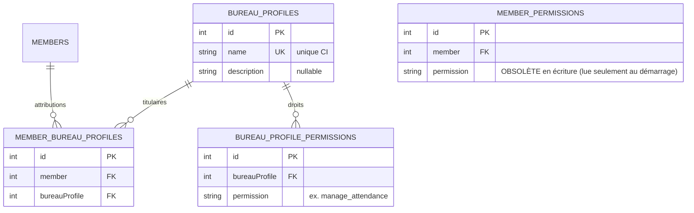
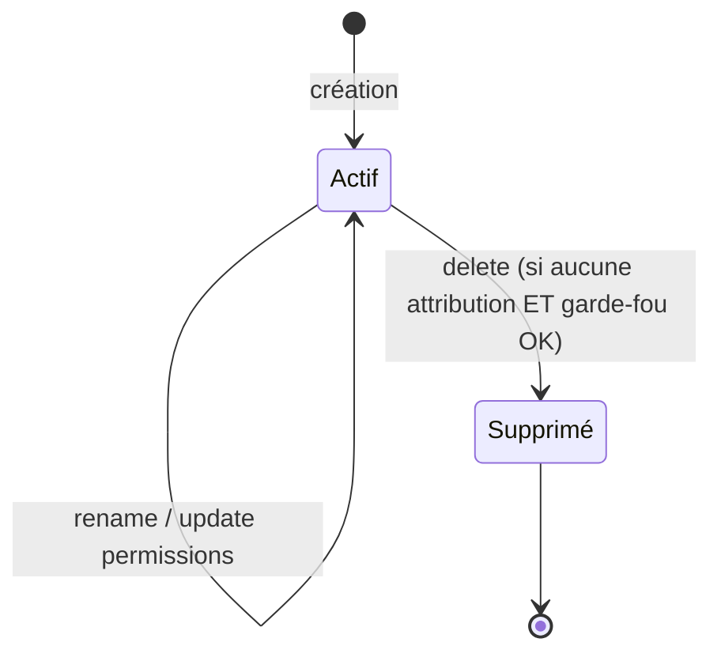

# Phase 1 — Modèle de données

**Feature**: Profils du bureau · **Date**: 2026-07-03

Trois nouvelles entités relationnelles (profil, association profil↔droit, association membre↔profil).
La table héritée `member_permissions` (feature 003) est **conservée** en lecture pour la migration
au démarrage et comme filet du bootstrap ; elle n'est plus lue par la chaîne d'authentification une
fois la migration effectuée. Champs d'audit hérités ; horodatages UTC.

## Vue d'ensemble



## Nouvelle entité : BureauProfile

Groupe nommé de droits fonctionnels.

| Champ | Type | Contraintes | Description |
|-------|------|-------------|-------------|
| `id` | int | PK, auto | Identifiant |
| `name` | string(80) | requis, unique (CI) | Nom affiché (ex. « Gestion des présences ») |
| `description` | string(255) | nullable | Description libre |
| *(audit)* | — | hérité | `createdt/by`, `updatedt/by` |

**Contraintes**
- Unicité de `name` **insensible à la casse** — index unique sur `LOWER(name)` (traduit en EF Core
  par un index sur une valeur normalisée `nameNormalized` calculée par le domaine).
- `name` non vide, longueur ≤ 80.
- `description` ≤ 255.

**Méthodes de domaine (invariants)**
- `Create(name, description, permissions, catalog)` → construit un profil ; le catalogue
  (`IPermissionCatalog`) valide chaque droit ; les doublons sont retirés.
- `Rename(name)`, `UpdateDescription(description)` — validations de longueur/nom.
- `SetPermissions(permissions, catalog)` — remplace la liste, distincte, dans le référentiel.

## Nouvelle entité : BureauProfilePermission (association profil ↔ droit)

| Champ | Type | Contraintes | Description |
|-------|------|-------------|-------------|
| `id` | int | PK, auto | Identifiant |
| `bureauProfile` | int | FK → BureauProfiles, requis, indexé | Profil |
| `permission` | string(60) | requis | Code de droit (référentiel figé) |
| *(audit)* | — | hérité | `createdt/by`, `updatedt/by` |

**Contraintes** : unicité `(bureauProfile, permission)` — un droit apparaît au plus une fois par
profil.

## Nouvelle entité : MemberBureauProfile (association membre ↔ profil)

| Champ | Type | Contraintes | Description |
|-------|------|-------------|-------------|
| `id` | int | PK, auto | Identifiant |
| `member` | int | FK → Members, requis, indexé | Membre attributaire |
| `bureauProfile` | int | FK → BureauProfiles, requis, indexé | Profil attribué |
| *(audit)* | — | hérité | `createdt/by`, `updatedt/by` (auteur = attribuant, date = attribution) |

**Contraintes**
- Unicité `(member, bureauProfile)` — évite les doublons ; l'attribution est **idempotente**
  (FR-005).
- L'attribution n'est acceptée que pour un membre au statut `Active` (contrainte applicative,
  FR-014).

## Objet en lecture seule : Référentiel des droits (IPermissionCatalog)

Le catalogue est **figé côté serveur** (aucune table associée). Il expose :
```
Permissions:
  - manage_attendance
  - manage_members
  - manage_bureau_profiles   (nouveau)
```
Toute création/modification de profil qui référence un droit hors catalogue est refusée (400).

## Table héritée : MemberPermission (statut post-migration)

- **État après feature 004** : source de vérité déplacée vers `bureau_profile_permissions` +
  `member_bureau_profiles`. La table `member_permissions` :
  - n'est **plus lue** par `IMemberPermissionRepository` (implémentation refactorée) ;
  - n'est **plus écrite** en dehors du fallback `PermissionBootstrapper` (feature 003) au démarrage ;
  - reste **conservée** (pas de drop) pour permettre la migration idempotente et servir de filet
    d'urgence si le bureau perd son admin.

## Correspondance exigences → modèle

| Exigence | Élément de modèle |
|----------|-------------------|
| FR-001/002/015 | `BureauProfile.Create/Rename/UpdatePermissions` + index unique CI |
| FR-003 | Cas d'usage `DeleteBureauProfile` refuse si attributions existantes |
| FR-004/005 | `MemberBureauProfile` + unicité `(member, profile)` |
| FR-006 | `IMemberPermissionRepository` refactoré : union des droits par profils |
| FR-007 | Émission de jeton inchangée (contrat `IMemberPermissionRepository`) |
| FR-008/015 | `IPermissionCatalog` (référentiel figé) |
| FR-009 | Requêtes de lecture (profil, titulaires, profils d'un membre) |
| FR-010 | `IAuditLogger` sur tous les cas d'usage |
| FR-011 | Constante `Permissions.ManageBureauProfiles` + policy `[Authorize]` |
| FR-012 | Requête `CountActiveAdministrators(...)` + garde-fous multi-portes |
| FR-013 | `BureauProfilesBootstrapper` — profil « Amorçage » idempotent |
| FR-014 | Contrainte applicative « membre actif » à l'attribution |
| FR-016 | DTO n'exposent que la vue publique du membre |

## Diagramme d'états d'un profil



## Notes de migration EF

- Migration nommée `BureauProfiles` : crée les trois tables + index (unicité CI sur
  `bureau_profiles.name_normalized`, unicités composées sur les tables d'association).
- **Aucune suppression** de table existante ; `member_permissions` reste en place.
- L'insertion du profil « Amorçage » est faite par le **service de démarrage** (pas par SQL de
  migration) car elle dépend de la configuration au runtime.
