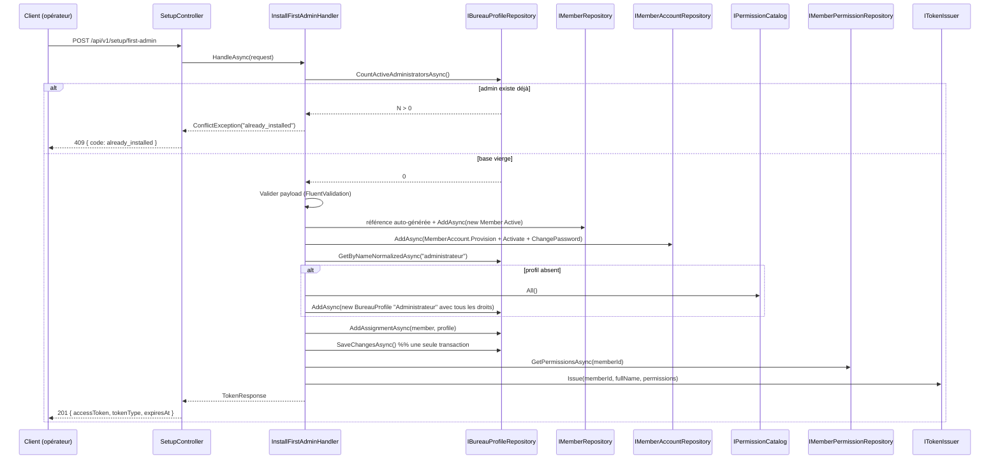

# Phase 1 — Modèle de données

**Feature**: Installation du premier administrateur · **Date**: 2026-07-03

**Aucune nouvelle entité, aucune migration.** Cette fonctionnalité **compose** des entités
existantes (features 001/002/003/004) au sein d'un cas d'usage unique. Le présent document
récapitule les entités touchées, leurs invariants pertinents, et l'ordre des écritures.

## Vue d'ensemble

## Entités touchées

### Member *(existante, feature 001/002)*
- Créé avec : `Reference` auto-générée, `Status = Active`, `LastName`, `FirstName`, `Gender`,
  `Email?`, `Mobile?`, `EntryDate = IClock.UtcNow`, `IntroducerId = null`, `AntennaId = null`.
- Contraintes réutilisées : unicité soft de coordonnée (index filtré des membres actifs, feature 002).

### MemberAccount *(existante, features 002/003)*
- Créé via `MemberAccount.Provision(member, hash)` puis :
  - `ChangePassword(hash)` pour lever `MustChangePassword` (le mot de passe fourni EST le nouveau).
  - `Activate()` pour passer `ActivationState` à `Active`.
- Résultat : compte immédiatement utilisable (l'opérateur peut appeler `/auth/login` avec ces
  identifiants, ou consommer directement le jeton retourné par `/setup/first-admin`).
- Contraintes réutilisées : unicité de `LoginId` (= `Member.Reference`).

### BureauProfile *(existante, feature 004)*
- Nom : `"Administrateur"` — recherche préalable par `NameNormalized = "administrateur"`.
- Si absent : `BureauProfile.Create("Administrateur", "Profil créé lors de l'installation initiale", allPermissions, catalog)`
  où `allPermissions = catalog.All().Select(d => d.Code)`.
- Si présent : réutilisation sans modification (FR-008/013).
- Contraintes réutilisées : unicité CI sur `NameNormalized`.

### MemberBureauProfile *(existante, feature 004)*
- Créé pour lier le nouveau `Member.Id` au `BureauProfile.Id`.
- Contraintes réutilisées : unicité `(member, bureau_profile)` — pas de collision possible sur une
  installation initiale.

## Objet transitoire

### TokenResponse *(existant, feature 003)*
- Réutilisé tel quel : `{ AccessToken, TokenType = "Bearer", ExpiresAt }`.
- Émis via `ITokenIssuer` en portant les droits effectifs consolidés du nouveau membre.

## Ordre des écritures (une seule transaction)

1. Créer `Member` (référence auto-générée), l'ajouter au contexte (non sauvegardé).
2. Créer `MemberAccount` via `Provision(member, hash)` + `ChangePassword(hash)` + `Activate()`,
   l'ajouter au contexte.
3. Chercher `BureauProfile` « Administrateur » (query — pas d'écriture).
4. Si absent : créer via `BureauProfile.Create(...)`, l'ajouter au contexte.
5. Créer `MemberBureauProfile`, l'ajouter au contexte.
6. **Un seul** `SaveChangesAsync` : EF matérialise les FK auto-générées et écrit en base
   atomiquement.
7. Après commit, calculer les droits effectifs (`IMemberPermissionRepository.GetPermissionsAsync`)
   et émettre le jeton.

## Configuration réutilisée

| Clé | Origine | Rôle ici |
|-----|---------|----------|
| `Auth:AccessTokenMinutes` | Feature 003 | Durée de vie du jeton retourné |
| `Auth:PasswordMinLength` | Feature 003 | Politique de mot de passe (validator) |
| `MemberReference:Format` | Feature 002 | Génération de la référence membre |
| `Jwt:*` | Feature 003 | Émission JWT |
| `Auth:Bootstrap:*` | Feature 003 | **Non requis** — filet indépendant |

## Correspondance exigences → modèle

| Exigence | Élément de modèle |
|----------|-------------------|
| FR-001/002 | `SetupController` + `InstallFirstAdminRequest` + validator minimal |
| FR-003 | `PasswordRules.ApplyPolicy` (héritée feature 003) |
| FR-004/005 | `CountActiveAdministratorsAsync` **avant** validation (voir séquence) |
| FR-006 | Séquence Member → Account (Activate + ChangePassword) → Profile → Assignment |
| FR-007 | Création profil avec `catalog.All()` (feature 004 `PermissionCatalog`) |
| FR-008/013 | `GetByNameNormalizedAsync("administrateur")` → réutilisation si présent |
| FR-009 | `ITokenIssuer.Issue(...)` avec `GetPermissionsAsync(memberId)` |
| FR-010 | `IAuditLogger.Operation("Setup.FirstAdminCreated", { memberId, reference })` |
| FR-011 | Aucune configuration additionnelle — vérification 100 % en base |
| FR-012 | `Auth:Bootstrap:*` non touché ; `PermissionBootstrapper` et `BureauProfilesBootstrapper` restent en place |
| FR-014 | Réutilise le mécanisme de détection de contact déjà exposé par `IMemberRepository` (feature 002) |
