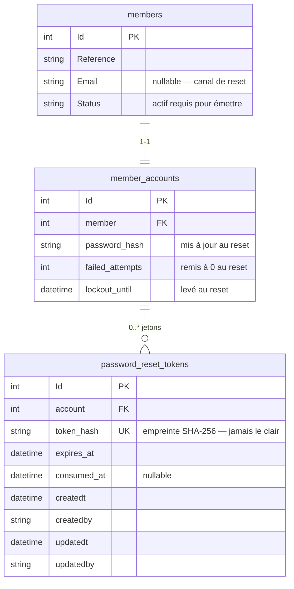
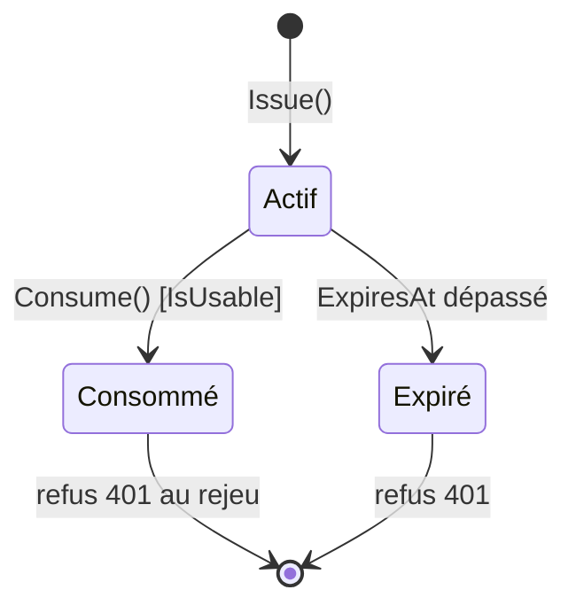

# Data Model — Mot de passe oublié (feature 006)

## Vue d'ensemble

Une **seule nouvelle entité** est introduite : `PasswordResetToken`. Les entités `MemberAccount`
(feature 002/003) et `Member` (feature 001/002) sont **consultées/mises à jour** mais **non modifiées
structurellement** (aucune colonne ajoutée à leurs tables).

## Nouvelle entité — `PasswordResetToken`

Hérite d'`AbstractEntity` (piste d'audit `createdt/createdby/updatedt/updatedby`, Constitution II).

| Attribut (propriété) | Colonne | Type SQL | Contrainte | Description |
|----------------------|---------|----------|------------|-------------|
| `Id` | `Id` | `int` IDENTITY | PK | Identifiant technique |
| `AccountId` | `account` | `int` | FK → `member_accounts.Id`, requis, `ON DELETE CASCADE` | Compte cible du reset |
| `TokenHash` | `token_hash` | `nvarchar(128)` | **UNIQUE**, requis | Empreinte SHA-256 du jeton (FR-009/016). Jamais le jeton en clair |
| `ExpiresAt` | `expires_at` | `datetime2` | requis | Fin de validité (UTC) = émission + `PasswordResetMinutes` (FR-004) |
| `ConsumedAt` | `consumed_at` | `datetime2` | nullable | Horodatage de consommation (usage unique, FR-007b). `null` = non consommé |
| *(audit)* | `createdt` … | — | hérité | Via `AuditColumns.Apply` |

### Règles / invariants (méthodes de domaine)

- **Fabrique** `static PasswordResetToken Issue(MemberAccount account, string tokenHash, DateTime nowUtc, int lifetimeMinutes)`
  - Lien par **navigation** (`Account = account`) — la FK `AccountId` est renseignée par EF à la
    sauvegarde, même idiome que `MemberAccount.Provision`.
  - Exige `account` non nul, `tokenHash` non vide, `lifetimeMinutes > 0` (sinon `DomainException`/`ArgumentNullException`).
  - Fixe `ExpiresAt = nowUtc.AddMinutes(lifetimeMinutes)`, `ConsumedAt = null`.
- **`bool IsUsable(DateTime nowUtc)`** → `ConsumedAt is null && ExpiresAt > nowUtc` (FR-004, FR-007b).
- **`void Consume(DateTime nowUtc)`**
  - Si `ConsumedAt is not null` → `DomainException` (filet anti-double-consommation).
  - Sinon `ConsumedAt = nowUtc`.

### Transitions d'état

Un jeton **Expiré** ou **Consommé** n'est jamais réactivé — toute présentation ultérieure est refusée
par un **401 générique** (indistinct de « introuvable », FR-008, SC-003).

### Index & contraintes (EF Core — `PasswordResetTokenConfiguration`)

- `ToTable("password_reset_tokens")`, `HasKey(Id)`.
- `HasIndex(TokenHash).IsUnique()` — matérialise FR-016 (deux émissions ne peuvent produire la même
  empreinte) et sert la recherche O(1) par empreinte.
- `HasIndex(AccountId)` — non unique (un compte peut avoir plusieurs jetons actifs, cf. Assumptions :
  pas d'invalidation proactive).
- `HasOne<MemberAccount>().WithMany().HasForeignKey(AccountId).OnDelete(Cascade)` — suppression du
  compte ⇒ suppression de ses jetons.
- `AuditColumns.Apply(builder)`.

## Entités existantes — usage (non modifiées structurellement)

### `MemberAccount` (feature 002/003) — **mis à jour** au reset

Réutilisation des méthodes de domaine existantes, aucune colonne ni méthode ajoutée :
- `ChangePassword(newPasswordHash)` → nouvelle empreinte + `MustChangePassword = false` (FR-007a).
- `RegisterSuccessfulLogin(nowUtc)` → `FailedAttempts = 0` + `LockoutUntil = null` (FR-007c, SC-007).

### `Member` (feature 001/002) — **consulté** uniquement

- `Email` (nullable) : canal d'envoi ; **absent ⇒ aucun envoi**, réponse générique (FR-011).
- `IsActive` (dérivé de `Status`) : **doit être actif** pour émettre un jeton ; sinon traité comme
  inexistant (FR-012). Accessible via la navigation `MemberAccount.Member`.

## Migration

Migration **additive** `<timestamp>_PasswordReset` :
- `CreateTable("password_reset_tokens")` avec colonnes ci-dessus + colonnes d'audit.
- `CreateIndex` **unique** sur `token_hash`.
- `CreateIndex` (non unique) sur `account` + `ForeignKey` vers `member_accounts(Id)` cascade.
- `Down` : `DropTable("password_reset_tokens")`.

Aucune colonne ajoutée/modifiée sur `member_accounts` ni `members` — rejouable sur base vierge
(Constitution II).
