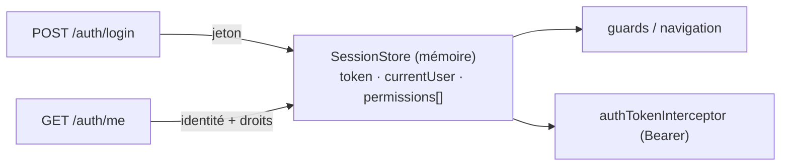

# Data Model — Console web Lumineux (état client)

## Vue d'ensemble

La SPA **ne persiste aucune donnée**. Elle manipule des **modèles de vue** (view models) en mémoire,
alimentés par les réponses de l'API. Aucun schéma, aucune migration. Les modèles ci-dessous décrivent
l'**état applicatif** et les **données de saisie transitoires**.

## État de session — `SessionStore` (en mémoire, volatil)

| Attribut | Type | Source | Description |
|----------|------|--------|-------------|
| `accessToken` | chaîne \| null | `POST /auth/login`, `/activate`, `/setup/first-admin`, `/reset`… | Jeton porté par l'intercepteur. **Jamais** persisté. `null` = non authentifié. |
| `currentUser` | `CurrentUser` \| null | `GET /auth/me` | Identité de session. `null` tant que non chargée. |
| `permissions` | liste de chaînes | `GET /auth/me` | Droits effectifs pour le RBAC d'affichage. |
| `isAuthenticated` | booléen (dérivé) | — | `accessToken != null && currentUser != null`. |

Opérations : `establish(token)` (après login/activation) → charge `/auth/me` → peuple
`currentUser`/`permissions` ; `clear()` (déconnexion / 401) → remet tout à `null`.

### `CurrentUser` (vue, depuis `GET /auth/me`)

| Attribut | Type | Description |
|----------|------|-------------|
| `memberId` | entier | Identifiant du membre connecté. |
| `displayName` | chaîne | Libellé d'affichage (nom complet). |
| `permissions` | liste de chaînes | Droits effectifs de la session. |

## Données de saisie transitoires (formulaires — non conservées après soumission)

| Modèle | Champs | Écran | Notes |
|--------|--------|-------|-------|
| `LoginForm` | `reference`, `password` | Connexion | Message d'échec non révélateur. |
| `ActivateForm` | `reference`, `temporaryPassword`, `newPassword`, `confirm` | Activation | `newPassword` conforme politique + ≠ temporaire. |
| `ForgotPasswordForm` | `reference` | Mot de passe oublié | Retour **générique**. |
| `ResetPasswordForm` | `token` (depuis l'URL), `newPassword`, `confirm` | Réinitialisation | Échec **générique** si jeton invalide. |
| `ChangePasswordForm` | `currentPassword`, `newPassword`, `confirm` | Changement | `newPassword` conforme + ≠ actuel. |
| `FirstAdminForm` | `lastName`, `firstName`, `gender`, `password`, `email?`, `mobile?` | Installation | Voir `contracts/api-consumption.md`. |

- Les champs de mot de passe sont **masqués** ; aucune valeur n'est journalisée ni placée dans une URL
  persistée (FR-009, SC-005).
- `confirm` = re-saisie côté client (contrôle d'égalité local) ; l'API ne reçoit pas ce champ.

## Règles de validation (côté client, indicatives — l'API tranche, FR-017)

- Mot de passe : **longueur ≥ 8**, **au moins une lettre**, **au moins un chiffre** (paramètre
  d'environnement pour la longueur, défaut 8).
- Activation / changement : `newPassword` **différent** du mot de passe fourni (temporaire / actuel).
- Champs requis non vides avant activation du bouton de soumission.

## Persistance

**Aucune.** Tout l'état est en mémoire et disparaît au rechargement/à la déconnexion.
