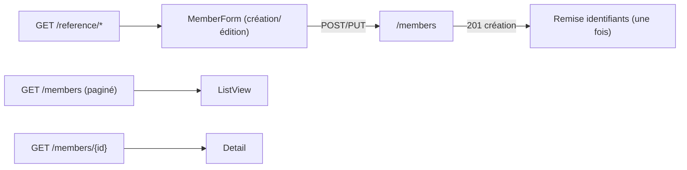

# Data Model — Console web : Gestion des membres (état client)

Aucune persistance côté SPA. Modèles de vue en mémoire, alimentés par l'API. Les contrats reflètent
les DTO de l'API (membres feature 002, référentiels feature 010).

## Modèles consommés (vue client — reflet des DTO API)

### Recherche / liste (`GET /members`)

| Modèle | Champs |
|--------|--------|
| `MemberListItem` | `id`, `reference`, `lastName`, `firstName`, `mobile?`, `email?`, `antennaId?`, `status` |
| `MemberListResponse` | `page`, `pageSize`, `total`, `items: MemberListItem[]` |

### Fiche (`GET /members/{id}`) — `MemberResponse`

`id`, `reference`, `entryDate`, `lastName`, `firstName`, `gender`, `mobile?`, `email?`, `antennaId?`,
`civilityId?`, `birthDate?`, `birthPlaceId?`, `birthCityId?`, `address?`, `districtId?`,
`nationalityId?`, `introducerId?`, `status`, `accountActivationState`. **Aucun secret.**

### Création (`POST /members`) — `CreateMemberRequest`

Requis : `lastName`, `firstName`, `gender`, `antennaId`. Optionnels : `mobile?`, `email?`,
`civilityId?`, `birthDate?`, `birthPlaceId?`, `birthCityId?`, `address?`, `districtId?`,
`nationalityId?`, `introducerId?`, **`confirmDuplicate`** (défaut `false`).

### Réponse création — `MemberCreatedResponse`

`member: MemberResponse`, `loginId`, `credentialsDelivery` (`EmailSent` | `BureauHandout`),
`temporaryPassword?` (**présent uniquement** si `BureauHandout` — affiché **une seule fois**).

### Correction (`PUT /members/{id}`) — `UpdateMemberRequest`

Mêmes champs que la création **sans** `confirmDuplicate` ; la **référence n'est pas** modifiable.

### Référentiels (feature 010)

| Modèle | Champs |
|--------|--------|
| `ReferenceItem` | `id`, `code`, `label` (antennes, civilités, villes, districts) |
| `Country` | `id`, `code`, `country`, `nationality` |

## Erreurs métier (ProblemDetails + `code`)

| Statut | `code` | Sens | Traitement UI |
|--------|--------|------|---------------|
| `400` | — | validation | messages par champ (`detail`) |
| `404` | — | fiche introuvable | message « membre introuvable » |
| `409` | `duplicate_name` | homonyme (nom+prénom) — `duplicateMemberIds` fournis | **Confirmer/Annuler** → réessai `confirmDuplicate=true` (création) |
| `409` | `contact_in_use` | contact déjà utilisé par un membre actif | **erreur bloquante** (création **et** correction) |
| `401` | — | session invalide | purge + retour connexion (socle) |
| `403` | — | droit manquant | message « accès refusé » |

## État de vue (transitoire, non persisté)

- **Résultat de recherche** : page courante + items (rechargé à chaque recherche/navigation).
- **Formulaire membre** : valeurs saisies + listes de référence chargées ; `confirmDuplicate` (drapeau
  interne activé après confirmation d'homonyme).
- **Remise identifiants** : `loginId` + `temporaryPassword` **éphémères** (signal), affichés **une
  fois**, jamais persistés (FR-010, SC-005).

## Persistance

**Aucune** (côté SPA). L'API reste la source de vérité.
