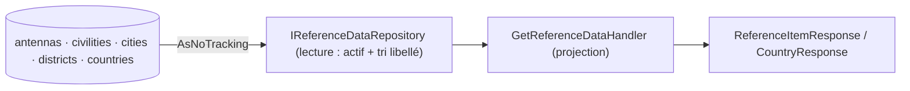

# Data Model — Endpoints de données de référence

## Vue d'ensemble

**Aucune entité persistée nouvelle**, **aucune migration**. Les nomenclatures existent déjà en base
(cibles de clé étrangère de la fiche membre). Cette fonctionnalité ajoute des **projections de
lecture** (DTO) exposées via des endpoints.

## Entités source (existantes — non modifiées)

| Entité | Colonnes utiles | Filtre |
|--------|-----------------|--------|
| `Antenna` | `Id`, `Code`, `Label`, `Status` | `Status` actif |
| `Civility` | `Id`, `Code`, `Label`, `Status` | `Status` actif |
| `City` | `Id`, `Code`, `Label`, `Status` | `Status` actif |
| `District` | `Id`, `Code`, `Label`, `Status` | `Status` actif |
| `Country` | `Id`, `Code`, `LabelCountry`, `LabelNationality`, `Status` | `Status` actif |

## Contrats de sortie (DTO — lecture seule)

### `ReferenceItemResponse` (antennes, civilités, villes, districts)

| Attribut | Type | Source |
|----------|------|--------|
| `id` | entier | `Id` (clé étrangère cible) |
| `code` | chaîne | `Code` |
| `label` | chaîne | `Label` |

### `CountryResponse` (pays / nationalités)

| Attribut | Type | Source |
|----------|------|--------|
| `id` | entier | `Id` |
| `code` | chaîne | `Code` |
| `country` | chaîne | `LabelCountry` |
| `nationality` | chaîne | `LabelNationality` |

## Règles / invariants (observables)

- Seules les entrées **actives** apparaissent (FR-004) — aucune entrée désactivée.
- Ordre **stable** par **libellé** (pour les pays : libellé de pays) — FR-005 / SC-004.
- **Aucune** donnée secrète (nomenclatures uniquement) — FR-006 / SC-005.
- Lecture **répétable** sans effet de bord (FR-007).

## Port de lecture — `IReferenceDataRepository` (Domain.Abstractions)

Renvoie les entités actives triées ; la projection en DTO est faite par le handler.

- `Task<IReadOnlyList<Antenna>> GetActiveAntennasAsync(CancellationToken)`
- `Task<IReadOnlyList<Civility>> GetActiveCivilitiesAsync(CancellationToken)`
- `Task<IReadOnlyList<City>> GetActiveCitiesAsync(CancellationToken)`
- `Task<IReadOnlyList<District>> GetActiveDistrictsAsync(CancellationToken)`
- `Task<IReadOnlyList<Country>> GetActiveCountriesAsync(CancellationToken)`

## Migration

**Aucune.** Rejouable sur base vierge sans impact.
