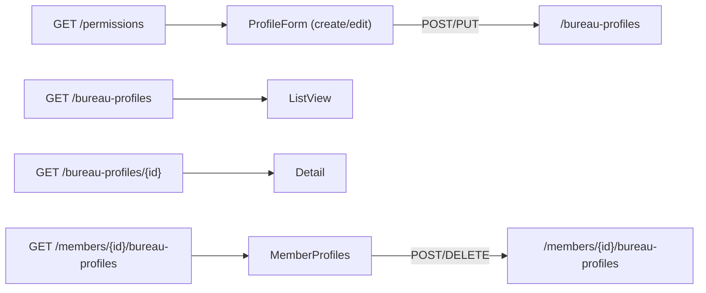

# Data Model — Console web : Profils du bureau & droits (état client)

Aucune persistance côté SPA. Modèles de vue en mémoire, reflet des DTO API (profils feature 004,
membres feature 002, catalogue de permissions).

## Modèles consommés (vue client — reflet des DTO API)

### Profils (`/bureau-profiles`)

| Modèle | Champs |
|--------|--------|
| `BureauProfileSummary` | `id`, `name`, `description?`, `permissions: string[]`, `memberCount` |
| `MemberRef` | `id`, `reference`, `fullName`, `status` |
| `BureauProfileDetail` | `id`, `name`, `description?`, `permissions: string[]`, `memberCount`, `members: MemberRef[]` |
| `BureauProfileWriteRequest` | `name`, `description?`, `permissions: string[]` (codes) |

### Attribution (`/members/{memberId}/bureau-profiles`)

| Modèle | Champs |
|--------|--------|
| `MemberProfilesResponse` | `member: MemberRef`, `profiles: BureauProfileSummary[]`, `effectivePermissions: string[]` |
| `AssignProfileRequest` | `profileId` |

### Catalogue (`/permissions`)

| Modèle | Champs |
|--------|--------|
| `PermissionDescriptor` | `code`, `label` |

## Erreurs métier (ProblemDetails + `code`)

| Statut | `code` | Sens | Traitement UI |
|--------|--------|------|---------------|
| `400` | — | validation / **permission inconnue** | message par champ / « droit invalide » |
| `404` | — | profil / membre introuvable | message « introuvable » |
| `409` | `duplicate_name` | nom de profil déjà utilisé | **bloquant** (création/modification) |
| `409` | `last_administrator` | garde-fou dernier administrateur | **bloquant** (modif / suppression / révocation) |
| `409` | `profile_in_use` | suppression d'un profil encore attribué | **bloquant** (révoquer d'abord) |
| `409` | `member_inactive` | attribution à un membre inactif | **bloquant** |
| `401` | — | session invalide | purge + retour connexion (socle) |
| `403` | — | droit d'écriture manquant | « action non autorisée » (API autorité) |

## Règles / invariants (observables)

- **Lecture** = `manage_bureau_profiles` OU `manage_members` ; **écriture** = `manage_bureau_profiles`.
- **Attribution idempotente** : réattribuer un profil déjà présent n'échoue pas (FR-011/SC-005).
- **Droits effectifs** = union des droits des profils attribués (FR-010/SC-006).
- Actions **destructrices** (suppression profil, révocation) **confirmées** (FR-015/SC-007).
- **Aucune** donnée sensible dans les vues (uniquement référence/nom/statut pour les titulaires).

## État de vue (transitoire, non persisté)

- Liste des profils ; détail (droits + titulaires).
- Formulaire de profil : nom, description, **codes de droits sélectionnés** + catalogue chargé.
- Écran profils du membre : profils attribués + droits effectifs ; sélection du profil à attribuer.

## Persistance

**Aucune** (côté SPA). L'API reste la source de vérité.
