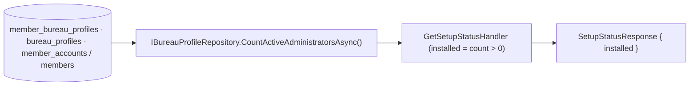

# Data Model — Statut d'installation (setup/status)

## Vue d'ensemble

**Aucune entité persistée nouvelle**, **aucune table**, **aucune migration**. La fonctionnalité expose
une **projection de lecture** dérivée du **décompte des administrateurs actifs** existant.

## Contrat de sortie — `SetupStatusResponse` (DTO, lecture seule)

| Attribut | Type | Dérivation |
|----------|------|------------|
| `installed` | booléen | `CountActiveAdministratorsAsync() > 0` (≥1 administrateur actif = installé) |

- **Aucun** autre champ. **Aucune** donnée sensible, **aucun** comptage exposé (FR-003).

## Règles / invariants (observables)

- `installed` reflète **exactement** le verrou d'installation (même décompte) — FR-002, SC-002.
- Lecture **anonyme**, **sans effet de bord**, **répétable** — FR-001/004.
- **N'altère pas** le verrou (`POST setup/first-admin` reste refusé si installé) — FR-005/SC-004.

## Source (existant, non modifié)

- Port `IBureauProfileRepository.CountActiveAdministratorsAsync(excludeProfileId?, ct)` (features
  004/005) : nombre de **membres actifs** titulaires du droit d'administration des profils.

## Migration

**Aucune.** Rejouable sur base vierge sans impact.
