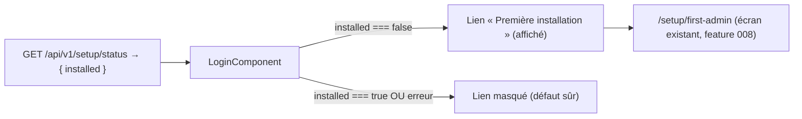

# Data Model — Installation découvrable (état client)

Aucune persistance côté SPA. La fonctionnalité **consomme** un statut fourni par l'API et pilote un
**affichage conditionnel**.

## Modèle consommé (vue client)

| Modèle | Champs | Source |
|--------|--------|--------|
| `SetupStatus` | `installed: boolean` | `GET /api/v1/setup/status` (feature 012, anonyme) |

## État de vue (transitoire, non persisté)

- **`showSetupLink`** (dérivé) : `true` **si et seulement si** le statut a été obtenu **et**
  `installed === false` ; `false` sinon (déjà installé **ou** statut indisponible — **défaut sûr**).

## Règles / invariants (observables)

- Lien **visible** ssi instance non initialisée (FR-002) ; **masqué** si installée (FR-003) ou si le
  statut échoue (FR-005).
- Parcours **anonyme** ; **aucune** donnée sensible affichée/persistée (FR-008, SC-004).
- Le lien mène à l'écran d'installation **existant** (FR-004) ; le verrou serveur reste effectif
  (FR-007).

## Persistance

**Aucune** (côté SPA).
