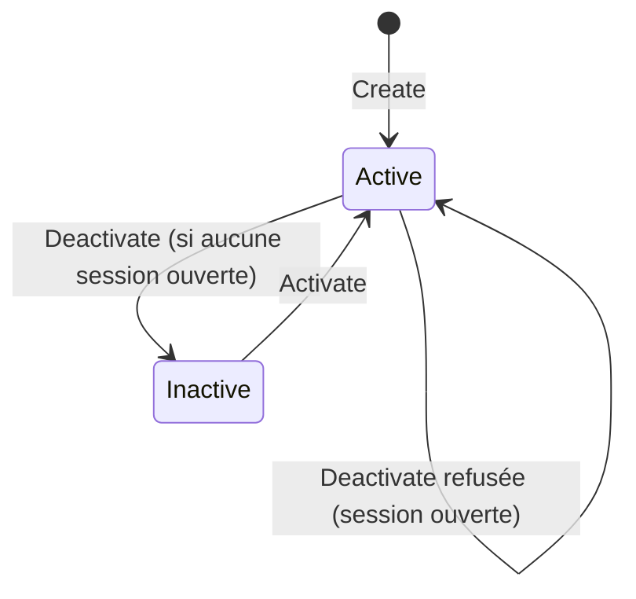

# Data Model — API de gestion des antennes

Une seule entité impactée : **Antenne** (existante, enrichie de comportements). Le **District** est un
référentiel existant (cible de rattachement, validé en existence). Aucune nouvelle table ; une
**migration** ajoute un **index unique** sur `antennas.code`.

```mermaid
flowchart LR
    A["Antenna\n(code unique, label, district, status)"] -->|district (int)| D[(districts)]
    M[(members.antenna)] -.FK Restrict.-> A
    S[(attendance_sessions.antenna)] -.FK Restrict.-> A
```

## Entité Antenne (table `antennas`, existante)

| Champ | Colonne | Type / règle |
|-------|---------|--------------|
| Id | `id` | PK auto |
| Code | `code` | requis, **unique** (nouvel index), max 60, stable (immuable après création) |
| Label | `label` | requis, max 100 |
| District | `district` | entier de rattachement → `districts.id` (existence validée) |
| Status | `status` | `Active` / `Inactive` (max 20) |
| Audit | `createdt`/`createdby`/`updatedt`/`updatedby` | hérités (intercepteur EF) |

### Comportements (Domain — invariants portés par l'entité)

| Opération | Règles |
|-----------|--------|
| `Create(code, label, districtId)` | code & label non vides (trim) ; districtId > 0 ; statut initial **Active** |
| `UpdateDetails(label, districtId)` | label non vide ; districtId > 0 ; **code inchangé** |
| `Deactivate()` | statut → **Inactive** (idempotent) ; la règle « sessions ouvertes » est vérifiée en amont (Application) |
| `Activate()` | statut → **Active** (idempotent) |

> Le contrôle « antenne rattachée à des sessions ouvertes » relève de l'**Application** (nécessite un
> accès au dépôt des sessions), pas de l'entité isolée.

## Règles de gestion (Application)

| Règle | Détail | Erreur |
|-------|--------|--------|
| Code unique | `GetByCodeAsync(trim)` avant insertion | `duplicate_code` (409) |
| District existant | `IReferenceLookupRepository.DistrictExistsAsync` | validation (400) |
| Antenne existante | `GetByIdAsync` pour modif/statut/consultation | `404` |
| Désactivation bloquée | `HasOpenSessionForAntennaAsync(antennaId)` = vrai | `antenna_has_open_sessions` (409) |
| Droit requis | `manage_referentials` (sinon 401/403) | `403` |

## Transitions d'état



## Ports (Domain/Application)

- **`IAntennaRepository`** (nouveau — gestion) : `GetByIdAsync`, `GetByCodeAsync`, `ListAllAsync`
  (actives + inactives), `AddAsync`, `SaveChangesAsync`.
- **`IAttendanceSessionRepository`** : + `HasOpenSessionForAntennaAsync(int antennaId, ct)`.
- **`IReferenceLookupRepository`** (existant) : `DistrictExistsAsync`.
- `IAntennaReadRepository` (existant, `ExistsAsync`) : **inchangé**.

## Migration

- **Index unique** `IX_antennas_code` sur `antennas.code`. Déterministe, rejouable sur base vierge.
  (Suppose l'absence de doublons de code préexistants — cohérent avec l'usage actuel.)
