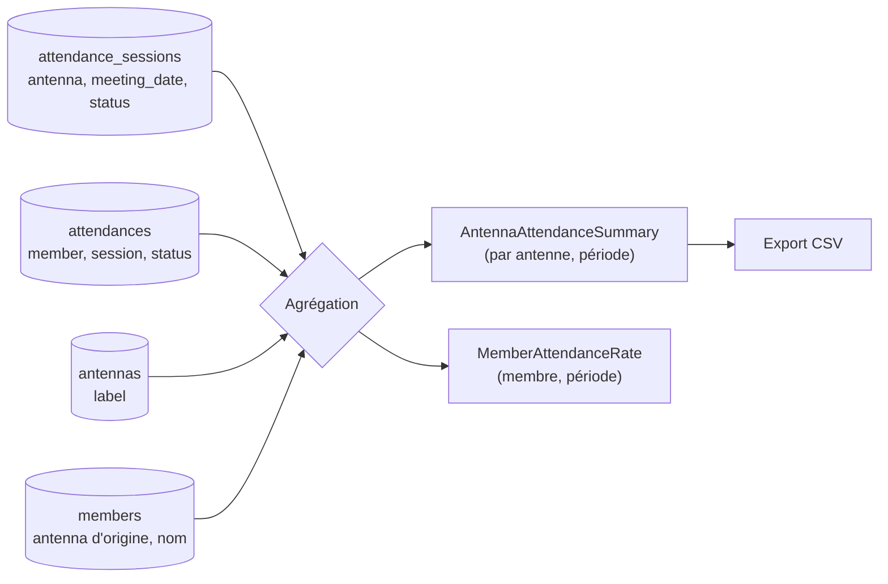

# Data Model — API de rapports & statistiques de présence

**Aucune nouvelle entité persistée, aucune migration.** Le modèle décrit des **vues calculées**
(agrégats) dérivées en lecture des tables existantes.

## Sources (lecture seule, inchangées)

| Table | Champs utilisés |
|-------|-----------------|
| `attendance_sessions` | `antenna`, `meeting_date`, `status` |
| `attendances` | `member`, `session`, `status` (`Valid`/`Cancelled`) |
| `antennas` | `id`, `label` (libellé de l'antenne) |
| `members` | `id`, nom (`first_name`/`last_name`), `antenna` (antenne d'origine) |

## Vues calculées (DTO de sortie)

### Synthèse par antenne (US1)

| Modèle | Champs |
|--------|--------|
| `AntennaAttendanceSummaryItem` | `antennaId`, `antennaLabel`, `sessionCount`, `validAttendanceCount`, `averageValidPerSession` |
| `AntennaAttendanceSummaryResponse` | `from`, `to`, `items: AntennaAttendanceSummaryItem[]` |

- `sessionCount` = sessions dont `meeting_date` ∈ [from, to] (par antenne).
- `validAttendanceCount` = présences `Valid` de ces sessions.
- `averageValidPerSession` = `validAttendanceCount / sessionCount` (0 si aucune session ; arrondi maîtrisé).

### Taux par membre (US2)

| Modèle | Champs |
|--------|--------|
| `MemberAttendanceRateResponse` | `memberId`, `memberFullName`, `from`, `to`, `validAttendanceCount`, `eligibleSessionCount`, `rate` (0..1 ou %) |

- `eligibleSessionCount` = sessions de l'**antenne d'origine** du membre sur la période.
- `validAttendanceCount` = présences `Valid` du membre sur la période.
- `rate` = `validAttendanceCount / eligibleSessionCount` (0 si dénominateur 0 — pas de division par zéro).

### Export CSV (US3)

- Rendu texte de la **synthèse par antenne** : en-têtes + une ligne par antenne (mêmes chiffres que le
  JSON). Séparateur `;`, UTF-8 (BOM), décimales pour la moyenne.

## Paramètres & validation

| Rapport | Paramètres | Règles |
|---------|-----------|--------|
| Synthèse / CSV | `from`, `to`, `antennaId?` | `from`,`to` requis ; `to ≥ from` ; plafond de période (ex. 366 j) |
| Taux membre | `memberId`, `from`, `to` | `memberId` > 0 ; `from`,`to` requis ; `to ≥ from` ; plafond |

Erreurs : plage invalide → `400` ; membre introuvable → `404` ; droit manquant → `401/403`.

## Port de lecture (Domain/Application)

- **`IAttendanceReportRepository`** (nouveau, lecture seule) :
  - `GetAntennaSummaryAsync(DateTime from, DateTime to, int? antennaId, ct)` → lignes agrégées
    (antennaId, label, sessionCount, validCount).
  - `GetMemberRateDataAsync(int memberId, DateTime from, DateTime to, ct)` → (memberFullName,
    originAntennaId?, validCount, eligibleSessionCount) ou `null` si membre introuvable.

## Persistance

**Aucune** création/modification. Agrégations calculées à la volée (EF `GroupBy`/`Count`).
