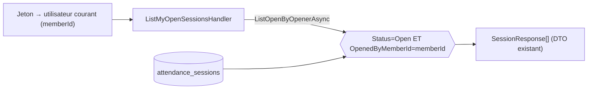

# Data Model — API : mes sessions de présence ouvertes

**Aucune nouvelle entité, aucune migration.** Vue **filtrée** (lecture) des sessions existantes.

## Source (lecture seule, inchangée)

| Table | Champs utilisés |
|-------|-----------------|
| `attendance_sessions` | `status` (= `Open`), `opened_by` (= utilisateur courant), + antenne, date, heure de début, etc. |

## Contrat de sortie (DTO existant réutilisé)

| Modèle | Champs |
|--------|--------|
| `SessionResponse` | `Id`, `AntennaId`, `MeetingDate`, `StartTime`, `EndTime?`, `Status`, `OpenedByMemberId`, `ClosedByMemberId?`, `AttendanceCount` (=0, comme `GetSession`) |
| Réponse | `SessionResponse[]` (0/1/plusieurs) |

## Filtre appliqué

| Critère | Règle |
|---------|-------|
| Statut | `Open` uniquement (clôturées exclues) |
| Initiateur | `OpenedByMemberId = memberId(jeton)` (sessions d'autres membres exclues) |
| Identité | déterminée par le **jeton** (`ICurrentUser`), jamais par un paramètre client |

## Port de lecture (Domain/Application — extension)

- **`IAttendanceSessionRepository`** (+ méthode) :
  `ListOpenByOpenerAsync(int openedByMemberId, CancellationToken)` → `IReadOnlyList<AttendanceSession>`
  (`Status == Open && OpenedByMemberId == openedByMemberId`).

## Paramètres & erreurs

| Élément | Règle |
|---------|-------|
| Paramètres | **aucun** (l'identité vient du jeton) |
| Droit | `manage_attendance` (sinon `401/403`) |
| Résultat | `200` avec liste (vide si aucune) |

## Persistance

**Aucune** création/modification. Requête simple, lecture seule.
