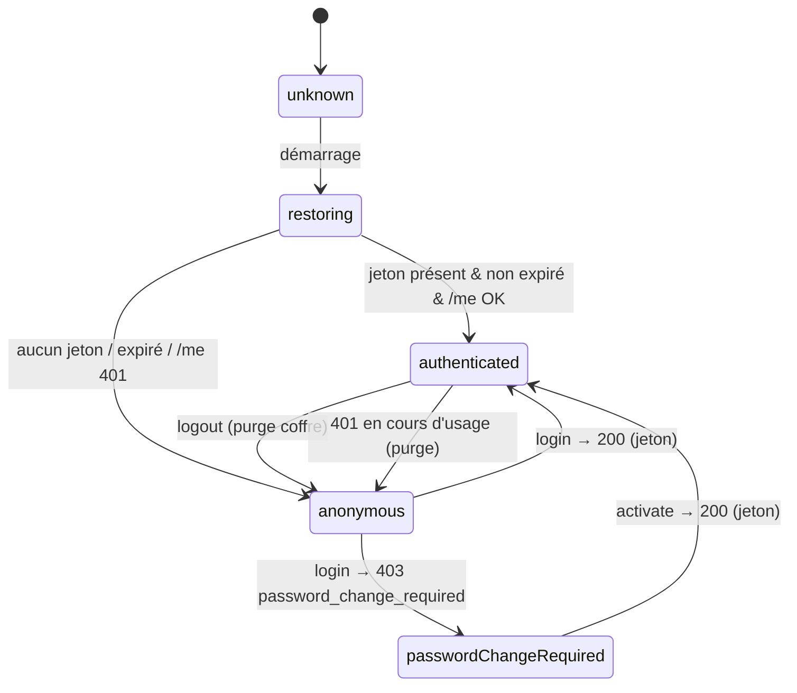

# Data Model (client) — Feature 025

**Portée** : modèle **côté client mobile** uniquement. Aucune entité de base de données, aucune migration.
Les objets ci-dessous sont des **modèles de session et de transfert** (DTO) reflétant les contrats de
l'API existante. Le seul élément **persisté** est le jeton (au coffre sécurisé).

---

## 1. Modèles de transfert (miroir des DTO API)

Reflètent exactement les contrats serveur (`Lumineux.Application.Contracts.Auth`). Voir
[contracts/api-consumption.md](./contracts/api-consumption.md).

| Modèle | Champs | Sens |
|--------|--------|------|
| `LoginRequest` | `reference`, `password` | Connexion. |
| `ActivateRequest` | `reference`, `temporaryPassword`, `newPassword` | Activation 1re connexion. |
| `ForgotPasswordRequest` | `reference` | Demande de réinitialisation (réponse générique). |
| `ResetPasswordRequest` | `token`, `newPassword` | Réinitialisation via jeton e-mail. |
| `ChangePasswordRequest` | `currentPassword`, `newPassword` | Changement (connecté). |
| `TokenResponse` | `accessToken`, `tokenType`, `expiresAt` | Jeton d'accès (login/activate). |
| `CurrentUser` | `memberId`, `displayName`, `permissions[]` | Identité + droits (`GET /auth/me`). |

**Règles** :
- Aucun mot de passe n'est jamais stocké ni journalisé.
- `permissions` est ignoré fonctionnellement en M0 (membre simple) mais lu pour l'affichage/futur usage.

## 2. Entités de session (client)

### `AuthToken`
- **Champs** : `value: String` (opaque), `type: String` (« Bearer »), `expiresAt: DateTime`.
- **Persistance** : sérialisé dans le **coffre sécurisé** (clé unique). **Jamais** ailleurs.
- **Règle** : considéré « potentiellement valide » si `expiresAt` est dans le futur (pré-vérification
  locale) ; l'API reste l'autorité (un 401 le déclare invalide → purge).

### `SessionState` (état applicatif, non persisté)
Machine à états portée par `SessionController` (Riverpod `Notifier`).

| État | Signification | Écran cible (garde) |
|------|---------------|---------------------|
| `unknown` | Au démarrage, avant lecture du coffre. | Splash/chargement |
| `restoring` | Lecture du coffre en cours. | Splash/chargement |
| `authenticated(CurrentUser)` | Jeton valide + identité chargée. | `/home` |
| `passwordChangeRequired(reference)` | Login a renvoyé `403 password_change_required`. | `/auth/activate` (référence pré-remplie) |
| `anonymous` | Aucun jeton / expiré / déconnecté. | `/login` |

**Transitions** :

## 3. Erreurs applicatives (`ApiException`)

Produites par l'intercepteur d'erreurs `dio`, consommées par les écrans via `error_messages.dart`.

| Type | Origine HTTP | Message FR (exemples) | Action |
|------|--------------|------------------------|--------|
| `unauthorized` | 401 | « Identifiants invalides » (login) / « Session expirée » (autre) | login → message ; ailleurs → purge + retour connexion |
| `forbidden` | 403 | selon `code` | si `password_change_required` → bascule activation ; sinon message |
| `validation` | 400 (+ ProblemDetails) | message issu du `detail`/`title` | afficher sous le champ/formulaire |
| `network` | timeout / hors ligne | « Réseau indisponible, réessayez » | réessai possible |
| `server` | 5xx | « Une erreur est survenue » | réessai possible |

**Codes métier lus dans `extensions.code`** : `password_change_required` (au login) → parcours activation.

## 4. Validation client (`PasswordPolicy`) — confort, non autorité

- **Règles répliquées (publiques)** : longueur minimale, ≥ 1 lettre et ≥ 1 chiffre.
- **Usage** : retour immédiat sur les écrans activation / réinitialisation / changement, avant appel
  réseau. **L'API reste l'autorité** (un rejet serveur prime et s'affiche).
