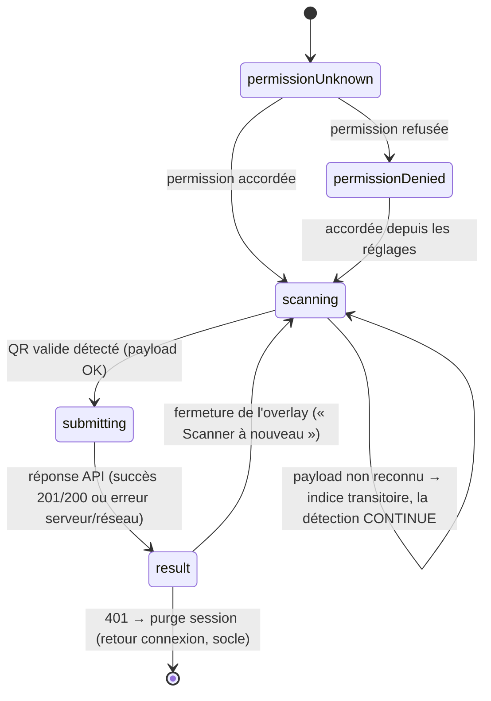

# Data Model (client) — Feature 026

**Portée** : modèle **côté client mobile** uniquement. Aucune entité de base de données, aucune migration,
**aucune persistance locale nouvelle**. Les objets ci-dessous sont des **modèles de transfert et d'état
d'écran**. Le jeton est éphémère : jamais affiché, journalisé ni persisté.

---

## 1. Charge du QR (`QrPayload`)

Résultat du décodage/validation du contenu scanné. Voir [contracts/qr-payload.md](./contracts/qr-payload.md).

| Champ | Type | Sens |
|-------|------|------|
| `sessionId` | `int` | Identifiant de la séance (`s` du JSON). |
| `token` | `String` | Jeton rotatif courant (`t` du JSON), opaque. |

**Parsing** `QrPayload.parse(String raw) → QrPayloadResult` :
- Décoder le JSON ; exiger `v == 1`, `s` entier > 0, `t` chaîne non vide.
- Succès → `QrPayloadResult.valid(QrPayload)`.
- JSON illisible / `v` inconnue / champ manquant ou invalide → `QrPayloadResult.unrecognized`
  (→ « code non reconnu », la caméra continue). **Ne fait jamais autorité** (le serveur valide).

## 2. Modèles de transfert (miroir des DTO API)

Reflètent les contrats serveur `Lumineux.Application.Contracts.Attendances`. Voir
[contracts/scan-api-consumption.md](./contracts/scan-api-consumption.md).

| Modèle | Champs | Sens |
|--------|--------|------|
| `AttendanceResponse` | `id`, `sessionId`, `memberId`, `memberFullName?`, `arrivalTime`, `endTime?`, `source`, `status`, `originAntennaId?` | Vue d'une présence renvoyée par l'API. Seuls `memberFullName` et `arrivalTime` alimentent l'overlay. |
| `ScanOutcome` | `attendance: AttendanceResponse`, `created: bool` | Résultat client d'un scan : `created=true` si **201** (nouvellement enregistrée), `false` si **200** (déjà présente). |

**Règle** : `arrivalTime` est l'**heure serveur** (autorité) — affichée telle quelle, non recalculée côté client.

## 3. État de l'écran Scanner (`ScanState`)

Machine à états portée par `ScanController` (Riverpod `Notifier`). Non persistée.

| État | Signification | UI |
|------|---------------|-----|
| `permissionUnknown` | Statut caméra non encore déterminé. | Chargement bref |
| `permissionDenied` | Permission caméra refusée. | Message + bouton « Ouvrir les réglages » |
| `scanning` | Caméra active, en recherche de QR. | Aperçu + cadre de visée |
| `submitting` | Un code capté est en cours d'enregistrement (détection **suspendue**). | Aperçu figé + indicateur |
| `result(ScanResultView)` | Résultat prêt (succès ou erreur). | **Overlay modal** |

**Transitions** :

**Anti double-soumission** : dès l'entrée en `submitting`, la détection est **arrêtée** ; une seule
soumission par code ; reprise (`scanning`) uniquement à la fermeture de l'overlay.

**QR non reconnu (non bloquant)** : un payload illisible / version inconnue / étranger **n'entre pas** dans
`result` et **ne déclenche pas** d'overlay modal. La détection **reste en `scanning`** ; un **indice
transitoire** (bref message non bloquant, ex. bandeau/snackbar « Code non reconnu ») est émis, avec une
**temporisation anti-répétition** pour ne pas le ré-émettre en boucle sur le même code encore dans le
cadre (aligné spec US2/AS-5 et Edge Cases : « la caméra continue de chercher »).

**Accès permission** : la lecture/demande de permission caméra passe par une **abstraction substituable**
(façade), afin de tester les états `permissionDenied`/`scanning` sans canal plateforme réel.

## 4. Vue de résultat (`ScanResultView`)

Contenu de l'overlay modal, dérivé du `ScanOutcome` (succès) ou d'une `ApiException`/erreur locale.

| Champ | Type | Sens |
|-------|------|------|
| `kind` | `success \| alreadyPresent \| error` | Nature du résultat. |
| `title` | `String` | « Présence enregistrée » / « Déjà enregistrée » / titre d'erreur. |
| `subtitle` | `String?` | Succès : `memberFullName · {heure d'arrivée}` ; si `memberFullName` est **nul/absent** → afficher **l'heure seule** (repli, sans nom). Erreur : message mappé. |

## 5. Erreurs applicatives (extension de l'existant)

Réutilise `ApiException` (socle M0). **Extension** de `mapDioException` pour catégoriser les cas de scan :

| Type (ajout) | HTTP | Message affiché |
|--------------|------|-----------------|
| `gone` | 410 | `detail` serveur (« Code QR expiré… ») |
| `conflict` | 409 | `detail` serveur (« La réunion est terminée… ») |
| `notFound` | 404 | `detail` serveur (« Séance introuvable ») |
| `forbidden` (existant) | 403 | `detail` serveur (membre inactif/inconnu) |
| `unauthorized` (existant) | 401 | → purge session (socle) |
| `network`/`server` (existants) | — | messages génériques FR |

Le jeton et le payload **ne figurent dans aucun message ni journal**.
