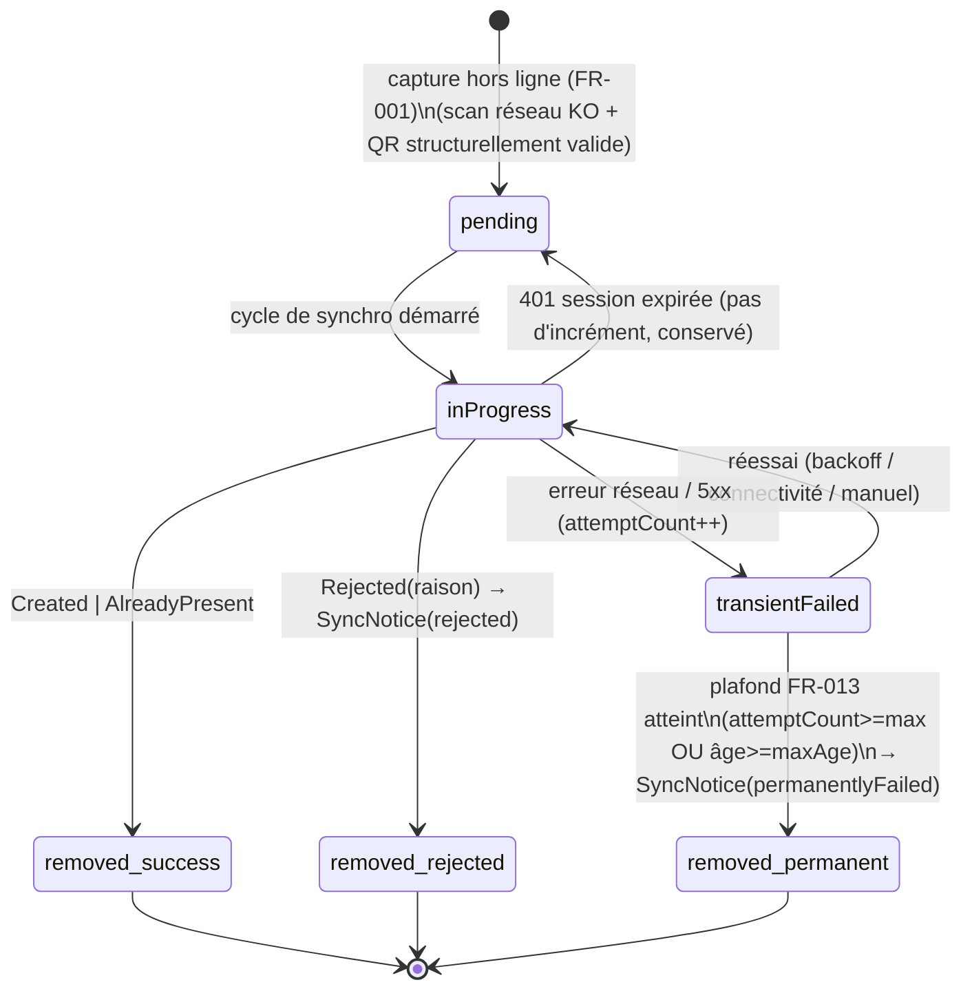

# Data Model — Capture hors ligne & synchronisation (M2, client)

**Feature** : `027-mobile-offline-sync` · **Phase 1** · **Date** : 2026-07-09

Modèle **client uniquement** (Flutter). **Aucune** entité serveur ni migration : le serveur consomme le
contrat existant `/scan/batch`. Les structures ci-dessous sont locales à `mobile/`.

---

## 1. `PendingCapture` — capture hors ligne en attente

Élément de la **file locale persistante** (coffre sécurisé, D1). Représente un scan mémorisé tant qu'il n'a
pas d'issue définitive.

| Champ | Type | Contraintes | Notes |
|-------|------|-------------|-------|
| `clientOperationId` | `String` | **PK**, unique, non vide, **≤ 64** car. (D7) | Clé d'idempotence serveur ; **immuable** |
| `sessionId` | `int` | > 0 | Séance scannée (extrait du payload QR) |
| `token` | `String` | non vide, **sensible** | Jeton scanné ; **jamais** affiché/journalisé ; **purgé** à l'issue définitive (FR-009) |
| `clientArrivalTime` | `DateTime` (UTC) | = heure du **scan** | Envoyé tel quel ; **borné** par le serveur |
| `firstCapturedAt` | `DateTime` (UTC) | | Base du calcul d'âge (plafond FR-013) |
| `attemptCount` | `int` | ≥ 0, défaut 0 | Incrémenté **seulement** sur échec transitoire (réseau/5xx) |
| `lastAttemptAt` | `DateTime?` (UTC) | nullable | Dernière tentative ; pilote le backoff |
| `state` | `PendingState` | voir §3 | État courant de l'élément |

**Règles**
- **Unicité par séance (FR-014)** : la file contient **au plus un** `PendingCapture` par `sessionId`. Un
  re-scan d'une séance déjà présente est **ignoré** (capture existante conservée) → retour « déjà capturée
  hors ligne ».
- **Persistance (FR-003)** : sérialisé en JSON dans `flutter_secure_storage` ; survit au redémarrage.
- **Purge (FR-009)** : à l'issue définitive (Created / AlreadyPresent / Rejected / échec définitif), l'entrée
  — **jeton compris** — est **supprimée** du coffre.

## 2. `SyncNotice` — avis de synchro (rejet / échec définitif)

Message d'état persistant, **sans jeton** (store séparé, D6), affiché au membre jusqu'à acquittement.

| Champ | Type | Contraintes | Notes |
|-------|------|-------------|-------|
| `clientOperationId` | `String` | ≤ 64 car. | Corrèle à la capture d'origine (déjà retirée de la file) |
| `sessionId` | `int` | > 0 | Séance concernée |
| `kind` | `NoticeKind` | `rejected` \| `permanentlyFailed` | Nature de l'avis |
| `reason` | `String` | non vide | Raison lisible (ex. serveur : « Jeton QR invalide au moment du scan. ») |
| `occurredAt` | `DateTime` (UTC) | | Horodatage de l'avis |
| `acknowledged` | `bool` | défaut `false` | Passe à `true` quand le membre l'a lu/fermé |

**Règles** : **jamais** de jeton ; conservé jusqu'à acquittement (survit à un redémarrage) pour garantir
SC-004 même si le rejet survient app fermée.

## 3. États d'un `PendingCapture` — `PendingState`

```text
enum PendingState { pending, inProgress, transientFailed }
```

> `rejected`, `alreadyPresent`, `created` et `permanentlyFailed` ne sont **pas** des états persistés : ils
> déclenchent le **retrait** de la file (et, pour rejet/échec définitif, la création d'un `SyncNotice`).

### Transitions



**Invariants**
- Un élément quitte la file **uniquement** par : `removed_success`, `removed_rejected`, `removed_permanent`.
- `attemptCount` n'augmente que sur `transientFailed` (jamais sur 401).
- Aucun élément ne reste indéfiniment : `transientFailed` finit toujours par `inProgress` (réessai) puis, au
  pire, `removed_permanent` (SC-004).

## 4. `SyncStatus` — agrégat d'état présenté au membre (non persisté)

Vue dérivée pour l'indicateur d'état (FR-011, SC-006). Recalculée depuis les deux stores.

| Champ | Type | Dérivation |
|-------|------|-----------|
| `pendingCount` | `int` | nb de `PendingCapture` en `pending` ou `transientFailed` |
| `inProgressCount` | `int` | nb de `PendingCapture` en `inProgress` |
| `unacknowledgedNotices` | `List<SyncNotice>` | avis `acknowledged == false` (rejets + échecs définitifs) |
| `lastSyncAt` | `DateTime?` | horodatage de la dernière tentative de synchro |
| `lastSyncOutcome` | `enum { idle, running, success, partial, failed }` | résultat du dernier cycle |

## 5. Relation aux entités serveur (rappel, inchangées)

Le client **projette** `PendingCapture` vers le DTO serveur existant à l'envoi :

```text
PendingCapture ──map──> OfflineScanItem(clientOperationId, token, clientArrivalTime)
                         [ groupé par sessionId → OfflineScanBatchRequest(items) ]

OfflineScanResult(clientOperationId, outcome, reason, attendanceId)
   └── réconcilié (D5) ──> retrait de file / SyncNotice
```

Contrat serveur de référence (aucune modification) :
`src/Lumineux.Application/Contracts/Attendances/AttendanceDtos.cs`
(`OfflineScanItem`, `OfflineScanBatchRequest`, `OfflineScanResult`, `OfflineScanBatchResponse`,
`OfflineScanOutcome = { Created, AlreadyPresent, Rejected }`).
