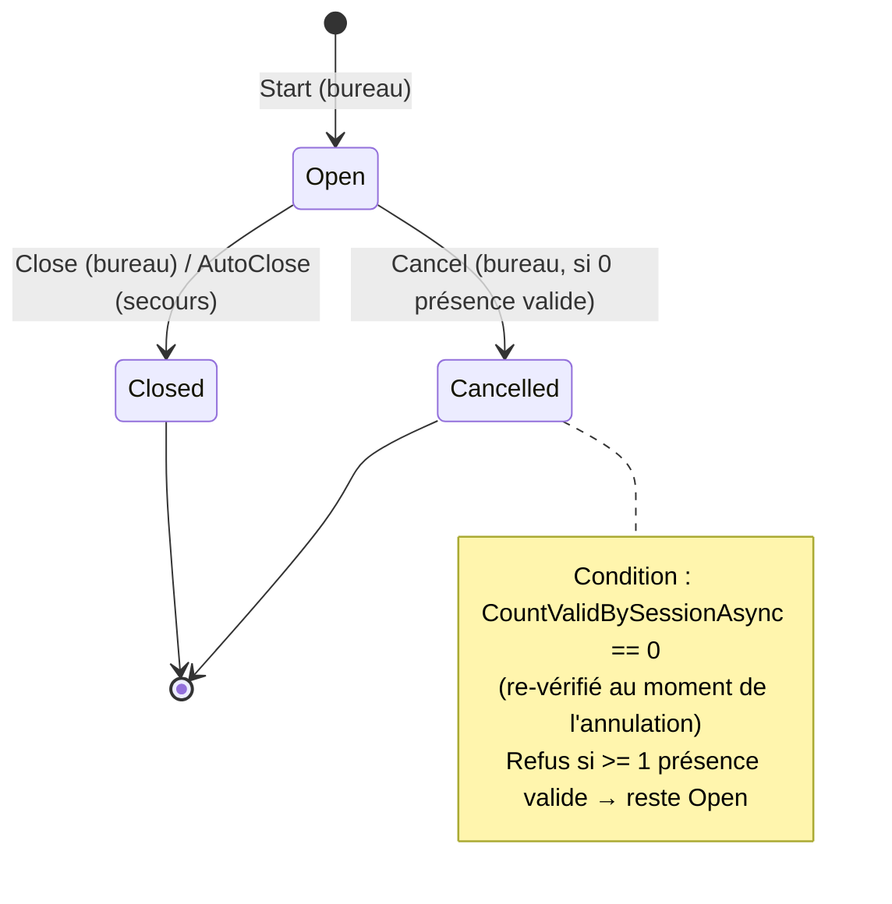

# Data Model — Annulation d'une session de présence vide (feature 028)

**Phase 1** · **Date** : 2026-07-09. Évolution **additive** du modèle existant (`AttendanceSession`).

## 1. `AttendanceSession` (entité existante — évolutions)

| Champ | Type | Évolution | Notes |
|-------|------|-----------|-------|
| `Status` | `SessionStatus` | **+ valeur `Cancelled`** | Open=0, Closed=1, **Cancelled=2** |
| `CancelledByMemberId` | `int?` | **NOUVEAU** (nullable) | Auteur de l'annulation (audit, FR-009) |
| `CancelledAt` | `DateTime?` (UTC) | **NOUVEAU** (nullable) | Horodatage serveur de l'annulation |
| (existants) `AntennaId`, `MeetingDate`, `StartTime`, `EndTime`, `OpenedByMemberId`, `ClosedByMemberId`, `QrSecret`, `QrStepSeconds` | — | inchangés | — |
| (hérités `AbstractEntity`) `createdt/by`, `updatedt/by` | — | inchangés | piste d'audit de base (Principe II) |

**Invariants / règles**
- `Cancel(cancelledByMemberId, nowUtc)` MUST exiger `Status == Open` (sinon `ConflictException`).
- Une session `Cancelled` a **0 présence valide** (garanti par la règle d'annulation) et est **terminale**
  (aucune transition sortante).
- `IsOpen => Status == Open` reste la définition d'« active » ; `Cancelled` n'est **pas** active.

## 2. `SessionStatus` (enum)

```text
Open = 0        // en cours (active)
Closed = 1      // clôturée (terminale, peut contenir des présences)
Cancelled = 2   // NOUVEAU : annulée (terminale, séance vide, exclue des vues actives)
```

## 3. Transitions d'état



**Règle d'annulation (portée par `CancelSessionHandler`)** :
1. session introuvable → **404** ;
2. `Status != Open` → **409** (« n'est pas ouverte / déjà clôturée / déjà annulée ») ;
3. `CountValidBySessionAsync(sessionId) > 0` (re-vérifié en transaction) → **409** (« contient des
   présences ») ; la session **reste Open**, aucune présence touchée ;
4. sinon → `Cancel(currentUserId, clock.UtcNow)`, `SaveChanges`, **audit**.

## 4. `Attendance` (entité existante — inchangée)

- Aucune modification. Le **décompte de présences valides** (`AttendanceStatus.Valid`, via
  `CountValidBySessionAsync`) détermine si la session est annulable. Une présence **annulée**
  (`Cancelled`) n'entre pas dans ce décompte → une session dont l'unique présence a été annulée redevient
  annulable (spec, Clarifications).

## 5. Effets sur les vues (aucune migration de requête)

| Vue / usage | Comportement vis-à-vis d'une session `Cancelled` |
|-------------|--------------------------------------------------|
| Reprise « mes sessions ouvertes » (023) | Exclue (`ListOpenByOpenerAsync` filtre `Open`) |
| Garde d'ouverture (`HasOpenSessionAsync`) | N'entre pas en compte (filtre `Open`) |
| Auto-clôture de secours (`ListOpenBeforeAsync`) | Exclue (filtre `Open`) |
| Rapports (018/020) | Absente des agrégats (0 présence valide) |
| Consultation directe `GET /{id}` | Reste accessible (statut « Cancelled ») pour l'audit |

## 6. Contrat de sortie

`SessionResponse` (existant) est réutilisé tel quel ; son champ `Status` sérialise « Cancelled » après
annulation. Aucun nouveau DTO. Voir `contracts/cancel-session-api.md`.
